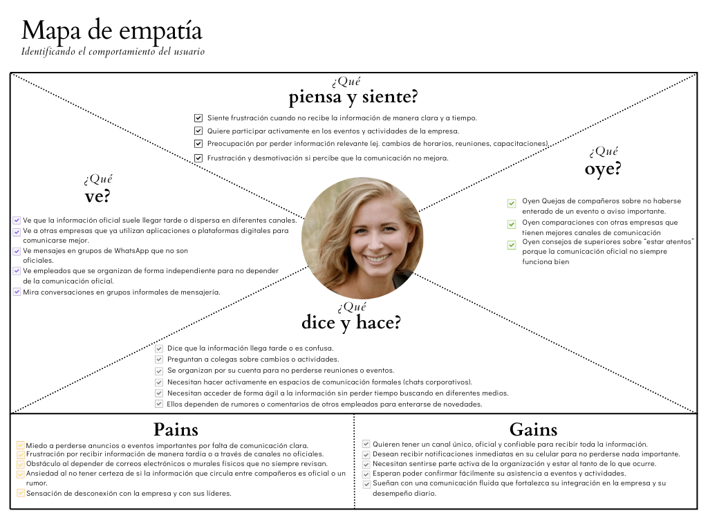
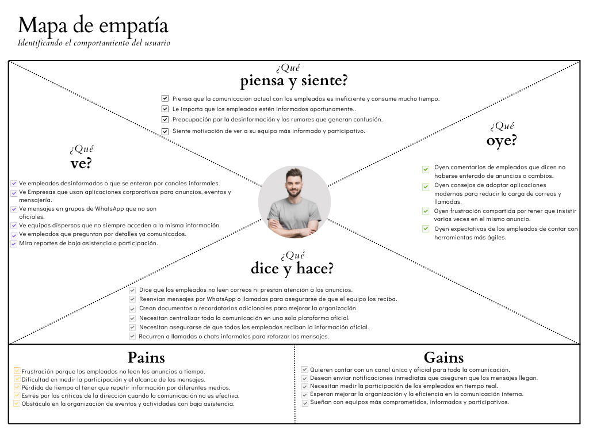

# Capítulo II: Requirements Elicitation & Analysis 
## 2.1. Competidores 

### 2.1.1. Análisis competitivo

| **Competitive Analysis Landscape**                       |                                                              |           |      |      |      |
| -------------------------------------------------------- | ------------------------------------------------------------ | --------- | ---- | ---- | ---- |
| ¿Por qué llevar acabo este análisis?                     | Escriba en el recuadro la pregunta que busca responder o el objetivo de este  análisis. |           |      |      |      |
| En la cabecera colocar por cada competidor nombre y logo |                                                              | Centralis |      |      |      |
| Perfil                                                   | Overview                                                     |           |      |      |      |
|                                                          | Ventaja competitiva ¿Qué valorofrece a losclientes?          |           |      |      |      |
| Perfil de Marketing                                      | Mercado objetivo                                             |           |      |      |      |
|                                                          | Estrategias de marketing                                     |           |      |      |      |
| Perfil de Producto                                       | Productos & Servicios                                        |           |      |      |      |
|                                                          | Precios & Costos                                             |           |      |      |      |
|                                                          | Canales de distribución                                      |           |      |      |      |
|                                                          | (Web y/o Móvil)                                              |           |      |      |      |
| Análisis SWOT                                            | Fortalezas                                                   |           |      |      |      |
|                                                          | Debilidades                                                  |           |      |      |      |
|                                                          | Oportunidades                                                |           |      |      |      |
|                                                          | Amenazas                                                     |           |      |      |      |

### 2.1.2. Estrategias y tácticas frente a competidores 
## 2.2. Entrevistas 
Con el objetivo de obtener información detallada acerca de las necesidades, expectativas y frustraciones de los usuarios objetivo de Centralis, se realizaron entrevistas estructuradas dirigidas a los dos segmentos estratégicos:  empleados y gerentes o líderes de equipos.

El diseño de las entrevistas se elaboró considerando formularios específicos para cada segmento, formulando preguntas abiertas que permitieran a los participantes expresar libremente sus experiencias, desafíos y expectativas en torno a la comunicación interna.

Cada entrevista fue registrada y documentada mediante notas detalladas, siguiendo las prácticas de obtención de requisitos y ética en investigación de usuarios. Posteriormente, los resultados se analizaron cualitativa y cuantitativamente, identificando patrones de comportamiento, puntos de dolor y oportunidades de mejora. Estos insights se consolidaron para la construcción de artefactos clave como User Personas, Empathy Maps y User Task Matrices, asegurando una base sólida para la definición de requisitos y el diseño de una plataforma centrada en las necesidades reales de sus usuarios.

La metodología aplicada garantizó la recolección de información contextualizada y accionable, fundamental para el desarrollo de Centralis como una solución intuitiva, segura y efectiva para la comunicación interna empresarial.

### 2.2.1. Diseño de entrevistas 

**Segmento Objetivo #1: Empleados de Empresas**

**Objetivo:** Comprender sus frustraciones cotidianas con las herramientas actuales, sus hábitos de comunicación y lo que valorarían en una solución como Centralis.

**Preguntas principales:**

1. ¿Qué aplicaciones o herramientas utilizas a diario para comunicarte con tus compañeros de trabajo y superiores? (Ej: WhatsApp, email, Teams, etc.)
2. ¿Has tenido problemas o inconvenientes usando estas herramientas? (Ej: mensajes perdidos)
3. Cuando tu jefe o la empresa publican un anuncio o avisos importante, ¿cómo te enteras?
4. ¿Cómo te organizas para saber sobre reuniones, capacitaciones o eventos de la empresa? (Ej: poner un recordatorio 15 minutos antes)
5. ¿Cómo te sientes acerca de usar tu WhatsApp personal para temas de trabajo? (Ej: Suele cambinar visa personal con laboral)
6. Imagina una herramienta de comunicación ideal para tu trabajo. ¿Qué características debería tener para hacerte la vida más fácil? (Ej: notificaicon de eventos de la empresa, comunicación exclusiva de entorno laboral)

**Preguntas Complementarias:**

1. ¿Podrías contarme sobre la última vez que un malentendido o un fallo de comunicación te causó un problema o retraso en tu trabajo?
2. ¿Prefieres que las conversaciones de diferentes proyectos o temas estén separadas? ¿Por qué?
3. ¿Qué tipo de notificaciones te parecen útiles y cuáles te resultan molestas o intrusivas?
4. ¿Qué dispositivo usas más para comunicarte en el trabajo: el celular o la computadora?

**Segmento Objetivo #2: Gerentes y Líderes de Equipos**

**Objetivo:** Descubrir sus desafíos de gestión, necesidades de control y accountability, y los criterios de decisión para implementar nuevas herramientas.

**Preguntas principales:**

1. ¿Cómo se comunica oficialmente con su equipo hoy en día? ¿Qué herramientas utiliza? (Ej: WhatsApp, Teams)
2. ¿Cuáles son los mayores desafíos o dolores de cabeza que enfrenta al gestionar la comunicación dentro de su equipo o empresa? (Ej: asegurar que todos lean los anuncios, coordinar tiempos)
3. ¿Ha tenido situaciones donde la información importante no llegó a todos? ¿Cuál fue el impacto?
4. ¿Cómo realiza el seguimiento para asegurarse de que su equipo ha visto y entendido las instrucciones o anuncios?
5. Al organizar una reunión o evento, ¿Qué herramientas usa?
7. Desde su perspectiva, ¿qué riesgos ve en el uso de aplicaciones informales como WhatsApp para la comunicación laboral?
8. ¿Qué criterios evalúa al considerar implementar una nueva herramienta tecnológica en la empresa? (Ej: costo, seguridad, facilidad de uso, adopción)

**Preguntas Complementarias:**

1. Cuando publica un anuncio importante, ¿necesita saber quiénes lo han leído y quiénes no? ¿Cómo le ayudaría esa información? (Ej: Valida la necesidad de confirmación de lectura)
2. Imagina un panel de control donde pudiera ver el engagement de su equipo con la comunicación. ¿Qué métricas o datos serían más valiosos para usted? (Ej: % de anuncios leídos, tasa de asistencia a eventos, actividad en chats).
3. Para la toma de decisiones, ¿le resultaría útil poder segmentar y enviar anuncios o eventos solo a departamentos o equipos específicos?
4. Desde el punto de vista de la seguridad, ¿qué tipo de controles o permisos considera indispensables en una herramienta de comunicación? (Ej: quién puede publicar anuncios, quién puede crear grupos).

### 2.2.2. Registro de entrevistas 
### 2.2.3. Análisis de entrevistas 
## 2.3. Needfinding 
### 2.3.1. User Personas 
### 2.3.2. User Task Matrix 
### 2.3.3. User Journey Mapping 
### 2.3.4. Empathy Mapping  

Los siguientes mapas de empatía ilustran los conocimientos recopilados para cada uno de los dos segmentos objetivo definidos en el proyecto: 

**Segment 1**  
  

**Segment 2**  
  

### 2.3.5. As-is Scenario Mapping 
## 2.4. Ubiquitous Language 
## 2.3.5. Ubiquitous Language
## 2.4. Requirements specification
### 2.4.1. User Stories
### 2.4.2. Impact Mapping
### 2.4.3. Product Backlog
## 2.5. Strategic-Level Domain-Driven Design
### 2.5.1. EventStorming
#### 2.5.1.1. Candidate Context Discovery
#### 2.5.1.2. Domain Message Flows Modeling
#### 2.5.1.3. Bounded Context Canvases
### 2.5.2. Context Mapping
### 2.5.3. Software Architecture
#### 2.5.3.1. Software Architecture Context Level Diagrams
#### 2.5.3.2. Software Architecture Container Level Diagrams
#### 2.5.3.3. Software Architecture Deployment Diagrams
## 2.6. Tactical-Level Domain-Driven Design
### 2.6.1. Bounded Context: Announcement Context  

### 2.6.1.1 Domain Layer  
El **Announcement Context** gestiona la publicación, visualización y comentarios de anuncios en la organización.  

- **Entities**  
  - **Announcement**  
    - `id: UUID`  
    - `title: String`  
    - `description: String`  
    - `image: String (opcional)`  
    - `priority: Priority (Value Object)`  
    - `createdAt: DateTime`  
    - `createdBy: UserId (Gerente)`  
    - **Métodos**: `publish()`, `markAsSeen(employeeId)`, `addComment(comment)`  

  - **Comment**  
    - `id: UUID`  
    - `announcementId: UUID`  
    - `employeeId: UserId`  
    - `content: String`  
    - `createdAt: DateTime`  

  - **User (simplificado)**  
    - `id: UUID`  
    - `name: String`  
    - `role: ENUM (Manager, Employee)`  

- **Value Objects**  
  - **Priority**  
    - `level: ENUM (Normal, High, Urgent)`  
    - Inmutable, solo puede asignarse al crear el anuncio.  

- **Aggregates**  
  - `Announcement` es el Aggregate Root.  
  - Contiene `Comments` y gestiona la lógica de negocio.  

- **Business Rules**  
  1. Solo los **Managers** pueden publicar anuncios.  
  2. Los **Employees** pueden visualizar anuncios y marcarlos como vistos.  
  3. Los **Employees** pueden comentar un anuncio publicado.  
  4. Un anuncio puede clasificarse por **Priority**.  

- **Repositories (Interfaces)**  
  - `IAnnouncementRepository`  
  - `ICommentRepository`  

---

### 2.6.1.2 Interface Layer
### 2.6.1.3 Application Layer  
### 2.6.1.4 Infrastructure Layer 
### 2.6.1.5 Bounded Context Software Architecture Component Level Diagram 
### 2.6.1.6 Bounded Context Software Architecture Code Level Diagrams 
#### 2.6.1.6.1 Domain Layer Class Diagram 
#### 2.6.1.6.2 Bounded Context Database Design Diagram 
