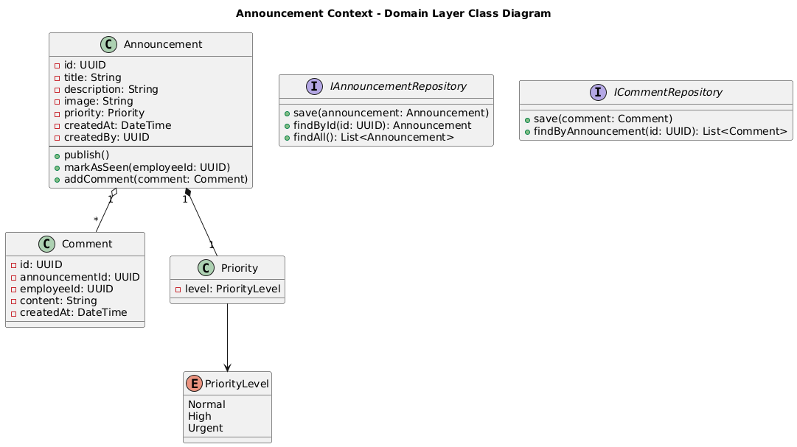
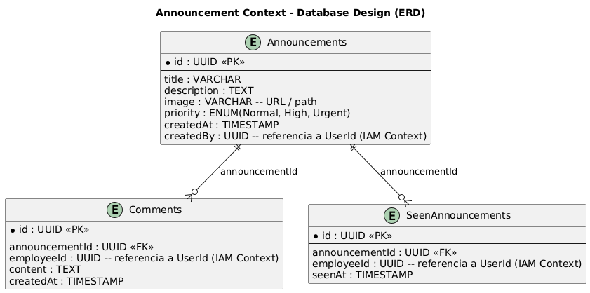
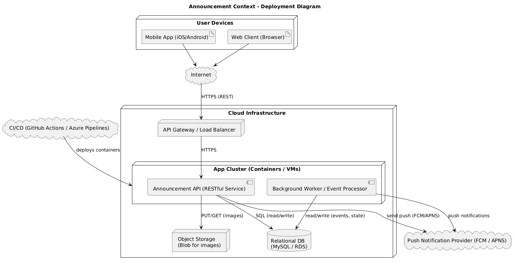

# **Capítulo II: Requirements Elicitation & Analysis**

## **2.1. Competidores**

### ***2.1.1. Análisis competitivo***

<body>
<table class="c16">
  <tr class="c1">
    <td class="c13" colspan="6">
Competitive Analysis Landscape
</td>
  </tr>
  <tr class="c1">
    <td class="c11" colspan="2">
¿Por qué llevar a cabo este análisis?
</td>
    <td class="c17" colspan="4">
Identificar fortalezas, debilidades, oportunidades y amenazas de los principales competidores (Teams, Slack y WhatsApp), para diferenciar a Centralis como solución enfocada en PYMEs LATAM.
</td>
  </tr>
  <tr class="c1">
    <td class="c11" colspan="2"></td>
    <td class="c0">
      
Centralis

      
    </td>
    <td class="c0">
      
Microsoft Teams

      
    </td>
    <td class="c0">
      
Slack

      
    </td>
    <td class="c0">
      
WhatsApp

      
    </td>
  </tr>
  <tr class="c1">
    <td class="c0" rowspan="2">
Perfil
</td>
    <td class="c0">
Overview
</td>
    <td class="c0">
Plataforma integral para PYMEs, diseñada para centralizar la comunicación laboral.
</td>
    <td class="c0">
Plataforma de colaboración de Microsoft, integrada en Microsoft 365.
</td>
    <td class="c0">
Herramienta de mensajería y colaboración empresarial.
</td>
    <td class="c0">
Aplicación de mensajería instantánea de Meta, orientada a uso personal.
</td>
  </tr>
  <tr class="c1">
    <td class="c0">
Ventaja competitiva
</td>
    <td class="c0">
Simplicidad, bajo costo, funciones en anuncios, eventos y chat laboral.
</td>
    <td class="c0">
Integración completa con Office 365, alta seguridad.
</td>
    <td class="c0">
Amplia integración con apps de terceros (Trello, Google Drive, Jira, etc.).
</td>
    <td class="c0">
Facilidad de uso y adopción masiva global.
</td>
  </tr>
  <tr class="c1">
    <td class="c0" rowspan="2">
Perfil de Marketing
</td>
    <td class="c0">
Mercado objetivo
</td>
    <td class="c0">
Pequeñas y medianas empresas en LATAM.
</td>
    <td class="c0">
Empresas medianas y grandes.
</td>
    <td class="c0">
Empresas tecnológicas, startups, equipos distribuidos.
</td>
    <td class="c0">
Usuarios generales, comunicación personal y grupos informales.
</td>
  </tr>
  <tr class="c1">
    <td class="c0">
Estrategias de marketing
</td>
    <td class="c0">
Marketing digital enfocado en PYMEs, alianzas con gremios y cámaras empresariales.
</td>
    <td class="c0">
Incluido en licencias de Microsoft 365, ventas corporativas.
</td>
    <td class="c0">
Modelo freemium, marketing digital, comunidad de desarrolladores.
</td>
    <td class="c0">
Posicionamiento masivo y gratuito, expansión viral.
</td>
  </tr>
  <tr class="c1">
    <td class="c0" rowspan="3">
Perfil de Producto
</td>
    <td class="c0">
Productos & Servicios
</td>
    <td class="c0">
Anuncios formales, gestión de eventos, chats laborales segmentados.
</td>
    <td class="c0">
Videollamadas, chat, colaboración documental, calendario.
</td>
    <td class="c0">
Canales temáticos, bots, integraciones externas, chat grupal.
</td>
    <td class="c0">
Mensajería, llamadas, grupos, archivos multimedia.
</td>
  </tr>
  <tr class="c1">
    <td class="c0">
Precios & Costos
</td>
    <td class="c0">
Suscripción accesible y escalable.
</td>
    <td class="c0">
Desde $4 USD/usuario/mes (básico).
</td>
    <td class="c0">
Desde $7.25 USD/usuario/mes (estándar).
</td>
    <td class="c0">
Gratuito (limitado en funciones empresariales).
</td>
  </tr>
  <tr class="c1">
    <td class="c0">
Canales de distribución
</td>
    <td class="c0">
Mobile-first (Android/iOS) + versión web complementaria.
</td>
    <td class="c0">
Web, Desktop, Móvil (Android/iOS).
</td>
    <td class="c0">
Web, Desktop, Móvil (Android/iOS).
</td>
    <td class="c0">
Web, Desktop, Móvil (Android/iOS).
</td>
  </tr>
  <tr class="c1">
    <td class="c0" rowspan="4">
Análisis SWOT
</td>
    <td class="c0">
Fortalezas
</td>
    <td class="c0">
Asequibilidad, enfoque LATAM, simplicidad laboral.
</td>
    <td class="c0">
Integración con Microsoft 365, seguridad.
</td>
    <td class="c0">
Flexibilidad, ecosistema de apps.
</td>
    <td class="c0">
Simplicidad, adopción masiva.
</td>
  </tr>
  <tr class="c1">
    <td class="c0">
Debilidades
</td>
    <td class="c0">
Startup nueva, menor reconocimiento de marca.
</td>
    <td class="c0">
Complejo para PYMEs, curva de aprendizaje alta.
</td>
    <td class="c0">
Costoso para equipos pequeños, saturación de apps.
</td>
    <td class="c0">
Baja seguridad, falta de funciones laborales.
</td>
  </tr>
  <tr class="c1">
    <td class="c0">
Oportunidades
</td>
    <td class="c0">
Brecha en PYMEs que necesitan centralización simple y económica.
</td>
    <td class="c0">
Creciente adopción de entornos híbridos.
</td>
    <td class="c0">
Expansión en empresas medianas.
</td>
    <td class="c0">
Uso laboral en mercados emergentes.
</td>
  </tr>
  <tr class="c1">
    <td class="c0">
Amenazas
</td>
    <td class="c0">
Copia rápida del modelo por grandes competidores.
</td>
    <td class="c0">
Competencia de Slack y Google Workspace.
</td>
    <td class="c0">
Competencia de Teams y Zoom.
</td>
    <td class="c0">
Regulaciones de privacidad y nuevas apps laborales.
</td>
  </tr>
</table>

#

### ***2.1.2. Estrategias y tácticas frente a competidores***

<ul>
  <li><b>Diferenciación Tecnológica:</b> Arquitectura DDD y hexagonal, bounded contexts claros, uso de Supabase y Firebase para escalabilidad y costos bajos.</li>
  <li><b>Experiencia de Usuario:</b> Diseño mobile-first, minimalista y simple frente a la complejidad de Teams y Slack. Diferenciación clara de vida laboral y personal frente a WhatsApp.</li>
  <li><b>Seguridad y Privacidad:</b> Roles y permisos integrados, cumplimiento con GDPR, encriptación en tránsito y reposo, auditorías.</li>
  <li><b>Escalabilidad y Despliegue:</b> Arquitectura en microservicios, despliegue modular, infraestructura serverless y monitoreo con Prometheus/Sentry.</li>
  <li><b>Go-to-Market:</b> Posicionamiento como alternativa formal y económica para PYMEs en LATAM, con plan freemium inicial y escalabilidad progresiva.</li>
</ul>
</body>

#

## **2.2. Entrevistas**

Con el objetivo de obtener información detallada acerca de las necesidades, expectativas y frustraciones de los usuarios objetivo de Centralis, se realizaron entrevistas estructuradas dirigidas a los dos segmentos estratégicos:  empleados y gerentes o líderes de equipos.

El diseño de las entrevistas se elaboró considerando formularios específicos para cada segmento, formulando preguntas abiertas que permitieran a los participantes expresar libremente sus experiencias, desafíos y expectativas en torno a la comunicación interna.

Cada entrevista fue registrada y documentada mediante notas detalladas, siguiendo las prácticas de obtención de requisitos y ética en investigación de usuarios. Posteriormente, los resultados se analizaron cualitativa y cuantitativamente, identificando patrones de comportamiento, puntos de dolor y oportunidades de mejora. Estos insights se consolidaron para la construcción de artefactos clave como User Personas, Empathy Maps y User Task Matrices, asegurando una base sólida para la definición de requisitos y el diseño de una plataforma centrada en las necesidades reales de sus usuarios.

La metodología aplicada garantizó la recolección de información contextualizada y accionable, fundamental para el desarrollo de Centralis como una solución intuitiva, segura y efectiva para la comunicación interna empresarial.

### ***2.2.1. Diseño de entrevistas***

<u>***- Segmento objetivo \#1: Empleados de Empresas***</u>

***Objetivo:*** Comprender sus frustraciones cotidianas con las herramientas actuales, sus hábitos de comunicación y lo que valorarían en una solución como Centralis.

***Preguntas principales:***

1. ¿Qué aplicaciones o herramientas utilizas a diario para comunicarte con tus compañeros de trabajo y superiores?

2. ¿Has tenido problemas o inconvenientes usando estas herramientas? 

3. Cuando tu jefe o la empresa publican un anuncio o avisos importante, ¿cómo te enteras?

4. ¿Cómo te organizas para saber sobre reuniones, capacitaciones o eventos de la empresa?

5. ¿Cómo te sientes acerca de usar tu WhatsApp personal para temas de trabajo? 

6. Imagina una herramienta de comunicación ideal para tu trabajo. ¿Qué características debería tener para hacerte la vida más fácil? 

***Preguntas Complementarias:***

1. ¿Podrías contarme sobre la última vez que un malentendido o un fallo de comunicación te causó un problema o retraso en tu trabajo?

2. ¿Prefieres que las conversaciones de diferentes proyectos o temas estén separadas? ¿Por qué?

3. ¿Qué tipo de notificaciones te parecen útiles y cuáles te resultan molestas o intrusivas?

4. ¿Qué dispositivo usas más para comunicarte en el trabajo: el celular o la computadora?

<u>***- Segmento objetivo \#2:  Gerentes y Líderes de Equipos***</u> 

**Objetivo:** Descubrir sus desafíos de gestión, necesidades de control y accountability, y los criterios de decisión para implementar nuevas herramientas.

***Preguntas principales:***

1. ¿Cómo se comunica oficialmente con su equipo hoy en día? ¿Qué herramientas utiliza? 

2. ¿Cuáles son los mayores desafíos o dolores de cabeza que enfrenta al gestionar la comunicación dentro de su equipo o empresa? 

3. ¿Ha tenido situaciones donde la información importante no llegó a todos? ¿Cuál fue el impacto?

4. ¿Cómo realiza el seguimiento para asegurarse de que su equipo ha visto y entendido las instrucciones o anuncios?

5. Al organizar una reunión o evento, ¿Qué herramientas usa?

6. Desde su perspectiva, ¿qué riesgos ve en el uso de aplicaciones informales como WhatsApp para la comunicación laboral?

7. ¿Qué criterios evalúa al considerar implementar una nueva herramienta tecnológica en la empresa? 

***Preguntas Complementarias:***

1. Cuando publica un anuncio importante, ¿necesita saber quiénes lo han leído y quiénes no? ¿Cómo le ayudaría esa información?

2. Imagina un panel de control donde pudiera ver el engagement de su equipo con la comunicación. ¿Qué métricas o datos serían más valiosos para usted?

3. Para la toma de decisiones, ¿le resultaría útil poder segmentar y enviar anuncios o eventos solo a departamentos o equipos específicos?

4. Desde el punto de vista de la seguridad, ¿qué tipo de controles o permisos considera indispensables en una herramienta de comunicación?

### 2.2.2. Registro de entrevistas 

#### Segmento objetivo #1: Empleados de Empresas

**Entrevista 1:**

- **Nombre:** Leonardo Delgado Arriola
- **Edad:** 21 años
- **Resumen:** Leonardo utiliza principalmente WhatsApp y correo electrónico para comunicarse en el trabajo. Señala que los mensajes laborales en WhatsApp suelen perderse entre los personales y que esto le ha causado retrasos. Se organiza con el calendario de su celular, aunque reconoce que no siempre es eficiente. Le resulta incómodo usar su WhatsApp personal para temas laborales porque no logra desconectarse. Prefiere separar conversaciones por proyectos y recibir solo notificaciones relevantes. Usa más el celular que la computadora para comunicarse.
- **Necesidades:** Leonardo requiere una herramienta exclusiva para el trabajo que separe proyectos, integre un calendario con recordatorios y filtre notificaciones importantes, evitando mezclar lo personal con lo laboral.

#### Segmento objetivo #2: Gerentes y lideres de equipo

**Entrevista 4:**

- **Nombre:** Ivan Lavado Vallejos
- **Edad:** 21 años
- **Resumen:** Iván, estudiante de Ingeniería Civil y líder en una empresa de construcción, se comunica principalmente por WhatsApp y correo electrónico, además de usar Google Calendar y Meet para reuniones. Su mayor dificultad es asegurar que todos reciban y lean la información, ya que a menudo los mensajes se pierden, generando retrasos. También le preocupa la falta de seguridad y el uso de aplicaciones informales como WhatsApp para temas laborales.

- **Necesidades:** 
  - Herramienta de comunicación exclusiva para lo laboral.
  - Confirmación de lectura en anuncios y mensajes importantes.
  - Segmentación de información por área o proyecto.
  - Panel de métricas para medir engagement del equipo.
  - Controles de seguridad y permisos para publicar o crear grupos.
  - Facilidad de adopción en un entorno de construcción.

### 2.2.3. Análisis de entrevistas 

En este apartado se documenta de manera estructurada cada una de las entrevistas realizadas a los diferentes segmentos objetivo. Para cada entrevista, se incluye información relevante como el perfil del entrevistado, el registro de sus respuestas, observaciones contextuales, y un resumen de los principales hallazgos obtenidos.

Esta sistematización permite asegurar la trazabilidad de los datos recolectados, facilitando su posterior análisis y su utilización en la construcción de artefactos de usuario, tales como User Personas, Empathy Maps y User Task Matrices.

Características objetivas y subjetivas más comunes de cada segmento:

<u>**Segmento objetivo #1: Empleados de Empresas**</u>

**Características Objetivas Comunes:**

- Sexo: Femenino.
- Edad: 28-35 años. 
- Dispositivos: Laptop de marca Hp con sistema operativo Windows 10 y smartphone android.
- Programas: WhatAspp , Meet, Google Calendar, Procreate.
- Canales de información: WhatsApp, Google Gmail,
- Marcas preferidas: Google Gmail, WhatsApp, Google Meet

**Características Subjetivas Comunes:**

- Problemas al encontrar mensajes importantes.
- Dispersión de comunicación, uso de varias aplicaciones.
- Disgusto por combinar conversiones de vida personal y laboral.
- Interés por la centralización de la comunicación laboral
- Mayor uso de dispositivos móviles.

<u>**Segmento objetivo #2: Gerentes o líderes de equipo**</u>

**Características Objetivas Comunes:**

- Sexo: Masculino.
- Edad: 40-55 años.
- Dispositivos: Laptop de marca HP con sistema operativo Windows 10 y iPhone.
- Canales de información: Messenger , WhatsApp, Outlook.
- Marcas preferidas: Messenger , WhatsApp, Outlook.

**Características Subjetivas Comunes:**

- Problemas con las confirmaciones de lectura 
- Conflicto con la organización de archivos
- Valora la facilidad del uso de la herramienta.
- Orientación hacia la eficiencia y ahorro de tiempo.
- Preocupación por la seguridad de la empresa y el profesionalismo de los empleados. 
- Necesidad del control jerárquico. 

## 2.3. Needfinding 

Para identificar las necesidades reales de los usuarios objetivo de Centralis, se realizaron entrevistas en profundidad a dos segmentos clave: empleados y gerentes/líderes. A través de estas entrevistas, se descubrieron patrones comunes y críticos en cada grupo, como la necesidad de centralizar la comunicación fragmentada en múltiples aplicaciones (WhatsApp, correo, calendarios), la frustración por la pérdida de información importante en entornos informales, la demanda de herramientas intuitivas y móviles que prioricen la usabilidad, y la urgencia por separar la comunicación laboral de la personal para mejorar el equilibrio vida-trabajo. 

### 2.3.1. User Personas 

En esta sección se construyeron perfiles representativos denominados “User Personas”, los cuales sintetizan características clave de los usuarios objetivo a partir del análisis cualitativo de las entrevistas. Cada User Persona refleja patrones comunes de comportamiento, motivaciones, frustraciones, objetivos, dispositivos utilizados y canales de información. Esta herramienta permitió traducir datos individuales en arquetipos comprensibles que orientan el diseño centrado en el usuario, facilitando decisiones estratégicas en cuanto a funcionalidades, experiencia de usuario y comunicación visual.

*“Anexo: Diagrama User Persona”* : https://acortar.link/gN7rnw

Se desarrollaron dos perfiles principales:

<u>**Segmento objetivo #1: Empleados de Empresas**</u>

**Figura 8**

*User Persona Segmento Objetivo #1: Empleados de Empresas*

<ins>**Segmento Objetivo 2: Gerentes y Líderes de Equipos**</ins>

**Figura 9**

*User Persona Segmento Objetivo #2: Gerentes y Líderes de Equipos*

### 2.3.2. User Task Matrix 

A continuación se presenta el User Task Matrix, construido a partir de las entrevistas realizadas a los dos segmentos definidos: Empleados de Empresas y Gerentes o Líderes de Equipos.

| N°   | Task Matrix                                       | Maria Moreira | Maria Moreira | Carlos Román | Carlos Román |
| ---- | ------------------------------------------------- | ------------- | ------------- | ------------ | ------------ |
|      |                                                   | Frecuencia    | Importancia   | Frecuencia   | Importancia  |
| 1    | Explora la landing page y conoce la aplicación    | Baja          | Media         | Media        | Media        |
| 2    | Recibe notificaciones de los eventos              | Alta          | Alta          | Alta         | Alta         |
| 3    | Crea grupos de chats                              | Media         | Media         | Media        | Alta         |
| 4    | Crea eventos para un grupo específico             | Baja          | Media         | Alta         | Alta         |
| 5    | Publica noticias o anuncios importantes           | Baja          | Media         | Alta         | Alta         |
| 6    | Crea eventos para un sector específico            | Baja          | Baja          | Media        | Alta         |
| 7    | Revisar quienes leyeron el anuncio                | Baja          | Baja          | Alta         | Alta         |
| 8    | Marca como leído un anuncio importante            | Media         | Alta          | Media        | Media        |
| 9    | Administrar permisos para crear grupos o anuncios | Baja          | Baja          | Media        | Alta         |
| 10   | Revisar métricas en el panel de control           | Baja          | Baja          | Media        | Alta         |

**Diferencias Clave entre Segmentos**

Enfoque en control vs. practicidad:

- Carlos realiza tareas de gestión y supervisión (revisar métricas, administrar permisos, publicar anuncios) con alta frecuencia e importancia.
- María se centra en tareas operativas y reactivas (recibir notificaciones, marcar anuncios como leídos) que simplifiquen su flujo de trabajo.

**Uso de analytics**:

- Carlos necesita paneles de control y métricas (ej: tasa de lectura de anuncios) para tomar decisiones.
- María no usa analytics, pero valora confirmaciones simples (ej: "visto" en anuncios) para su tranquilidad.

**Creación de contenido:**

- Carlos genera anuncios y eventos constantemente
- María principalmente los consume.

**Coincidencias Relevantes**

- Ambos comparten la necesidad de notificaciones efectivas y grupos de chat organizados.

- Tareas como crear eventos son más frecuentes para Carlos, pero ambos las consideran importantes para la coordinación.

- Marcar anuncios como leídos es relevante para ambos: para María, es una forma de confirmar recepción; para Carlos, un mecanismo de validación.

**Implicancias para el Diseño de Centralis**

Priorizar funcionalidades para gerentes:

- Paneles de control con métricas de engagement (ej: % de lectura de anuncios).
- Herramientas de segmentación para enviar mensajes a grupos específicos.

**Optimizar la experiencia para empleados:**

- Notificaciones que destaquen lo urgente.
- Flujos simples para confirmar lectura o asistencia a eventos.

Este análisis refuerza que Centralis debe equilibrar simplicidad para empleados como María con herramientas de gestión robustas para líderes como Carlos.

### 2.3.3. User Journey Mapping 

Con el objetivo de comprender en profundidad las necesidades, comportamientos, emociones y puntos de fricción de los usuarios de Centralis, se desarrolló un User Journey Mapping utilizando metodologías centradas en el usuario. Este proceso permitió visualizar de manera estructurada y empática el recorrido que cada segmento realiza desde el descubrimiento de la herramienta hasta su adopción y uso continuo, identificando oportunidades clave para optimizar la experiencia.

**La actividad se centró en dos segmentos principales:**

- María Moreira, empleada administrativa que busca centralizar la comunicación laboral y reducir el estrés causado por la fragmentación de canales.
- Carlos Román, gerente de ventas que necesita controlar la difusión de información crítica y garantizar la accountability de su equipo.

**Para cada perfil, se diseñó un mapa que incluye:**

- Fases del proceso: Descubrimiento, Registro, Uso diario y Análisis de resultados.
- Objetivos del usuario en cada etapa.
- Acciones específicas (procesos) y canales utilizados.
- Emociones experimentadas, representadas mediante un sistema visual intuitivo: Frustración, Alivio, Satisfacción.
- Problemas identificados y oportunidades de mejora a lo largo del recorrido.

Gracias a UXPressia, se logró una representación visual dinámica y clara que facilita la toma de decisiones centradas en el usuario. Este trabajo no solo mejora la comprensión de sus motivaciones y desafíos, sino que también guía el diseño de soluciones más relevantes, empáticas y funcionales para cada perfil identificado.

*“Anexo: Diagrama Journey Mapping”* : https://acortar.link/E1OgkX

<ins>**Segmento Objetivo 1: Empleados de Empresas**</ins>  

**Figura 10**

*User Journey Mapping Objetivo #1: Empleados de Empresas*

*Nota.* Elaboración propia. 

<ins>**Segmento Objetivo 2: Gerentes y Líderes de Equipos**</ins>

**Figura 11**

*User Journey Mapping Objetivo #2: Gerentes y Líderes de Equipos*

*Nota.* Elaboración propia. 

### 2.3.4. Empathy Mapping  

Los siguientes mapas de empatía ilustran los conocimientos recopilados para cada uno de los dos segmentos objetivo definidos en el proyecto: 

<ins>**Segmento Objetivo 2: Gerentes y Líderes de Equipos**</ins>

**Figura 12**

*Empathy Mapping Empleados de Empresas*

*Nota.* Elaboración propia.

<ins>**Segmento Objetivo 2: Gerentes y Líderes de Equipos**</ins>

 **Figura 13**

*Empathy Mapping Gerentes y Líderes de Equipos*
 

*Nota.* Elaboración propia.

### ***2.3.5. Ubiquitous Language***

| **Ubiquos Term**                | **Definition of Functional Domain**             |
| ------------------------------- | ------------------------------------------------------------ |
| Employee (Empleado)             | Cualquier persona que trabaja para la empresa y utiliza la plataforma para comunicarse con colegas y gerentes, y acceder a información relevante. |
| Manager (Gerente)               | Líder o supervisor que utiliza la plataforma para comunicar anuncios formales, organizar eventos, crear equipos y asegurar la llegada de información vital a sus equipos. |
| Event (Evento)                  | Actividad programada (reunión, capacitación, evento social) publicada por un gerente. Los empleados pueden acceder a detalles. |
| Chat (Chat)                     | Funcionalidad de mensajería bidireccional organizada en Groups para diferentes propósitos (departamentos, proyectos, etc.). |
| Announcement (Anuncio)          | Comunicación formal publicada por un Manager. Contiene información relevante. |
| Reading (Lectura)               | Mecanismo que permite a un Manager verificar qué Employees han leído un Announcement específico. |
| Group (Grupo)                   | Espacio de Chat dedicado a un tema, departamento o proyecto específico. Puede ser creado por Managers o Employees (según Permissions). |
| Notification (Notificación)     | Alerta que informa a los usuarios sobre Events. Puede ser prioritaria o regular. |
| Permission (Permiso)            | Configuración que define qué acciones puede realizar un usuario (ej: crear Groups, publicar Announcements). Los Managers tienen permisos elevados. |
| Dashboard (Panel de Control)    | Interfaz exclusiva para Managers que muestra métricas de engagement (ej: porcentaje de lectura de Announcements). |
| Read Status (Estado de Lectura) | Indicador que muestra si un Employee ha abierto y visto un Announcement. |
| Comment (comentario)            | Respuesta o feedback escrito por un Employee o Manager que puede agregar a un Announcement existente. Los comentarios son visibles para todos los usuarios con acceso al anuncio. |
| Notification (Notificación)     | Notificación enviada a los empleados cuando se crea un anuncio, evento y se envía un mensaje. |
| Invitees (Invitados)            | Lista de empleados invitados a un evento, ya sea reunión, capacitación, etc. |
| Priority (Prioridad)            | Atributo que indica alta importancia y desencadena notificaciones urgentes. |
| Profiles (Perfiles)             | Perfiles de los usuarios donde se mostrará datos personales  |

## **2.4. Requirements specification**

### ***2.4.1. User Stories.***

En esta sección se presentan los requisitos funcionales del sistema expresados como User Stories. Estas historias de usuario representan las necesidades de los diferentes roles que interactuarán con la plataforma Centralis, priorizando la entrega de valor para el usuario final. Cada story incluye su criterio de aceptación en formato Gherkin, asegurando que los requisitos sean claros, testeables y alineados con los objetivos del negocio. Las stories cubren tanto la experiencia móvil como la web, incluyendo el Landing Page y los Web Services.

<table style="width: 100%; border-collapse: collapse; margin: 0 auto;">
  <tr>
    <th style="border: 1px solid black; padding: 8px; text-align: center; width: 20%;">Story ID</th>
    <th style="border: 1px solid black; padding: 8px; text-align: center; width: 20%;">User</th>
    <th style="border: 1px solid black; padding: 8px; text-align: center; width: 20%;">Priority</th>
    <th style="border: 1px solid black; padding: 8px; text-align: center; width: 20%;">Epic</th>
  </tr>
  <tr>
    <td style="border: 1px solid black; padding: 8px; text-align: center;">US01</td>
    <td style="border: 1px solid black; padding: 8px; text-align: center;">visitante</td>
    <td style="border: 1px solid black; padding: 8px; text-align: center;">3</td>
    <td style="border: 1px solid black; padding: 8px; text-align: center;">Pagina de presentación</td>
  </tr>
  <tr>
    <td style="border: 1px solid black; padding: 8px; text-align: left; font-weight: bold; ">Title</td>
    <td colspan="3" style="border: 1px solid black; padding: 8px; text-align: left;">Cambiar el idioma de la landing page</td>
  </tr>
  <tr>
    <td style="border: 1px solid black; padding: 8px; text-align: left; font-weight: bold;">Description</td>
    <td colspan="3" style="border: 1px solid black; padding: 8px; text-align: left;">Como visitante, quiero traducir la página para leer el contenido en mi idioma preferido.</td>
  </tr>
  <tr>
    <td style="border: 1px solid black; padding: 8px; text-align: left; font-weight: bold; vertical-align: top;">Acceptance Criteria</td>
    <td colspan="3" style="border: 1px solid black; padding: 8px; text-align: left; vertical-align: top;">Feature: Traducción  Escenario: Traducir contenido Dado que el visitante se encuentra en la landing page,  Cuando elige su idioma preferido, Entonces se traduce al idioma seleccionado, Y el cambio se mantiene.</td>
  </tr>
</table>

<table style="width: 100%; border-collapse: collapse; margin: 0 auto;">
  <tr>
    <th style="border: 1px solid black; padding: 8px; text-align: center; width: 20%;">Story ID</th>
    <th style="border: 1px solid black; padding: 8px; text-align: center; width: 20%;">User</th>
    <th style="border: 1px solid black; padding: 8px; text-align: center; width: 20%;">Priority</th>
    <th style="border: 1px solid black; padding: 8px; text-align: center; width: 20%;">Epic</th>
  </tr>
  <tr>
    <td style="border: 1px solid black; padding: 8px; text-align: center;">US02</td>
    <td style="border: 1px solid black; padding: 8px; text-align: center;">visitante</td>
    <td style="border: 1px solid black; padding: 8px; text-align: center;">3</td>
    <td style="border: 1px solid black; padding: 8px; text-align: center;">Pagina de presentación</td>
  </tr>
  <tr>
    <td style="border: 1px solid black; padding: 8px; text-align: left; font-weight: bold;">Title</td>
    <td colspan="3" style="border: 1px solid black; padding: 8px; text-align: left;">Sección About de la landing page</td>
  </tr>
  <tr>
    <td style="border: 1px solid black; padding: 8px; text-align: left; font-weight: bold;">Description</td>
    <td colspan="3" style="border: 1px solid black; padding: 8px; text-align: left;">Como visitante, quiero ver una sección About en la landing page para entender la misión, visión y propósito de Centralis.</td>
  </tr>
  <tr>
    <td style="border: 1px solid black; padding: 8px; text-align: left; font-weight: bold; vertical-align: top;">Acceptance Criteria</td>
    <td colspan="3" style="border: 1px solid black; padding: 8px; text-align: left; vertical-align: top;">Feature: Sección About  Escenario: Visualizar información de la empresa Dado que un visitante navega a la landing page de Centralis, Cuando navega por la sección About, Entonces ve un texto claro que explica el propósito de la aplicación, misión y visión de la empresa .</td>
  </tr>
</table>

<table style="width: 100%; border-collapse: collapse; margin: 0 auto;">
  <tr>
    <th style="border: 1px solid black; padding: 8px; text-align: center; width: 20%;">Story ID</th>
    <th style="border: 1px solid black; padding: 8px; text-align: center; width: 20%;">User</th>
    <th style="border: 1px solid black; padding: 8px; text-align: center; width: 20%;">Priority</th>
    <th style="border: 1px solid black; padding: 8px; text-align: center; width: 20%;">Epic</th>
  </tr>
  <tr>
    <td style="border: 1px solid black; padding: 8px; text-align: center;">US03</td>
    <td style="border: 1px solid black; padding: 8px; text-align: center;">visitante</td>
    <td style="border: 1px solid black; padding: 8px; text-align: center;">3</td>
    <td style="border: 1px solid black; padding: 8px; text-align: center;">Pagina de presentación</td>
  </tr>
  <tr>
    <td style="border: 1px solid black; padding: 8px; text-align: left; font-weight: bold;">Title</td>
    <td colspan="3" style="border: 1px solid black; padding: 8px; text-align: left;">Historia de la startup</td>
  </tr>
  <tr>
    <td style="border: 1px solid black; padding: 8px; text-align: left; font-weight: bold;">Description</td>
    <td colspan="3" style="border: 1px solid black; padding: 8px; text-align: left;">Como visitante, quiero conocer la historia y origen de Centralis para generar confianza en la marca.</td>
  </tr>
  <tr>
    <td style="border: 1px solid black; padding: 8px; text-align: left; font-weight: bold; vertical-align: top;">Acceptance Criteria</td>
    <td colspan="3" style="border: 1px solid black; padding: 8px; text-align: left; vertical-align: top;">Feature: Historia de la compañía  Escenario: Leer la historia fundacional Dado que el visitante está en la la landing page, Cuando navega por la sección About, Entonces ve una información relevante acerca de la historia de Centralis.</td>
  </tr>
</table>

<table style="width: 100%; border-collapse: collapse; margin: 0 auto;">
  <tr>
    <th style="border: 1px solid black; padding: 8px; text-align: center; width: 20%;">Story ID</th>
    <th style="border: 1px solid black; padding: 8px; text-align: center; width: 20%;">User</th>
    <th style="border: 1px solid black; padding: 8px; text-align: center; width: 20%;">Priority</th>
    <th style="border: 1px solid black; padding: 8px; text-align: center; width: 20%;">Epic</th>
  </tr>
  <tr>
    <td style="border: 1px solid black; padding: 8px; text-align: center;">US04</td>
    <td style="border: 1px solid black; padding: 8px; text-align: center;">visitante</td>
    <td style="border: 1px solid black; padding: 8px; text-align: center;">3</td>
    <td style="border: 1px solid black; padding: 8px; text-align: center;">Pagina de presentación</td>
  </tr>
  <tr>
    <td style="border: 1px solid black; padding: 8px; text-align: left; font-weight: bold;">Title</td>
    <td colspan="3" style="border: 1px solid black; padding: 8px; text-align: left;">Sección FAQ</td>
  </tr>
  <tr>
    <td style="border: 1px solid black; padding: 8px; text-align: left; font-weight: bold;">Description</td>
    <td colspan="3" style="border: 1px solid black; padding: 8px; text-align: left;">Como visitante, quiero acceder a una sección FAQ para resolver mis dudas comunes sobre el producto.</td>
  </tr>
  <tr>
    <td style="border: 1px solid black; padding: 8px; text-align: left; font-weight: bold; vertical-align: top;">Acceptance Criteria</td>
    <td colspan="3" style="border: 1px solid black; padding: 8px; text-align: left; vertical-align: top;">Feature: Sección FAQ  Escenario: Consultar preguntas frecuentes Dado que el visitante tiene dudas sobre funcionalidades de Centralis, Cuando navega a la sección FAQ desde el menú principal, Entonces ve una lista organizada de preguntas y respuestas, Y puede expandir cada pregunta para ver la respuesta completa.</td>
  </tr>
</table>

<table style="width: 100%; border-collapse: collapse; margin: 0 auto;">
  <tr>
    <th style="border: 1px solid black; padding: 8px; text-align: center; width: 20%;">Story ID</th>
    <th style="border: 1px solid black; padding: 8px; text-align: center; width: 20%;">User</th>
    <th style="border: 1px solid black; padding: 8px; text-align: center; width: 20%;">Priority</th>
    <th style="border: 1px solid black; padding: 8px; text-align: center; width: 20%;">Epic</th>
  </tr>
  <tr>
    <td style="border: 1px solid black; padding: 8px; text-align: center;">US05</td>
    <td style="border: 1px solid black; padding: 8px; text-align: center;">visitante</td>
    <td style="border: 1px solid black; padding: 8px; text-align: center;">3</td>
    <td style="border: 1px solid black; padding: 8px; text-align: center;">Pagina de presentación</td>
  </tr>
  <tr>
    <td style="border: 1px solid black; padding: 8px; text-align: left; font-weight: bold;">Title</td>
    <td colspan="3" style="border: 1px solid black; padding: 8px; text-align: left;">Sección Team</td>
  </tr>
  <tr>
    <td style="border: 1px solid black; padding: 8px; text-align: left; font-weight: bold;">Description</td>
    <td colspan="3" style="border: 1px solid black; padding: 8px; text-align: left;">Como visitante, quiero conocer al equipo detrás de Centralis para humanizar la marca y generar confianza.</td>
  </tr>
  <tr>
    <td style="border: 1px solid black; padding: 8px; text-align: left; font-weight: bold; vertical-align: top;">Acceptance Criteria</td>
    <td colspan="3" style="border: 1px solid black; padding: 8px; text-align: left; vertical-align: top;">Feature: Sección Team  Escenario: Ver información del equipo Dado que el visitante quiere conocer a los creadores de Centralis, Cuando navega a la sección Team, Entonces ve fotos y perfiles de los miembros del equipo de desarrollo, Y puede conocer sus roles y experiencia relevante.</td>
  </tr>
</table>

<table style="width: 100%; border-collapse: collapse; margin: 0 auto;">
  <tr>
    <th style="border: 1px solid black; padding: 8px; text-align: center; width: 20%;">Story ID</th>
    <th style="border: 1px solid black; padding: 8px; text-align: center; width: 20%;">User</th>
    <th style="border: 1px solid black; padding: 8px; text-align: center; width: 20%;">Priority</th>
    <th style="border: 1px solid black; padding: 8px; text-align: center; width: 20%;">Epic</th>
  </tr>
  <tr>
    <td style="border: 1px solid black; padding: 8px; text-align: center;">US06</td>
    <td style="border: 1px solid black; padding: 8px; text-align: center;">visitante</td>
    <td style="border: 1px solid black; padding: 8px; text-align: center;">3</td>
    <td style="border: 1px solid black; padding: 8px; text-align: center;">Pagina de presentación</td>
  </tr>
  <tr>
    <td style="border: 1px solid black; padding: 8px; text-align: left; font-weight: bold;">Title</td>
    <td colspan="3" style="border: 1px solid black; padding: 8px; text-align: left;">Links profesionales del equipo</td>
  </tr>
  <tr>
    <td style="border: 1px solid black; padding: 8px; text-align: left; font-weight: bold;">Description</td>
    <td colspan="3" style="border: 1px solid black; padding: 8px; text-align: left;">Como visitante, quiero acceder a los perfiles profesionales del equipo para verificar su expertise.</td>
  </tr>
  <tr>
    <td style="border: 1px solid black; padding: 8px; text-align: left; font-weight: bold; vertical-align: top;">Acceptance Criteria</td>
    <td colspan="3" style="border: 1px solid black; padding: 8px; text-align: left; vertical-align: top;">Feature: Links profesionales  Escenario: Acceder a los perfiles profesionales de los desarrolladores Dado que el visitante está en la sección Team, Cuando hace clic en el perfil de un desarrollador, Entonces es redirigido al perfil profesional del desarrollador, Y puede verificar su experiencia.</td>
  </tr>
</table>

<table style="width: 100%; border-collapse: collapse; margin: 0 auto;">
  <tr>
    <th style="border: 1px solid black; padding: 8px; text-align: center; width: 20%;">Story ID</th>
    <th style="border: 1px solid black; padding: 8px; text-align: center; width: 20%;">User</th>
    <th style="border: 1px solid black; padding: 8px; text-align: center; width: 20%;">Priority</th>
    <th style="border: 1px solid black; padding: 8px; text-align: center; width: 20%;">Epic</th>
  </tr>
  <tr>
    <td style="border: 1px solid black; padding: 8px; text-align: center;">US07</td>
    <td style="border: 1px solid black; padding: 8px; text-align: center;">visitante</td>
    <td style="border: 1px solid black; padding: 8px; text-align: center;">3</td>
    <td style="border: 1px solid black; padding: 8px; text-align: center;">Pagina de presentación</td>
  </tr>
  <tr>
    <td style="border: 1px solid black; padding: 8px; text-align: left; font-weight: bold;">Title</td>
    <td colspan="3" style="border: 1px solid black; padding: 8px; text-align: left;">Compatibilidad con múltiples dispositivos</td>
  </tr>
  <tr>
    <td style="border: 1px solid black; padding: 8px; text-align: left; font-weight: bold;">Description</td>
    <td colspan="3" style="border: 1px solid black; padding: 8px; text-align: left;">Como visitante, quiero poder ver la landing page en mi dispositivo móvil para no tener que abrir el sitio web en un dispositivo similar a una computadora de escritorio.</td>
  </tr>
  <tr>
    <td style="border: 1px solid black; padding: 8px; text-align: left; font-weight: bold; vertical-align: top;">Acceptance Criteria</td>
    <td colspan="3" style="border: 1px solid black; padding: 8px; text-align: left; vertical-align: top;">Feature: Diseño adaptable  Escenario: Diseño adaptable Dado que el visitante se encuentra un dispositivo móvil,  Cuando abre la landing page, Entonces la landing page muestra una versión adaptada a su dispositivo móvil</td>
  </tr>
</table>

<table style="width: 100%; border-collapse: collapse; margin: 0 auto;">
  <tr>
    <th style="border: 1px solid black; padding: 8px; text-align: center; width: 20%;">Story ID</th>
    <th style="border: 1px solid black; padding: 8px; text-align: center; width: 20%;">User</th>
    <th style="border: 1px solid black; padding: 8px; text-align: center; width: 20%;">Priority</th>
    <th style="border: 1px solid black; padding: 8px; text-align: center; width: 20%;">Epic</th>
  </tr>
  <tr>
    <td style="border: 1px solid black; padding: 8px; text-align: center;">US08</td>
    <td style="border: 1px solid black; padding: 8px; text-align: center;">visitante</td>
    <td style="border: 1px solid black; padding: 8px; text-align: center;">2</td>
    <td style="border: 1px solid black; padding: 8px; text-align: center;">Pagina de presentación</td>
  </tr>
  <tr>
    <td style="border: 1px solid black; padding: 8px; text-align: left; font-weight: bold;">Title</td>
    <td colspan="3" style="border: 1px solid black; padding: 8px; text-align: left;">Acceso a Centralis desde la landing page</td>
  </tr>
  <tr>
    <td style="border: 1px solid black; padding: 8px; text-align: left; font-weight: bold;">Description</td>
    <td colspan="3" style="border: 1px solid black; padding: 8px; text-align: left;">Como visitante, quiero acceder a Centralis directamente desde la landing page para poder interactuar con la aplicacion.</td>
  </tr>
  <tr>
    <td style="border: 1px solid black; padding: 8px; text-align: left; font-weight: bold; vertical-align: top;">Acceptance Criteria</td>
    <td colspan="3" style="border: 1px solid black; padding: 8px; text-align: left; vertical-align: top;">Feature: Acceder a Centralis  Escenario: Redirigir a Centralis Dado que el visitante se encuentra en la landing page. Cuando se registra o inicia sesión, Entonces se le redirige a Centralis. Y puede interactuar con la aplicación.</td>
  </tr>
</table>

<table style="width: 100%; border-collapse: collapse; margin: 0 auto;">
  <tr>
    <th style="border: 1px solid black; padding: 8px; text-align: center; width: 20%;">Story ID</th>
    <th style="border: 1px solid black; padding: 8px; text-align: center; width: 20%;">User</th>
    <th style="border: 1px solid black; padding: 8px; text-align: center; width: 20%;">Priority</th>
    <th style="border: 1px solid black; padding: 8px; text-align: center; width: 20%;">Epic</th>
  </tr>
  <tr>
    <td style="border: 1px solid black; padding: 8px; text-align: center;">US09</td>
    <td style="border: 1px solid black; padding: 8px; text-align: center;">visitante</td>
    <td style="border: 1px solid black; padding: 8px; text-align: center;">3</td>
    <td style="border: 1px solid black; padding: 8px; text-align: center;">Pagina de presentación</td>
  </tr>
  <tr>
    <td style="border: 1px solid black; padding: 8px; text-align: left; font-weight: bold;">Title</td>
    <td colspan="3" style="border: 1px solid black; padding: 8px; text-align: left;">Navegación Accesible</td>
  </tr>
  <tr>
    <td style="border: 1px solid black; padding: 8px; text-align: left; font-weight: bold;">Description</td>
    <td colspan="3" style="border: 1px solid black; padding: 8px; text-align: left;">Como visitante que utiliza tecnologías de asistencia, quiero que la landing page anuncie claramente las etiquetas de las secciones para comprender su estructura y propósito.</td>
  </tr>
  <tr>
    <td style="border: 1px solid black; padding: 8px; text-align: left; font-weight: bold; vertical-align: top;">Acceptance Criteria</td>
    <td colspan="3" style="border: 1px solid black; padding: 8px; text-align: left; vertical-align: top;">Feature: Integración de Accesibilidad ARIA  Escenario: Escuchar etiquetas descriptivas Dado que el visitante utiliza un lector de pantalla para navegar por los sitios web,  Cuando navega por la landing page con el teclado,  Entonces se anuncian los roles ARIA correspondientes a cada sección. Escenario: Navegación por puntos de referencia Dado que el visitante utiliza un lector de pantalla con la navegación activada,  Cuando navega por la landing page usando puntos de referencia o accesos directos,  Entonces puede acceder a las secciones clave.</td>
  </tr>
</table>
<table style="width: 100%; border-collapse: collapse; margin: 0 auto;">
  <tr>
    <th style="border: 1px solid black; padding: 8px; text-align: center; width: 20%;">Story ID</th>
    <th style="border: 1px solid black; padding: 8px; text-align: center; width: 20%;">User</th>
    <th style="border: 1px solid black; padding: 8px; text-align: center; width: 20%;">Priority</th>
    <th style="border: 1px solid black; padding: 8px; text-align: center; width: 20%;">Epic</th>
  </tr>
  <tr>
    <td style="border: 1px solid black; padding: 8px; text-align: center;">US10</td>
    <td style="border: 1px solid black; padding: 8px; text-align: center;">visitante</td>
    <td style="border: 1px solid black; padding: 8px; text-align: center;">3</td>
    <td style="border: 1px solid black; padding: 8px; text-align: center;">Pagina de presentación</td>
  </tr>
  <tr>
    <td style="border: 1px solid black; padding: 8px; text-align: left; font-weight: bold;">Title</td>
    <td colspan="3" style="border: 1px solid black; padding: 8px; text-align: left;">Acceder a las descripciones de las imágenes</td>
  </tr>
  <tr>
    <td style="border: 1px solid black; padding: 8px; text-align: left; font-weight: bold;">Description</td>
    <td colspan="3" style="border: 1px solid black; padding: 8px; text-align: left;">Como visitante que utiliza un lector de pantalla, quiero que todas las imágenes significativas de la página de destino incluyan texto alternativo claro para poder comprender el contenido visual y navegar por el sitio web.</td>
  </tr>
  <tr>
    <td style="border: 1px solid black; padding: 8px; text-align: left; font-weight: bold; vertical-align: top;">Acceptance Criteria</td>
    <td colspan="3" style="border: 1px solid black; padding: 8px; text-align: left; vertical-align: top;">Feature: Accesibilidad de imágenes  Escenario: Integrar texto alternativo Dado que el visitante utiliza un lector de pantalla,  Cuando navega a una imagen que transmite información,  Entonces se anuncia una descripción clara de la imagen.</td>
  </tr>
</table>

<table style="width: 100%; border-collapse: collapse; margin: 0 auto;">
  <tr>
    <th style="border: 1px solid black; padding: 8px; text-align: center; width: 20%;">Story ID</th>
    <th style="border: 1px solid black; padding: 8px; text-align: center; width: 20%;">User</th>
    <th style="border: 1px solid black; padding: 8px; text-align: center; width: 20%;">Priority</th>
    <th style="border: 1px solid black; padding: 8px; text-align: center; width: 20%;">Epic</th>
  </tr>
  <tr>
    <td style="border: 1px solid black; padding: 8px; text-align: center;">US11</td>
    <td style="border: 1px solid black; padding: 8px; text-align: center;">visitante</td>
    <td style="border: 1px solid black; padding: 8px; text-align: center;">3</td>
    <td style="border: 1px solid black; padding: 8px; text-align: center;">Pagina de presentación</td>
  </tr>
  <tr>
    <td style="border: 1px solid black; padding: 8px; text-align: left; font-weight: bold;">Title</td>
    <td colspan="3" style="border: 1px solid black; padding: 8px; text-align: left;">Explorar redes sociales</td>
  </tr>
  <tr>
    <td style="border: 1px solid black; padding: 8px; text-align: left; font-weight: bold;">Description</td>
    <td colspan="3" style="border: 1px solid black; padding: 8px; text-align: left;">Como visitante, quiero ver enlaces a las cuentas oficiales de redes sociales para seguir las actualizaciones, mantenerme informado o contactar al equipo.</td>
  </tr>
  <tr>
    <td style="border: 1px solid black; padding: 8px; text-align: left; font-weight: bold; vertical-align: top;">Acceptance Criteria</td>
    <td colspan="3" style="border: 1px solid black; padding: 8px; text-align: left; vertical-align: top;">Feature: Redes sociales  Escenario: Mostrar redes sociales Dado que el visitante quiere contactar o seguir a la startup, Cuando navega a contacto o redes sociales,  Entonces las conexiones de la startup en redes sociales estarán disponibles.</td>
  </tr>
</table>

---

<table style="width: 100%; border-collapse: collapse; margin: 0 auto;">
  <tr>
    <th style="border: 1px solid black; padding: 8px; text-align: center; width: 20%;">Story ID</th>
    <th style="border: 1px solid black; padding: 8px; text-align: center; width: 20%;">User</th>
    <th style="border: 1px solid black; padding: 8px; text-align: center; width: 20%;">Priority</th>
    <th style="border: 1px solid black; padding: 8px; text-align: center; width: 20%;">Epic</th>
  </tr>
  <tr>
    <td style="border: 1px solid black; padding: 8px; text-align: center;">US12</td>
    <td style="border: 1px solid black; padding: 8px; text-align: center;">visitante</td>
    <td style="border: 1px solid black; padding: 8px; text-align: center;">3</td>
    <td style="border: 1px solid black; padding: 8px; text-align: center;">Pagina de presentación</td>
  </tr>
  <tr>
    <td style="border: 1px solid black; padding: 8px; text-align: left; font-weight: bold;">Title</td>
    <td colspan="3" style="border: 1px solid black; padding: 8px; text-align: left;">Mostrar representaciones visuales de la aplicación.</td>
  </tr>
  <tr>
    <td style="border: 1px solid black; padding: 8px; text-align: left; font-weight: bold;">Description</td>
    <td colspan="3" style="border: 1px solid black; padding: 8px; text-align: left;">Como visitante, quiero ver ejemplos visuales de cómo funciona la aplicación para conocer más acerca de la aplicación.</td>
  </tr>
  <tr>
    <td style="border: 1px solid black; padding: 8px; text-align: left; font-weight: bold; vertical-align: top;">Acceptance Criteria</td>
    <td colspan="3" style="border: 1px solid black; padding: 8px; text-align: left; vertical-align: top;">Feature: Mostrar la funcionalidad de la aplicación.   Escenario: Mostrar funcionalidades clave de la aplicación. Dado que el visitante se encuentra en la landing page y quiere conocer más funciones clave de la aplicación, Cuando navega por la landing page,  Entonces visualiza las funciones principales de la aplicación</td>
  </tr>
</table>

---

<table style="width: 100%; border-collapse: collapse; margin: 0 auto;">
  <tr>
    <th style="border: 1px solid black; padding: 8px; text-align: center; width: 20%;">Story ID</th>
    <th style="border: 1px solid black; padding: 8px; text-align: center; width: 20%;">User</th>
    <th style="border: 1px solid black; padding: 8px; text-align: center; width: 20%;">Priority</th>
    <th style="border: 1px solid black; padding: 8px; text-align: center; width: 20%;">Epic</th>
  </tr>
  <tr>
    <td style="border: 1px solid black; padding: 8px; text-align: center;">US13</td>
    <td style="border: 1px solid black; padding: 8px; text-align: center;">empleado</td>
    <td style="border: 1px solid black; padding: 8px; text-align: center;">2</td>
    <td style="border: 1px solid black; padding: 8px; text-align: center;">Soporte de plataforma multilingüe</td>
  </tr>
  <tr>
    <td style="border: 1px solid black; padding: 8px; text-align: left; font-weight: bold;">Title</td>
    <td colspan="3" style="border: 1px solid black; padding: 8px; text-align: left;">Traducir la aplicación móvil</td>
  </tr>
  <tr>
    <td style="border: 1px solid black; padding: 8px; text-align: left; font-weight: bold;">Description</td>
    <td colspan="3" style="border: 1px solid black; padding: 8px; text-align: left;">Como empleado, quiero elegir mi idioma preferido en la interfaz de usuario para poder interactuar con la plataforma en mi idioma nativo.</td>
  </tr>
  <tr>
    <td style="border: 1px solid black; padding: 8px; text-align: left; font-weight: bold; vertical-align: top;">Acceptance Criteria</td>
    <td colspan="3" style="border: 1px solid black; padding: 8px; text-align: left; vertical-align: top;">Feature: Vincular el selector de idioma a i18n Escenario: Cambiar el idioma dinámicamente con i18n Dado que un empleado se encuentra en la interfaz de la aplicación móvil, Cuando selecciona un idioma desde la interfaz, Entonces el módulo i18n ejecuta la función dinámicamente. Escenario: Cargar traducciones de respaldo Dado que un empleado se encuentra en la interfaz de la aplicación móvil, Cuando selecciona un idioma y falta una clave en esa configuración regional, Entonces el módulo regresa al texto del idioma predeterminado.</td>
  </tr>
</table>

---

<table style="width: 100%; border-collapse: collapse; margin: 0 auto;">
  <tr>
    <th style="border: 1px solid black; padding: 8px; text-align: center; width: 20%;">Story ID</th>
    <th style="border: 1px solid black; padding: 8px; text-align: center; width: 20%;">User</th>
    <th style="border: 1px solid black; padding: 8px; text-align: center; width: 20%;">Priority</th>
    <th style="border: 1px solid black; padding: 8px; text-align: center; width: 20%;">Epic</th>
  </tr>
  <tr>
    <td style="border: 1px solid black; padding: 8px; text-align: center;">US14</td>
    <td style="border: 1px solid black; padding: 8px; text-align: center;">desarrollador</td>
    <td style="border: 1px solid black; padding: 8px; text-align: center;">5</td>
    <td style="border: 1px solid black; padding: 8px; text-align: center;">Soporte de plataforma multilingüe</td>
  </tr>
  <tr>
    <td style="border: 1px solid black; padding: 8px; text-align: left; font-weight: bold;">Title</td>
    <td colspan="3" style="border: 1px solid black; padding: 8px; text-align: left;">Vincular el selector de idioma al módulo i18n y activar el cambio de idioma</td>
  </tr>
  <tr>
    <td style="border: 1px solid black; padding: 8px; text-align: left; font-weight: bold;">Description</td>
    <td colspan="3" style="border: 1px solid black; padding: 8px; text-align: left;">Como desarrollador, quiero vincular un selector de idioma desplegable al módulo i18n y activar la función dinámicamente.</td>
  </tr>
  <tr>
    <td style="border: 1px solid black; padding: 8px; text-align: left; font-weight: bold; vertical-align: top;">Acceptance Criteria</td>
    <td colspan="3" style="border: 1px solid black; padding: 8px; text-align: left; vertical-align: top;">Feature: Vincular el selector de idioma a i18n  Escenario: Cambiar el idioma dinámicamente con i18n  Dado que un empleado se encuentra en la interfaz de la aplicación móvil, Cuando selecciona un idioma desde la interfaz, Entonces el módulo i18n ejecuta la función dinámicamente.  Escenario: Cargar traducciones de respaldo  Dado que un empleado se encuentra en la interfaz de la aplicación móvil, Cuando selecciona un idioma y falta una clave en esa configuración regional, el módulo regresa al texto del idioma predeterminado.</td>
  </tr>
</table>

<table style="width: 100%; border-collapse: collapse; margin: 0 auto;">
  <tr>
    <th style="border: 1px solid black; padding: 8px; text-align: center; width: 20%;">Story ID</th>
    <th style="border: 1px solid black; padding: 8px; text-align: center; width: 20%;">User</th>
    <th style="border: 1px solid black; padding: 8px; text-align: center; width: 20%;">Priority</th>
    <th style="border: 1px solid black; padding: 8px; text-align: center; width: 20%;">Epic</th>
  </tr>
  <tr>
    <td style="border: 1px solid black; padding: 8px; text-align: center;">US15</td>
    <td style="border: 1px solid black; padding: 8px; text-align: center;">gerente</td>
    <td style="border: 1px solid black; padding: 8px; text-align: center;">8</td>
    <td style="border: 1px solid black; padding: 8px; text-align: center;">Publicacion de anuncios</td>
  </tr>
  <tr>
    <td style="border: 1px solid black; padding: 8px; text-align: left; font-weight: bold;">Title</td>
    <td colspan="3" style="border: 1px solid black; padding: 8px; text-align: left;">Publicación básica de anuncios</td>
  </tr>
  <tr>
    <td style="border: 1px solid black; padding: 8px; text-align: left; font-weight: bold;">Description</td>
    <td colspan="3" style="border: 1px solid black; padding: 8px; text-align: left;">Como gerente, quiero publicar anuncios en la aplicación móvil para que los empleados estén informados de las novedades de la empresa.</td>
  </tr>
  <tr>
    <td style="border: 1px solid black; padding: 8px; text-align: left; font-weight: bold; vertical-align: top;">Acceptance Criteria</td>
    <td colspan="3" style="border: 1px solid black; padding: 8px; text-align: left; vertical-align: top;">Feature: Publicación de anuncios  Escenario: Publicar un anuncio exitosamente Dado que el gerente ha iniciado sesión en la aplicación móvil, Cuando quiera publicar un anuncio con información relevante, Entonces el sistema guarda el anuncio en la base de datos, Y muestra el anuncio donde los empleados puedan verlo.</td>
  </tr>
</table>

---

<table style="width: 100%; border-collapse: collapse; margin: 0 auto;">
  <tr>
    <th style="border: 1px solid black; padding: 8px; text-align: center; width: 20%;">Story ID</th>
    <th style="border: 1px solid black; padding: 8px; text-align: center; width: 20%;">User</th>
    <th style="border: 1px solid black; padding: 8px; text-align: center; width: 20%;">Priority</th>
    <th style="border: 1px solid black; padding: 8px; text-align: center; width: 20%;">Epic</th>
  </tr>
  <tr>
    <td style="border: 1px solid black; padding: 8px; text-align: center;">US16</td>
    <td style="border: 1px solid black; padding: 8px; text-align: center;">gerente</td>
    <td style="border: 1px solid black; padding: 8px; text-align: center;">5</td>
    <td style="border: 1px solid black; padding: 8px; text-align: center;">Publicacion de anuncios</td>
  </tr>
  <tr>
    <td style="border: 1px solid black; padding: 8px; text-align: left; font-weight: bold;">Title</td>
    <td colspan="3" style="border: 1px solid black; padding: 8px; text-align: left;">Priorización de anuncios</td>
  </tr>
  <tr>
    <td style="border: 1px solid black; padding: 8px; text-align: left; font-weight: bold;">Description</td>
    <td colspan="3" style="border: 1px solid black; padding: 8px; text-align: left;">Como gerente, quiero marcar anuncios como prioritarios para que los empleados los vean primero.</td>
  </tr>
  <tr>
    <td style="border: 1px solid black; padding: 8px; text-align: left; font-weight: bold; vertical-align: top;">Acceptance Criteria</td>
    <td colspan="3" style="border: 1px solid black; padding: 8px; text-align: left; vertical-align: top;">Feature: Anuncios prioritarios  Escenario: Marcar un anuncio como prioritario Dado que el gerente está creando un nuevo anuncio, Cuando marca el anuncio como prioritario y completa la publicación, Entonces el sistema muestra el anuncio en la sección destacada, Y envía una notificación urgente a todos los empleados.</td>
  </tr>
</table>
<table style="width: 100%; border-collapse: collapse; margin: 0 auto;">
  <tr>
    <th style="border: 1px solid black; padding: 8px; text-align: center; width: 20%;">Story ID</th>
    <th style="border: 1px solid black; padding: 8px; text-align: center; width: 20%;">User</th>
    <th style="border: 1px solid black; padding: 8px; text-align: center; width: 20%;">Priority</th>
    <th style="border: 1px solid black; padding: 8px; text-align: center; width: 20%;">Epic</th>
  </tr>
  <tr>
    <td style="border: 1px solid black; padding: 8px; text-align: center;">US17</td>
    <td style="border: 1px solid black; padding: 8px; text-align: center;">gerente</td>
    <td style="border: 1px solid black; padding: 8px; text-align: center;">5</td>
    <td style="border: 1px solid black; padding: 8px; text-align: center;">Publicacion de anuncios</td>
  </tr>
  <tr>
    <td style="border: 1px solid black; padding: 8px; text-align: left; font-weight: bold;">Title</td>
    <td colspan="3" style="border: 1px solid black; padding: 8px; text-align: left;">Edición de anuncios</td>
  </tr>
  <tr>
    <td style="border: 1px solid black; padding: 8px; text-align: left; font-weight: bold;">Description</td>
    <td colspan="3" style="border: 1px solid black; padding: 8px; text-align: left;">Como gerente, quiero editar anuncios ya publicados para corregir errores o actualizar información.</td>
  </tr>
  <tr>
    <td style="border: 1px solid black; padding: 8px; text-align: left; font-weight: bold; vertical-align: top;">Acceptance Criteria</td>
    <td colspan="3" style="border: 1px solid black; padding: 8px; text-align: left; vertical-align: top;">Feature: Editar anuncio Escenario: Editar un anuncio existente Dado que el gerente visualiza un anuncio publicado previamente, Cuando modifica y guarda los cambios de la nueva información del anuncio, Entonces el sistema actualiza el anuncio en la base de datos, Y los cambios se reflejan inmediatamente.</td>
  </tr>
</table>

---

<table style="width: 100%; border-collapse: collapse; margin: 0 auto;">
  <tr>
    <th style="border: 1px solid black; padding: 8px; text-align: center; width: 20%;">Story ID</th>
    <th style="border: 1px solid black; padding: 8px; text-align: center; width: 20%;">User</th>
    <th style="border: 1px solid black; padding: 8px; text-align: center; width: 20%;">Priority</th>
    <th style="border: 1px solid black; padding: 8px; text-align: center; width: 20%;">Epic</th>
  </tr>
  <tr>
    <td style="border: 1px solid black; padding: 8px; text-align: center;">US18</td>
    <td style="border: 1px solid black; padding: 8px; text-align: center;">gerente</td>
    <td style="border: 1px solid black; padding: 8px; text-align: center;">3</td>
    <td style="border: 1px solid black; padding: 8px; text-align: center;">Publicacion de anuncios</td>
  </tr>
  <tr>
    <td style="border: 1px solid black; padding: 8px; text-align: left; font-weight: bold;">Title</td>
    <td colspan="3" style="border: 1px solid black; padding: 8px; text-align: left;">Eliminación de anuncios</td>
  </tr>
  <tr>
    <td style="border: 1px solid black; padding: 8px; text-align: left; font-weight: bold;">Description</td>
    <td colspan="3" style="border: 1px solid black; padding: 8px; text-align: left;">Como gerente, quiero eliminar anuncios obsoletos para mantener la información actualizada.</td>
  </tr>
  <tr>
    <td style="border: 1px solid black; padding: 8px; text-align: left; font-weight: bold; vertical-align: top;">Acceptance Criteria</td>
    <td colspan="3" style="border: 1px solid black; padding: 8px; text-align: left; vertical-align: top;">Feature: Eliminación de anuncios  Escenario: Eliminar un anuncio publicado Dado que el gerente visualiza un anuncio, Cuando selecciona el anuncio a eliminar y confirma la acción, Entonces el sistema remueve el anuncio de la base de datos, Y los empleados ya no pueden visualizarlo en sus dispositivos.</td>
  </tr>
</table>

<table style="width: 100%; border-collapse: collapse; margin: 0 auto;">
  <tr>
    <th style="border: 1px solid black; padding: 8px; text-align: center; width: 20%;">Story ID</th>
    <th style="border: 1px solid black; padding: 8px; text-align: center; width: 20%;">User</th>
    <th style="border: 1px solid black; padding: 8px; text-align: center; width: 20%;">Priority</th>
    <th style="border: 1px solid black; padding: 8px; text-align: center; width: 20%;">Epic</th>
  </tr>
  <tr>
    <td style="border: 1px solid black; padding: 8px; text-align: center;">US19</td>
    <td style="border: 1px solid black; padding: 8px; text-align: center;">gerente</td>
    <td style="border: 1px solid black; padding: 8px; text-align: center;">3</td>
    <td style="border: 1px solid black; padding: 8px; text-align: center;">Publicacion de anuncios</td>
  </tr>
  <tr>
    <td style="border: 1px solid black; padding: 8px; text-align: left; font-weight: bold;">Title</td>
    <td colspan="3" style="border: 1px solid black; padding: 8px; text-align: left;">Segmentación de anuncios por departamento</td>
  </tr>
  <tr>
    <td style="border: 1px solid black; padding: 8px; text-align: left; font-weight: bold;">Description</td>
    <td colspan="3" style="border: 1px solid black; padding: 8px; text-align: left;">Como gerente, quiero dirigir anuncios a departamentos específicos para que la información relevante llegue solo a quienes corresponda.</td>
  </tr>
  <tr>
    <td style="border: 1px solid black; padding: 8px; text-align: left; font-weight: bold; vertical-align: top;">Acceptance Criteria</td>
    <td colspan="3" style="border: 1px solid black; padding: 8px; text-align: left; vertical-align: top;">Feature: Segmentación de anuncios  Escenario: Publicar anuncio para un departamento específico Dado que el gerente está creando un anuncio, Cuando selecciona un selector de departamentos y completa la publicación, Entonces el sistema muestra el anuncio solo a empleados del departamento seleccionado, Y los empleados de otros departamentos no reciben la notificación.</td>
  </tr>
</table>

---

<table style="width: 100%; border-collapse: collapse; margin: 0 auto;">
  <tr>
    <th style="border: 1px solid black; padding: 8px; text-align: center; width: 20%;">Story ID</th>
    <th style="border: 1px solid black; padding: 8px; text-align: center; width: 20%;">User</th>
    <th style="border: 1px solid black; padding: 8px; text-align: center; width: 20%;">Priority</th>
    <th style="border: 1px solid black; padding: 8px; text-align: center; width: 20%;">Epic</th>
  </tr>
  <tr>
    <td style="border: 1px solid black; padding: 8px; text-align: center;">US20</td>
    <td style="border: 1px solid black; padding: 8px; text-align: center;">gerente</td>
    <td style="border: 1px solid black; padding: 8px; text-align: center;">5</td>
    <td style="border: 1px solid black; padding: 8px; text-align: center;">Publicacion de anuncios</td>
  </tr>
  <tr>
    <td style="border: 1px solid black; padding: 8px; text-align: left; font-weight: bold;">Title</td>
    <td colspan="3" style="border: 1px solid black; padding: 8px; text-align: left;">Confirmaciones de lectura</td>
  </tr>
  <tr>
    <td style="border: 1px solid black; padding: 8px; text-align: left; font-weight: bold;">Description</td>
    <td colspan="3" style="border: 1px solid black; padding: 8px; text-align: left;">Como gerente, quiero ver confirmaciones de lectura de anuncios para saber quién ha leído la información importante.</td>
  </tr>
  <tr>
    <td style="border: 1px solid black; padding: 8px; text-align: left; font-weight: bold; vertical-align: top;">Acceptance Criteria</td>
    <td colspan="3" style="border: 1px solid black; padding: 8px; text-align: left; vertical-align: top;">Feature: Confirmaciones de lectura  Escenario: Ver reporte de lecturas de un anuncio Dado que el gerente ha publicado un anuncio prioritario, Cuando selecciona el anuncio, Entonces el sistema muestra la lista de empleados que han leído el anuncio,</td>
  </tr>
</table>

---

<table style="width: 100%; border-collapse: collapse; margin: 0 auto;">
  <tr>
    <th style="border: 1px solid black; padding: 8px; text-align: center; width: 20%;">Story ID</th>
    <th style="border: 1px solid black; padding: 8px; text-align: center; width: 20%;">User</th>
    <th style="border: 1px solid black; padding: 8px; text-align: center; width: 20%;">Priority</th>
    <th style="border: 1px solid black; padding: 8px; text-align: center; width: 20%;">Epic</th>
  </tr>
  <tr>
    <td style="border: 1px solid black; padding: 8px; text-align: center;">US21</td>
    <td style="border: 1px solid black; padding: 8px; text-align: center;">empleado</td>
    <td style="border: 1px solid black; padding: 8px; text-align: center;">3</td>
    <td style="border: 1px solid black; padding: 8px; text-align: center;">Publicacion de anuncios</td>
  </tr>
  <tr>
    <td style="border: 1px solid black; padding: 8px; text-align: left; font-weight: bold;">Title</td>
    <td colspan="3" style="border: 1px solid black; padding: 8px; text-align: left;">Marcar anuncios como leídos</td>
  </tr>
  <tr>
    <td style="border: 1px solid black; padding: 8px; text-align: left; font-weight: bold;">Description</td>
    <td colspan="3" style="border: 1px solid black; padding: 8px; text-align: left;">Como empleado, quiero marcar anuncios como leídos para llevar un control de la información revisada.</td>
  </tr>
  <tr>
    <td style="border: 1px solid black; padding: 8px; text-align: left; font-weight: bold; vertical-align: top;">Acceptance Criteria</td>
    <td colspan="3" style="border: 1px solid black; padding: 8px; text-align: left; vertical-align: top;">Feature: Marcado de anuncios leídos  Escenario: Marcar automáticamente un anuncio como leído Dado que el empleado abre un anuncio, Cuando visualiza el contenido y sale de la pantalla, Entonces el sistema registra automáticamente el anuncio como leído,</td>
  </tr>
</table>

---

<table style="width: 100%; border-collapse: collapse; margin: 0 auto;">
  <tr>
    <th style="border: 1px solid black; padding: 8px; text-align: center; width: 20%;">Story ID</th>
    <th style="border: 1px solid black; padding: 8px; text-align: center; width: 20%;">User</th>
    <th style="border: 1px solid black; padding: 8px; text-align: center; width: 20%;">Priority</th>
    <th style="border: 1px solid black; padding: 8px; text-align: center; width: 20%;">Epic</th>
  </tr>
  <tr>
    <td style="border: 1px solid black; padding: 8px; text-align: center;">US22</td>
    <td style="border: 1px solid black; padding: 8px; text-align: center;">empleado</td>
    <td style="border: 1px solid black; padding: 8px; text-align: center;">2</td>
    <td style="border: 1px solid black; padding: 8px; text-align: center;">Publicacion de anuncios</td>
  </tr>
  <tr>
    <td style="border: 1px solid black; padding: 8px; text-align: left; font-weight: bold;">Title</td>
    <td colspan="3" style="border: 1px solid black; padding: 8px; text-align: left;">Filtrado de anuncios por prioridad</td>
  </tr>
  <tr>
    <td style="border: 1px solid black; padding: 8px; text-align: left; font-weight: bold;">Description</td>
    <td colspan="3" style="border: 1px solid black; padding: 8px; text-align: left;">Como empleado, quiero filtrar anuncios por prioridad para ver primero lo más importante.</td>
  </tr>
  <tr>
    <td style="border: 1px solid black; padding: 8px; text-align: left; font-weight: bold; vertical-align: top;">Acceptance Criteria</td>
    <td colspan="3" style="border: 1px solid black; padding: 8px; text-align: left; vertical-align: top;">Feature: Filtrado de anuncios  Escenario: Filtrar anuncios prioritarios Dado que el empleado está en la sección de anuncios, Cuando selecciona ver prioritarios, Entonces el sistema muestra únicamente los anuncios marcados como prioritarios, Y oculta temporalmente los anuncios regulares.</td>
  </tr>
</table>

---

<table style="width: 100%; border-collapse: collapse; margin: 0 auto;">
  <tr>
    <th style="border: 1px solid black; padding: 8px; text-align: center; width: 20%;">Story ID</th>
    <th style="border: 1px solid black; padding: 8px; text-align: center; width: 20%;">User</th>
    <th style="border: 1px solid black; padding: 8px; text-align: center; width: 20%;">Priority</th>
    <th style="border: 1px solid black; padding: 8px; text-align: center; width: 20%;">Epic</th>
  </tr>
  <tr>
    <td style="border: 1px solid black; padding: 8px; text-align: center;">US23</td>
    <td style="border: 1px solid black; padding: 8px; text-align: center;">empleado</td>
    <td style="border: 1px solid black; padding: 8px; text-align: center;">5</td>
    <td style="border: 1px solid black; padding: 8px; text-align: center;">Publicacion de anuncios</td>
  </tr>
  <tr>
    <td style="border: 1px solid black; padding: 8px; text-align: left; font-weight: bold;">Title</td>
    <td colspan="3" style="border: 1px solid black; padding: 8px; text-align: left;">Comentarios en anuncios</td>
  </tr>
  <tr>
    <td style="border: 1px solid black; padding: 8px; text-align: left; font-weight: bold;">Description</td>
    <td colspan="3" style="border: 1px solid black; padding: 8px; text-align: left;">Como empleado, quiero dar feedback sobre anuncios para aclarar dudas o hacer comentarios.</td>
  </tr>
  <tr>
    <td style="border: 1px solid black; padding: 8px; text-align: left; font-weight: bold; vertical-align: top;">Acceptance Criteria</td>
    <td colspan="3" style="border: 1px solid black; padding: 8px; text-align: left; vertical-align: top;">Feature: Comentarios en anuncios  Escenario: Comentar un anuncio Dado que el empleado está visualizando un anuncio sobre nuevas políticas, Cuando selecciona el anuncio y escribe su pregunta, Entonces el sistema publica el comentario asociado al anuncio,</td>
  </tr>
</table>

---

<table style="width: 100%; border-collapse: collapse; margin: 0 auto;">
  <tr>
    <th style="border: 1px solid black; padding: 8px; text-align: center; width: 20%;">Story ID</th>
    <th style="border: 1px solid black; padding: 8px; text-align: center; width: 20%;">User</th>
    <th style="border: 1px solid black; padding: 8px; text-align: center; width: 20%;">Priority</th>
    <th style="border: 1px solid black; padding: 8px; text-align: center; width: 20%;">Epic</th>
  </tr>
  <tr>
    <td style="border: 1px solid black; padding: 8px; text-align: center;">US24</td>
    <td style="border: 1px solid black; padding: 8px; text-align: center;">gerente</td>
    <td style="border: 1px solid black; padding: 8px; text-align: center;">5</td>
    <td style="border: 1px solid black; padding: 8px; text-align: center;">Publicacion de anuncios</td>
  </tr>
  <tr>
    <td style="border: 1px solid black; padding: 8px; text-align: left; font-weight: bold;">Title</td>
    <td colspan="3" style="border: 1px solid black; padding: 8px; text-align: left;">Subir imágenes en anuncios</td>
  </tr>
  <tr>
    <td style="border: 1px solid black; padding: 8px; text-align: left; font-weight: bold;">Description</td>
    <td colspan="3" style="border: 1px solid black; padding: 8px; text-align: left;">Como gerente quiero poder adjuntar imágenes a los anuncios publicados, para que la información sea más clara y atractiva.</td>
  </tr>
  <tr>
    <td style="border: 1px solid black; padding: 8px; text-align: left; font-weight: bold; vertical-align: top;">Acceptance Criteria</td>
    <td colspan="3" style="border: 1px solid black; padding: 8px; text-align: left; vertical-align: top;">Feature: Subir imágenes en anuncios  Escenario: Adjuntar imagen a un anuncio Dado que un gerente está creando un anuncio, Cuando selecciona la opción de adjuntar una imagen desde su dispositivo, Entonces la imagen se carga en Cloudinary y queda asociada al anuncio.</td>
  </tr>
</table>

<table style="width: 100%; border-collapse: collapse; margin: 0 auto;">
  <tr>
    <th style="border: 1px solid black; padding: 8px; text-align: center; width: 20%;">Story ID</th>
    <th style="border: 1px solid black; padding: 8px; text-align: center; width: 20%;">User</th>
    <th style="border: 1px solid black; padding: 8px; text-align: center; width: 20%;">Priority</th>
    <th style="border: 1px solid black; padding: 8px; text-align: center; width: 20%;">Epic</th>
  </tr>
  <tr>
    <td style="border: 1px solid black; padding: 8px; text-align: center;">US25</td>
    <td style="border: 1px solid black; padding: 8px; text-align: center;">empleado</td>
    <td style="border: 1px solid black; padding: 8px; text-align: center;">5</td>
    <td style="border: 1px solid black; padding: 8px; text-align: center;">Publicacion de anuncios</td>
  </tr>
  <tr>
    <td style="border: 1px solid black; padding: 8px; text-align: left; font-weight: bold;">Title</td>
    <td colspan="3" style="border: 1px solid black; padding: 8px; text-align: left;">Visualizar imágenes en anuncios</td>
  </tr>
  <tr>
    <td style="border: 1px solid black; padding: 8px; text-align: left; font-weight: bold;">Description</td>
    <td colspan="3" style="border: 1px solid black; padding: 8px; text-align: left;">Como empleado quiero poder ver las imágenes adjuntas en los anuncios, para comprender mejor la información publicada.</td>
  </tr>
  <tr>
    <td style="border: 1px solid black; padding: 8px; text-align: left; font-weight: bold; vertical-align: top;">Acceptance Criteria</td>
    <td colspan="3" style="border: 1px solid black; padding: 8px; text-align: left; vertical-align: top;">Feature: Visualizar imágenes en anuncios Escenario: Mostrar imagen en un anuncio publicado Dado que un empleado visualiza un anuncio, Cuando el anuncio tiene una imagen adjunta, Entonces la imagen se muestra con buena resolución y adaptada a su dispositivo.</td>
  </tr>
</table>

<table style="width: 100%; border-collapse: collapse; margin: 0 auto;">
  <tr>
    <th style="border: 1px solid black; padding: 8px; text-align: center; width: 20%;">Story ID</th>
    <th style="border: 1px solid black; padding: 8px; text-align: center; width: 20%;">User</th>
    <th style="border: 1px solid black; padding: 8px; text-align: center; width: 20%;">Priority</th>
    <th style="border: 1px solid black; padding: 8px; text-align: center; width: 20%;">Epic</th>
  </tr>
  <tr>
    <td style="border: 1px solid black; padding: 8px; text-align: center;">US26</td>
    <td style="border: 1px solid black; padding: 8px; text-align: center;">gerente</td>
    <td style="border: 1px solid black; padding: 8px; text-align: center;">8</td>
    <td style="border: 1px solid black; padding: 8px; text-align: center;">Creación de eventos</td>
  </tr>
  <tr>
    <td style="border: 1px solid black; padding: 8px; text-align: left; font-weight: bold;">Title</td>
    <td colspan="3" style="border: 1px solid black; padding: 8px; text-align: left;">Creación básica de eventos</td>
  </tr>
  <tr>
    <td style="border: 1px solid black; padding: 8px; text-align: left; font-weight: bold;">Description</td>
    <td colspan="3" style="border: 1px solid black; padding: 8px; text-align: left;">Como gerente, quiero crear eventos en la aplicación móvil para organizar reuniones y actividades de la empresa.</td>
  </tr>
  <tr>
    <td style="border: 1px solid black; padding: 8px; text-align: left; font-weight: bold; vertical-align: top;">Acceptance Criteria</td>
    <td colspan="3" style="border: 1px solid black; padding: 8px; text-align: left; vertical-align: top;">Feature: Creación de eventos  Escenario: Crear un evento exitosamente Dado que el gerente ha iniciado sesión en la aplicación móvil, Cuando crea un evento llenando los datos necesarios, Entonces el sistema guarda el evento en la base de datos, Y lo muestra a los empleados seleccionados.</td>
  </tr>
</table>
<table style="width: 100%; border-collapse: collapse; margin: 0 auto;">
  <tr>
    <th style="border: 1px solid black; padding: 8px; text-align: center; width: 20%;">Story ID</th>
    <th style="border: 1px solid black; padding: 8px; text-align: center; width: 20%;">User</th>
    <th style="border: 1px solid black; padding: 8px; text-align: center; width: 20%;">Priority</th>
    <th style="border: 1px solid black; padding: 8px; text-align: center; width: 20%;">Epic</th>
  </tr>
  <tr>
    <td style="border: 1px solid black; padding: 8px; text-align: center;">US27</td>
    <td style="border: 1px solid black; padding: 8px; text-align: center;">gerente</td>
    <td style="border: 1px solid black; padding: 8px; text-align: center;">5</td>
    <td style="border: 1px solid black; padding: 8px; text-align: center;">Creación de eventos</td>
  </tr>
  <tr>
    <td style="border: 1px solid black; padding: 8px; text-align: left; font-weight: bold;">Title</td>
    <td colspan="3" style="border: 1px solid black; padding: 8px; text-align: left;">Invitación a departamentos específicos</td>
  </tr>
  <tr>
    <td style="border: 1px solid black; padding: 8px; text-align: left; font-weight: bold;">Description</td>
    <td colspan="3" style="border: 1px solid black; padding: 8px; text-align: left;">Como gerente, quiero invitar a departamentos específicos a eventos para asegurar que solo participen los empleados requeridos.</td>
  </tr>
  <tr>
    <td style="border: 1px solid black; padding: 8px; text-align: left; font-weight: bold; vertical-align: top;">Acceptance Criteria</td>
    <td colspan="3" style="border: 1px solid black; padding: 8px; text-align: left; vertical-align: top;">Feature: Segmentación de eventos  Escenario: Invitar solo a un departamento específico Dado que el gerente está creando un evento, Cuando selecciona un departamento específico, Entonces el sistema envía invitaciones solo a empleados del departamento seleccionado, Y los empleados de otros departamentos no reciben la notificación.</td>
  </tr>
</table>
<table style="width: 100%; border-collapse: collapse; margin: 0 auto;">
  <tr>
    <th style="border: 1px solid black; padding: 8px; text-align: center; width: 20%;">Story ID</th>
    <th style="border: 1px solid black; padding: 8px; text-align: center; width: 20%;">User</th>
    <th style="border: 1px solid black; padding: 8px; text-align: center; width: 20%;">Priority</th>
    <th style="border: 1px solid black; padding: 8px; text-align: center; width: 20%;">Epic</th>
  </tr>
  <tr>
    <td style="border: 1px solid black; padding: 8px; text-align: center;">US28</td>
    <td style="border: 1px solid black; padding: 8px; text-align: center;">empleado</td>
    <td style="border: 1px solid black; padding: 8px; text-align: center;">3</td>
    <td style="border: 1px solid black; padding: 8px; text-align: center;">Creación de eventos</td>
  </tr>
  <tr>
    <td style="border: 1px solid black; padding: 8px; text-align: left; font-weight: bold;">Title</td>
    <td colspan="3" style="border: 1px solid black; padding: 8px; text-align: left;">Confirmación de asistencia</td>
  </tr>
  <tr>
    <td style="border: 1px solid black; padding: 8px; text-align: left; font-weight: bold;">Description</td>
    <td colspan="3" style="border: 1px solid black; padding: 8px; text-align: left;">Como empleado, quiero confirmar mi asistencia a eventos para que los organizadores sepan cuántos asistirán.</td>
  </tr>
  <tr>
    <td style="border: 1px solid black; padding: 8px; text-align: left; font-weight: bold; vertical-align: top;">Acceptance Criteria</td>
    <td colspan="3" style="border: 1px solid black; padding: 8px; text-align: left; vertical-align: top;">Feature: Confirmación de asistencia  Escenario: Confirmar asistencia a evento Dado que el empleado visualiza los detalles de un evento, Cuando selecciona el evento para confirmar su asistencia, Entonces el sistema registra su confirmación en la base de datos, Y actualiza el contador de asistentes visible para el gerente.</td>
  </tr>
</table>

---

<table style="width: 100%; border-collapse: collapse; margin: 0 auto;">
  <tr>
    <th style="border: 1px solid black; padding: 8px; text-align: center; width: 20%;">Story ID</th>
    <th style="border: 1px solid black; padding: 8px; text-align: center; width: 20%;">User</th>
    <th style="border: 1px solid black; padding: 8px; text-align: center; width: 20%;">Priority</th>
    <th style="border: 1px solid black; padding: 8px; text-align: center; width: 20%;">Epic</th>
  </tr>
  <tr>
    <td style="border: 1px solid black; padding: 8px; text-align: center;">US29</td>
    <td style="border: 1px solid black; padding: 8px; text-align: center;">gerente</td>
    <td style="border: 1px solid black; padding: 8px; text-align: center;">3</td>
    <td style="border: 1px solid black; padding: 8px; text-align: center;">Creación de eventos</td>
  </tr>
  <tr>
    <td style="border: 1px solid black; padding: 8px; text-align: left; font-weight: bold;">Title</td>
    <td colspan="3" style="border: 1px solid black; padding: 8px; text-align: left;">Cancelación de eventos</td>
  </tr>
  <tr>
    <td style="border: 1px solid black; padding: 8px; text-align: left; font-weight: bold;">Description</td>
    <td colspan="3" style="border: 1px solid black; padding: 8px; text-align: left;">Como gerente, quiero cancelar eventos cuando sea necesario para evitar confusiones.</td>
  </tr>
  <tr>
    <td style="border: 1px solid black; padding: 8px; text-align: left; font-weight: bold; vertical-align: top;">Acceptance Criteria</td>
    <td colspan="3" style="border: 1px solid black; padding: 8px; text-align: left; vertical-align: top;">Feature: Cancelación de eventos  Escenario: Cancelar evento programado Dado que el gerente visualiza un evento futuro en la lista de eventos, Cuando selecciona un evento para cancelarlo y proporciona una razón, Entonces el sistema notifica automáticamente a todos los invitados sobre la cancelación, Y elimina el evento de la lista de eventos.</td>
  </tr>
</table>

---

<table style="width: 100%; border-collapse: collapse; margin: 0 auto;">
  <tr>
    <th style="border: 1px solid black; padding: 8px; text-align: center; width: 20%;">Story ID</th>
    <th style="border: 1px solid black; padding: 8px; text-align: center; width: 20%;">User</th>
    <th style="border: 1px solid black; padding: 8px; text-align: center; width: 20%;">Priority</th>
    <th style="border: 1px solid black; padding: 8px; text-align: center; width: 20%;">Epic</th>
  </tr>
  <tr>
    <td style="border: 1px solid black; padding: 8px; text-align: center;">US30</td>
    <td style="border: 1px solid black; padding: 8px; text-align: center;">gerente</td>
    <td style="border: 1px solid black; padding: 8px; text-align: center;">3</td>
    <td style="border: 1px solid black; padding: 8px; text-align: center;">Creación de eventos</td>
  </tr>
  <tr>
    <td style="border: 1px solid black; padding: 8px; text-align: left; font-weight: bold;">Title</td>
    <td colspan="3" style="border: 1px solid black; padding: 8px; text-align: left;">Modificación de eventos</td>
  </tr>
  <tr>
    <td style="border: 1px solid black; padding: 8px; text-align: left; font-weight: bold;">Description</td>
    <td colspan="3" style="border: 1px solid black; padding: 8px; text-align: left;">Como gerente, quiero modificar detalles de eventos existentes para ajustar cambios de último momento.</td>
  </tr>
  <tr>
    <td style="border: 1px solid black; padding: 8px; text-align: left; font-weight: bold; vertical-align: top;">Acceptance Criteria</td>
    <td colspan="3" style="border: 1px solid black; padding: 8px; text-align: left; vertical-align: top;">Feature: Modificación de eventos  Escenario: Cambiar fecha de evento Dado que el gerente necesita posponer un eventos, Cuando edita la fecha del evento y guarda los cambios, Entonces el sistema notifica automáticamente a los invitados sobre la nueva fecha, Y actualiza el evento en la lista de eventos.</td>
  </tr>
</table>

---

<table style="width: 100%; border-collapse: collapse; margin: 0 auto;">
  <tr>
    <th style="border: 1px solid black; padding: 8px; text-align: center; width: 20%;">Story ID</th>
    <th style="border: 1px solid black; padding: 8px; text-align: center; width: 20%;">User</th>
    <th style="border: 1px solid black; padding: 8px; text-align: center; width: 20%;">Priority</th>
    <th style="border: 1px solid black; padding: 8px; text-align: center; width: 20%;">Epic</th>
  </tr>
  <tr>
    <td style="border: 1px solid black; padding: 8px; text-align: center;">US31</td>
    <td style="border: 1px solid black; padding: 8px; text-align: center;">gerente</td>
    <td style="border: 1px solid black; padding: 8px; text-align: center;">3</td>
    <td style="border: 1px solid black; padding: 8px; text-align: center;">Creación de eventos</td>
  </tr>
  <tr>
    <td style="border: 1px solid black; padding: 8px; text-align: left; font-weight: bold;">Title</td>
    <td colspan="3" style="border: 1px solid black; padding: 8px; text-align: left;">Eventos prioritarios</td>
  </tr>
  <tr>
    <td style="border: 1px solid black; padding: 8px; text-align: left; font-weight: bold;">Description</td>
    <td colspan="3" style="border: 1px solid black; padding: 8px; text-align: left;">Como gerente, quiero marcar eventos como prioritarios para que los empleados les presten especial atención.</td>
  </tr>
  <tr>
    <td style="border: 1px solid black; padding: 8px; text-align: left; font-weight: bold; vertical-align: top;">Acceptance Criteria</td>
    <td colspan="3" style="border: 1px solid black; padding: 8px; text-align: left; vertical-align: top;">Feature: Eventos prioritarios  Escenario: Marcar evento como prioritario Dado que el gerente está creando un evento importante, Cuando marque el evento como importante antes de publicar, Entonces el sistema muestra el evento como prioritario.</td>
  </tr>
</table>

<table style="width: 100%; border-collapse: collapse; margin: 0 auto;">
  <tr>
    <th style="border: 1px solid black; padding: 8px; text-align: center; width: 20%;">Story ID</th>
    <th style="border: 1px solid black; padding: 8px; text-align: center; width: 20%;">User</th>
    <th style="border: 1px solid black; padding: 8px; text-align: center; width: 20%;">Priority</th>
    <th style="border: 1px solid black; padding: 8px; text-align: center; width: 20%;">Epic</th>
  </tr>
  <tr>
    <td style="border: 1px solid black; padding: 8px; text-align: center;">US32</td>
    <td style="border: 1px solid black; padding: 8px; text-align: center;">gerente</td>
    <td style="border: 1px solid black; padding: 8px; text-align: center;">5</td>
    <td style="border: 1px solid black; padding: 8px; text-align: center;">Creación de eventos</td>
  </tr>
  <tr>
    <td style="border: 1px solid black; padding: 8px; text-align: left; font-weight: bold;">Title</td>
    <td colspan="3" style="border: 1px solid black; padding: 8px; text-align: left;">Métricas de participación</td>
  </tr>
  <tr>
    <td style="border: 1px solid black; padding: 8px; text-align: left; font-weight: bold;">Description</td>
    <td colspan="3" style="border: 1px solid black; padding: 8px; text-align: left;">Como gerente, quiero ver métricas de participación en eventos para medir el engagement del equipo.</td>
  </tr>
  <tr>
    <td style="border: 1px solid black; padding: 8px; text-align: left; font-weight: bold; vertical-align: top;">Acceptance Criteria</td>
    <td colspan="3" style="border: 1px solid black; padding: 8px; text-align: left; vertical-align: top;">Feature: Métricas de eventos  Escenario: Ver tasa de asistencia a eventos Dado que el gerente navega al dashboard de eventos, Cuando selecciona un evento, Entonces el sistema muestra el porcentaje de asistencia promedio por evento.</td>
  </tr>
</table>
<table style="width: 100%; border-collapse: collapse; margin: 0 auto;">
  <tr>
    <th style="border: 1px solid black; padding: 8px; text-align: center; width: 20%;">Story ID</th>
    <th style="border: 1px solid black; padding: 8px; text-align: center; width: 20%;">User</th>
    <th style="border: 1px solid black; padding: 8px; text-align: center; width: 20%;">Priority</th>
    <th style="border: 1px solid black; padding: 8px; text-align: center; width: 20%;">Epic</th>
  </tr>
  <tr>
    <td style="border: 1px solid black; padding: 8px; text-align: center;">US33</td>
    <td style="border: 1px solid black; padding: 8px; text-align: center;">empleado</td>
    <td style="border: 1px solid black; padding: 8px; text-align: center;">5</td>
    <td style="border: 1px solid black; padding: 8px; text-align: center;">Comunicación por chats</td>
  </tr>
  <tr>
    <td style="border: 1px solid black; padding: 8px; text-align: left; font-weight: bold;">Title</td>
    <td colspan="3" style="border: 1px solid black; padding: 8px; text-align: left;">Creación de chats grupales</td>
  </tr>
  <tr>
    <td style="border: 1px solid black; padding: 8px; text-align: left; font-weight: bold;">Description</td>
    <td colspan="3" style="border: 1px solid black; padding: 8px; text-align: left;">Como empleado, quiero crear chats grupales para discutir temas específicos con mis colegas.</td>
  </tr>
  <tr>
    <td style="border: 1px solid black; padding: 8px; text-align: left; font-weight: bold; vertical-align: top;">Acceptance Criteria</td>
    <td colspan="3" style="border: 1px solid black; padding: 8px; text-align: left; vertical-align: top;">Feature: Creación de chats grupales  Escenario: Crear chat grupal para proyecto Dado que el empleado necesita coordinar un proyecto con un equipo, Cuando crea un nuevo chat, añade participantes y establece un nombre para el grupo, Entonces el sistema crea el chat con todos los miembros añadidos.</td>
  </tr>
</table>
<table style="width: 100%; border-collapse: collapse; margin: 0 auto;">
  <tr>
    <th style="border: 1px solid black; padding: 8px; text-align: center; width: 20%;">Story ID</th>
    <th style="border: 1px solid black; padding: 8px; text-align: center; width: 20%;">User</th>
    <th style="border: 1px solid black; padding: 8px; text-align: center; width: 20%;">Priority</th>
    <th style="border: 1px solid black; padding: 8px; text-align: center; width: 20%;">Epic</th>
  </tr>
  <tr>
    <td style="border: 1px solid black; padding: 8px; text-align: center;">US34</td>
    <td style="border: 1px solid black; padding: 8px; text-align: center;">gerente</td>
    <td style="border: 1px solid black; padding: 8px; text-align: center;">8</td>
    <td style="border: 1px solid black; padding: 8px; text-align: center;">Comunicación por chats</td>
  </tr>
  <tr>
    <td style="border: 1px solid black; padding: 8px; text-align: left; font-weight: bold;">Title</td>
    <td colspan="3" style="border: 1px solid black; padding: 8px; text-align: left;">Chats por departamentos</td>
  </tr>
  <tr>
    <td style="border: 1px solid black; padding: 8px; text-align: left; font-weight: bold;">Description</td>
    <td colspan="3" style="border: 1px solid black; padding: 8px; text-align: left;">Como gerente, quiero crear chats automáticos por departamentos para facilitar la comunicación interna.</td>
  </tr>
  <tr>
    <td style="border: 1px solid black; padding: 8px; text-align: left; font-weight: bold; vertical-align: top;">Acceptance Criteria</td>
    <td colspan="3" style="border: 1px solid black; padding: 8px; text-align: left; vertical-align: top;">Feature: Chats departamentales  Escenario: Crear chat de departamento automático Dado que el gerente quiere un chat para un departamento en específico, Cuando crea un nuevo grupo de chat y elige el departamento, Entonces el sistema añade automáticamente a todos los empleados de ese departamento.</td>
  </tr>
</table>

---

<table style="width: 100%; border-collapse: collapse; margin: 0 auto;">
  <tr>
    <th style="border: 1px solid black; padding: 8px; text-align: center; width: 20%;">Story ID</th>
    <th style="border: 1px solid black; padding: 8px; text-align: center; width: 20%;">User</th>
    <th style="border: 1px solid black; padding: 8px; text-align: center; width: 20%;">Priority</th>
    <th style="border: 1px solid black; padding: 8px; text-align: center; width: 20%;">Epic</th>
  </tr>
  <tr>
    <td style="border: 1px solid black; padding: 8px; text-align: center;">US35</td>
    <td style="border: 1px solid black; padding: 8px; text-align: center;">gerente</td>
    <td style="border: 1px solid black; padding: 8px; text-align: center;">5</td>
    <td style="border: 1px solid black; padding: 8px; text-align: center;">Comunicación por chats</td>
  </tr>
  <tr>
    <td style="border: 1px solid black; padding: 8px; text-align: left; font-weight: bold;">Title</td>
    <td colspan="3" style="border: 1px solid black; padding: 8px; text-align: left;">Eliminar grupos de chats</td>
  </tr>
  <tr>
    <td style="border: 1px solid black; padding: 8px; text-align: left; font-weight: bold;">Description</td>
    <td colspan="3" style="border: 1px solid black; padding: 8px; text-align: left;">Como gerente, quiero eliminar chats grupales para mantener el orden de las conversaciones.</td>
  </tr>
  <tr>
    <td style="border: 1px solid black; padding: 8px; text-align: left; font-weight: bold; vertical-align: top;">Acceptance Criteria</td>
    <td colspan="3" style="border: 1px solid black; padding: 8px; text-align: left; vertical-align: top;">Feature: Moderación de chats  Escenario: Eliminar mensaje inapropiado Dado que un empleado envía un mensaje inadecuado en un chat grupal, Cuando el gerente selecciona el mensaje y confirma su eliminación, Entonces el sistema remueve el mensaje para todos los participantes.</td>
  </tr>
</table>

<table style="width: 100%; border-collapse: collapse; margin: 0 auto;">
  <tr>
    <th style="border: 1px solid black; padding: 8px; text-align: center; width: 20%;">Story ID</th>
    <th style="border: 1px solid black; padding: 8px; text-align: center; width: 20%;">User</th>
    <th style="border: 1px solid black; padding: 8px; text-align: center; width: 20%;">Priority</th>
    <th style="border: 1px solid black; padding: 8px; text-align: center; width: 20%;">Epic</th>
  </tr>
  <tr>
    <td style="border: 1px solid black; padding: 8px; text-align: center;">US36</td>
    <td style="border: 1px solid black; padding: 8px; text-align: center;">empleado</td>
    <td style="border: 1px solid black; padding: 8px; text-align: center;">3</td>
    <td style="border: 1px solid black; padding: 8px; text-align: center;">Comunicación por chats</td>
  </tr>
  <tr>
    <td style="border: 1px solid black; padding: 8px; text-align: left; font-weight: bold;">Title</td>
    <td colspan="3" style="border: 1px solid black; padding: 8px; text-align: left;">Envío de mensajes</td>
  </tr>
  <tr>
    <td style="border: 1px solid black; padding: 8px; text-align: left; font-weight: bold;">Description</td>
    <td colspan="3" style="border: 1px solid black; padding: 8px; text-align: left;">Como empleado, quiero enviar mensajes para mantenerme comunicado con mi equipo</td>
  </tr>
  <tr>
    <td style="border: 1px solid black; padding: 8px; text-align: left; font-weight: bold; vertical-align: top;">Acceptance Criteria</td>
    <td colspan="3" style="border: 1px solid black; padding: 8px; text-align: left; vertical-align: top;">Feature: Entrega de mensajes  Escenario: Enviar mensaje  Dado que el empleado envía un mensaje importante en un chat, Cuando el mensaje es entregado al servidor, Entonces el sistema muestra el mensaje en el chat del grupo.</td>
  </tr>
</table>
<table style="width: 100%; border-collapse: collapse; margin: 0 auto;">
  <tr>
    <th style="border: 1px solid black; padding: 8px; text-align: center; width: 20%;">Story ID</th>
    <th style="border: 1px solid black; padding: 8px; text-align: center; width: 20%;">User</th>
    <th style="border: 1px solid black; padding: 8px; text-align: center; width: 20%;">Priority</th>
    <th style="border: 1px solid black; padding: 8px; text-align: center; width: 20%;">Epic</th>
  </tr>
  <tr>
    <td style="border: 1px solid black; padding: 8px; text-align: center;">US37</td>
    <td style="border: 1px solid black; padding: 8px; text-align: center;">empleado</td>
    <td style="border: 1px solid black; padding: 8px; text-align: center;">5</td>
    <td style="border: 1px solid black; padding: 8px; text-align: center;">Comunicación por chats</td>
  </tr>
  <tr>
    <td style="border: 1px solid black; padding: 8px; text-align: left; font-weight: bold;">Title</td>
    <td colspan="3" style="border: 1px solid black; padding: 8px; text-align: left;">Eliminación de mensajes enviados</td>
  </tr>
  <tr>
    <td style="border: 1px solid black; padding: 8px; text-align: left; font-weight: bold;">Description</td>
    <td colspan="3" style="border: 1px solid black; padding: 8px; text-align: left;">Como empleado, quiero eliminar mensajes que envié por error para corregir mis equivocaciones.</td>
  </tr>
  <tr>
    <td style="border: 1px solid black; padding: 8px; text-align: left; font-weight: bold; vertical-align: top;">Acceptance Criteria</td>
    <td colspan="3" style="border: 1px solid black; padding: 8px; text-align: left; vertical-align: top;">Feature: Eliminación de mensajes propios  Escenario: Eliminar mensaje recién enviado Dado que el empleado envió un mensaje con información incorrecta, Cuando selecciona el mensaje y lo elimina, Entonces el sistema remueve el mensaje para todos los participantes.</td>
  </tr>
</table>

<table style="width: 100%; border-collapse: collapse; margin: 0 auto;">
  <tr>
    <th style="border: 1px solid black; padding: 8px; text-align: center; width: 20%;">Story ID</th>
    <th style="border: 1px solid black; padding: 8px; text-align: center; width: 20%;">User</th>
    <th style="border: 1px solid black; padding: 8px; text-align: center; width: 20%;">Priority</th>
    <th style="border: 1px solid black; padding: 8px; text-align: center; width: 20%;">Epic</th>
  </tr>
  <tr>
    <td style="border: 1px solid black; padding: 8px; text-align: center;">US38</td>
    <td style="border: 1px solid black; padding: 8px; text-align: center;">empleado</td>
    <td style="border: 1px solid black; padding: 8px; text-align: center;">3</td>
    <td style="border: 1px solid black; padding: 8px; text-align: center;">Comunicación por chats</td>
  </tr>
  <tr>
    <td style="border: 1px solid black; padding: 8px; text-align: left; font-weight: bold;">Title</td>
    <td colspan="3" style="border: 1px solid black; padding: 8px; text-align: left;">Modificación de mensajes enviados</td>
  </tr>
  <tr>
    <td style="border: 1px solid black; padding: 8px; text-align: left; font-weight: bold;">Description</td>
    <td colspan="3" style="border: 1px solid black; padding: 8px; text-align: left;">Como empleado, quiero editar mensajes que ya envié para corregir errores tipográficos.</td>
  </tr>
  <tr>
    <td style="border: 1px solid black; padding: 8px; text-align: left; font-weight: bold; vertical-align: top;">Acceptance Criteria</td>
    <td colspan="3" style="border: 1px solid black; padding: 8px; text-align: left; vertical-align: top;">Feature: Edición de mensajes  Escenario: Corregir error tipográfico en mensaje Dado que el empleado envió un mensaje con un error de ortografía, Cuando selecciona el mensaje y realiza la corrección, Entonces el sistema actualiza el contenido del mensaje.</td>
  </tr>
</table>
<table style="width: 100%; border-collapse: collapse; margin: 0 auto;">
  <tr>
    <th style="border: 1px solid black; padding: 8px; text-align: center; width: 20%;">Story ID</th>
    <th style="border: 1px solid black; padding: 8px; text-align: center; width: 20%;">User</th>
    <th style="border: 1px solid black; padding: 8px; text-align: center; width: 20%;">Priority</th>
    <th style="border: 1px solid black; padding: 8px; text-align: center; width: 20%;">Epic</th>
  </tr>
  <tr>
    <td style="border: 1px solid black; padding: 8px; text-align: center;">US39</td>
    <td style="border: 1px solid black; padding: 8px; text-align: center;">gerente</td>
    <td style="border: 1px solid black; padding: 8px; text-align: center;">3</td>
    <td style="border: 1px solid black; padding: 8px; text-align: center;">Comunicación por chats</td>
  </tr>
  <tr>
    <td style="border: 1px solid black; padding: 8px; text-align: left; font-weight: bold;">Title</td>
    <td colspan="3" style="border: 1px solid black; padding: 8px; text-align: left;">Eliminación de mensajes por moderadores</td>
  </tr>
  <tr>
    <td style="border: 1px solid black; padding: 8px; text-align: left; font-weight: bold;">Description</td>
    <td colspan="3" style="border: 1px solid black; padding: 8px; text-align: left;">Como gerente, quiero eliminar mensajes inapropiados de cualquier chat para mantener la profesionalidad.</td>
  </tr>
  <tr>
    <td style="border: 1px solid black; padding: 8px; text-align: left; font-weight: bold; vertical-align: top;">Acceptance Criteria</td>
    <td colspan="3" style="border: 1px solid black; padding: 8px; text-align: left; vertical-align: top;">Feature: Moderación de mensajes  Escenario: Eliminar mensaje inapropiado como moderador Dado que un empleado envía contenido inadecuado en un chat grupal, Cuando el gerente selecciona el mensaje y lo elimina, Entonces el sistema remueve el mensaje para todos los participantes.</td>
  </tr>
</table>
<table style="width: 100%; border-collapse: collapse; margin: 0 auto;">
  <tr>
    <th style="border: 1px solid black; padding: 8px; text-align: center; width: 20%;">Story ID</th>
    <th style="border: 1px solid black; padding: 8px; text-align: center; width: 20%;">User</th>
    <th style="border: 1px solid black; padding: 8px; text-align: center; width: 20%;">Priority</th>
    <th style="border: 1px solid black; padding: 8px; text-align: center; width: 20%;">Epic</th>
  </tr>
  <tr>
    <td style="border: 1px solid black; padding: 8px; text-align: center;">US40</td>
    <td style="border: 1px solid black; padding: 8px; text-align: center;">gerente</td>
    <td style="border: 1px solid black; padding: 8px; text-align: center;">3</td>
    <td style="border: 1px solid black; padding: 8px; text-align: center;">Comunicación por chats</td>
  </tr>
  <tr>
    <td style="border: 1px solid black; padding: 8px; text-align: left; font-weight: bold;">Title</td>
    <td colspan="3" style="border: 1px solid black; padding: 8px; text-align: left;">Eliminación de chats grupales por gerentes</td>
  </tr>
  <tr>
    <td style="border: 1px solid black; padding: 8px; text-align: left; font-weight: bold;">Description</td>
    <td colspan="3" style="border: 1px solid black; padding: 8px; text-align: left;">Como gerente, quiero eliminar chats grupales obsoletos o inactivos para mantener la lista de chats organizada y relevante.</td>
  </tr>
  <tr>
    <td style="border: 1px solid black; padding: 8px; text-align: left; font-weight: bold; vertical-align: top;">Acceptance Criteria</td>
    <td colspan="3" style="border: 1px solid black; padding: 8px; text-align: left; vertical-align: top;">Feature: Eliminación de chats grupales  Escenario: Eliminar chat grupal inactivo Dado que un chat grupal ya no es de utilidad, Cuando el gerente selecciona el chat y confirma la eliminación, Entonces el sistema elimina permanentemente el chat y todo su historial.</td>
  </tr>
</table>
<table style="width: 100%; border-collapse: collapse; margin: 0 auto;">
  <tr>
    <th style="border: 1px solid black; padding: 8px; text-align: center; width: 20%;">Story ID</th>
    <th style="border: 1px solid black; padding: 8px; text-align: center; width: 20%;">User</th>
    <th style="border: 1px solid black; padding: 8px; text-align: center; width: 20%;">Priority</th>
    <th style="border: 1px solid black; padding: 8px; text-align: center; width: 20%;">Epic</th>
  </tr>
  <tr>
    <td style="border: 1px solid black; padding: 8px; text-align: center;">US41</td>
    <td style="border: 1px solid black; padding: 8px; text-align: center;">empleado</td>
    <td style="border: 1px solid black; padding: 8px; text-align: center;">3</td>
    <td style="border: 1px solid black; padding: 8px; text-align: center;">Comunicación por chats</td>
  </tr>
  <tr>
    <td style="border: 1px solid black; padding: 8px; text-align: left; font-weight: bold;">Title</td>
    <td colspan="3" style="border: 1px solid black; padding: 8px; text-align: left;">Listado organizado de chats</td>
  </tr>
  <tr>
    <td style="border: 1px solid black; padding: 8px; text-align: left; font-weight: bold;">Description</td>
    <td colspan="3" style="border: 1px solid black; padding: 8px; text-align: left;">Como empleado, quiero ver todos los chats de los que forma parte para encontrar rápidamente conversaciones específicas.</td>
  </tr>
  <tr>
    <td style="border: 1px solid black; padding: 8px; text-align: left; font-weight: bold; vertical-align: top;">Acceptance Criteria</td>
    <td colspan="3" style="border: 1px solid black; padding: 8px; text-align: left; vertical-align: top;">Escenario: Ver chats de los que forma parte Dado que el empleado está en la aplicación móvil, Cuando navega a la lista principal de chats, Entonces el sistema muestra todos los chats de los que forma parte.</td>
  </tr>
</table>

<table style="width: 100%; border-collapse: collapse; margin: 0 auto;">
  <tr>
    <th style="border: 1px solid black; padding: 8px; text-align: center; width: 20%;">Story ID</th>
    <th style="border: 1px solid black; padding: 8px; text-align: center; width: 20%;">User</th>
    <th style="border: 1px solid black; padding: 8px; text-align: center; width: 20%;">Priority</th>
    <th style="border: 1px solid black; padding: 8px; text-align: center; width: 20%;">Epic</th>
  </tr>
  <tr>
    <td style="border: 1px solid black; padding: 8px; text-align: center;">US42</td>
    <td style="border: 1px solid black; padding: 8px; text-align: center;">empleado</td>
    <td style="border: 1px solid black; padding: 8px; text-align: center;">3</td>
    <td style="border: 1px solid black; padding: 8px; text-align: center;">Comunicación por chats</td>
  </tr>
  <tr>
    <td style="border: 1px solid black; padding: 8px; text-align: left; font-weight: bold;">Title</td>
    <td colspan="3" style="border: 1px solid black; padding: 8px; text-align: left;">Enviar imágenes en chats grupales</td>
  </tr>
  <tr>
    <td style="border: 1px solid black; padding: 8px; text-align: left; font-weight: bold;">Description</td>
    <td colspan="3" style="border: 1px solid black; padding: 8px; text-align: left;">Como empleado quiero poder enviar imágenes en los chats grupales, para compartir información visual con mi equipo.</td>
  </tr>
  <tr>
    <td style="border: 1px solid black; padding: 8px; text-align: left; font-weight: bold; vertical-align: top;">Acceptance Criteria</td>
    <td colspan="3" style="border: 1px solid black; padding: 8px; text-align: left; vertical-align: top;">Feature: Enviar imágenes en chats grupales  Escenario: Enviar imagen en un chat grupal Dado que un usuario participa en un chat grupal, Cuando adjunta y envía una imagen, Entonces el sistema sube la imagen a Cloudinary y la muestra en la conversación. Escenario: Error al enviar imagen Dado que un usuario participa en un chat, Cuando intenta enviar una imagen y ocurre un error de carga, Entonces el sistema muestra un mensaje de error y le permite reintentar.</td>
  </tr>
</table>

---

<table style="width: 100%; border-collapse: collapse; margin: 0 auto;">
  <tr>
    <th style="border: 1px solid black; padding: 8px; text-align: center; width: 20%;">Story ID</th>
    <th style="border: 1px solid black; padding: 8px; text-align: center; width: 20%;">User</th>
    <th style="border: 1px solid black; padding: 8px; text-align: center; width: 20%;">Priority</th>
    <th style="border: 1px solid black; padding: 8px; text-align: center; width: 20%;">Epic</th>
  </tr>
  <tr>
    <td style="border: 1px solid black; padding: 8px; text-align: center;">US43</td>
    <td style="border: 1px solid black; padding: 8px; text-align: center;">usuario</td>
    <td style="border: 1px solid black; padding: 8px; text-align: center;">3</td>
    <td style="border: 1px solid black; padding: 8px; text-align: center;">Comunicación por chats</td>
  </tr>
  <tr>
    <td style="border: 1px solid black; padding: 8px; text-align: left; font-weight: bold;">Title</td>
    <td colspan="3" style="border: 1px solid black; padding: 8px; text-align: left;">Eliminar imágenes enviadas en el chat</td>
  </tr>
  <tr>
    <td style="border: 1px solid black; padding: 8px; text-align: left; font-weight: bold;">Description</td>
    <td colspan="3" style="border: 1px solid black; padding: 8px; text-align: left;">Como usuario quiero poder eliminar una imagen enviada en un chat, para corregir errores o evitar confusiones.</td>
  </tr>
  <tr>
    <td style="border: 1px solid black; padding: 8px; text-align: left; font-weight: bold; vertical-align: top;">Acceptance Criteria</td>
    <td colspan="3" style="border: 1px solid black; padding: 8px; text-align: left; vertical-align: top;">Feature: Eliminar imágenes enviadas en el chat  Escenario: Eliminar una imagen enviada Dado que un usuario envió una imagen en un chat, Cuando selecciona la opción de eliminar, Entonces la imagen desaparece del chat y se muestra un marcador de "archivo eliminado". Escenario: Visualizar imagen eliminada en el historial Dado que un usuario eliminó una imagen, Cuando otro participante revisa el historial del chat, Entonces debe visualizar el marcador de "archivo eliminado" en lugar de la imagen.</td>
  </tr>
</table>
<table style="width: 100%; border-collapse: collapse; margin: 0 auto;">
  <tr>
    <th style="border: 1px solid black; padding: 8px; text-align: center; width: 20%;">Story ID</th>
    <th style="border: 1px solid black; padding: 8px; text-align: center; width: 20%;">User</th>
    <th style="border: 1px solid black; padding: 8px; text-align: center; width: 20%;">Priority</th>
    <th style="border: 1px solid black; padding: 8px; text-align: center; width: 20%;">Epic</th>
  </tr>
  <tr>
    <td style="border: 1px solid black; padding: 8px; text-align: center;">US44</td>
    <td style="border: 1px solid black; padding: 8px; text-align: center;">empleado</td>
    <td style="border: 1px solid black; padding: 8px; text-align: center;">3</td>
    <td style="border: 1px solid black; padding: 8px; text-align: center;">Comunicación por chats</td>
  </tr>
  <tr>
    <td style="border: 1px solid black; padding: 8px; text-align: left; font-weight: bold;">Title</td>
    <td colspan="3" style="border: 1px solid black; padding: 8px; text-align: left;">Visualizar imágenes en chats</td>
  </tr>
  <tr>
    <td style="border: 1px solid black; padding: 8px; text-align: left; font-weight: bold;">Description</td>
    <td colspan="3" style="border: 1px solid black; padding: 8px; text-align: left;">Como empleado, quiero ver todos los chats de los que forma parte para encontrar rápidamente conversaciones específicas.</td>
  </tr>
  <tr>
    <td style="border: 1px solid black; padding: 8px; text-align: left; font-weight: bold; vertical-align: top;">Acceptance Criteria</td>
    <td colspan="3" style="border: 1px solid black; padding: 8px; text-align: left; vertical-align: top;">Feature: Visualizar imágenes en chats  Escenario: Mostrar imagen recibida en un chat Dado que un usuario recibe una imagen en un chat, Cuando abre la conversación, Entonces puede ver la imagen dentro del mensaje. Escenario: Ampliar imagen recibida Dado que un usuario recibe una imagen, Cuando presiona sobre la imagen, Entonces puede visualizarla en pantalla completa.</td>
  </tr>
</table>
<table style="width: 100%; border-collapse: collapse; margin: 0 auto;">
  <tr>
    <th style="border: 1px solid black; padding: 8px; text-align: center; width: 20%;">Story ID</th>
    <th style="border: 1px solid black; padding: 8px; text-align: center; width: 20%;">User</th>
    <th style="border: 1px solid black; padding: 8px; text-align: center; width: 20%;">Priority</th>
    <th style="border: 1px solid black; padding: 8px; text-align: center; width: 20%;">Epic</th>
  </tr>
  <tr>
    <td style="border: 1px solid black; padding: 8px; text-align: center;">US45</td>
    <td style="border: 1px solid black; padding: 8px; text-align: center;">empleado</td>
    <td style="border: 1px solid black; padding: 8px; text-align: center;">2</td>
    <td style="border: 1px solid black; padding: 8px; text-align: center;">Notificaciones</td>
  </tr>
  <tr>
    <td style="border: 1px solid black; padding: 8px; text-align: left; font-weight: bold;">Title</td>
    <td colspan="3" style="border: 1px solid black; padding: 8px; text-align: left;">Notificaciones de anuncios</td>
  </tr>
  <tr>
    <td style="border: 1px solid black; padding: 8px; text-align: left; font-weight: bold;">Description</td>
    <td colspan="3" style="border: 1px solid black; padding: 8px; text-align: left;">Como empleado, quiero recibir notificaciones de nuevos anuncios para estar informado.</td>
  </tr>
  <tr>
    <td style="border: 1px solid black; padding: 8px; text-align: left; font-weight: bold; vertical-align: top;">Acceptance Criteria</td>
    <td colspan="3" style="border: 1px solid black; padding: 8px; text-align: left; vertical-align: top;">Feature: Notificaciones   Escenario: Recibir notificación de anuncio prioritario Dado que el gerente publica un anuncio marcado como prioritario, Cuando el empleado tiene la app instalada y las notificaciones activadas, Entonces el sistema envía una notificación a su dispositivo móvil.</td>
  </tr>
</table>
<table style="width: 100%; border-collapse: collapse; margin: 0 auto;">
  <tr>
    <th style="border: 1px solid black; padding: 8px; text-align: center; width: 20%;">Story ID</th>
    <th style="border: 1px solid black; padding: 8px; text-align: center; width: 20%;">User</th>
    <th style="border: 1px solid black; padding: 8px; text-align: center; width: 20%;">Priority</th>
    <th style="border: 1px solid black; padding: 8px; text-align: center; width: 20%;">Epic</th>
  </tr>
  <tr>
    <td style="border: 1px solid black; padding: 8px; text-align: center;">US46</td>
    <td style="border: 1px solid black; padding: 8px; text-align: center;">empleado</td>
    <td style="border: 1px solid black; padding: 8px; text-align: center;">5</td>
    <td style="border: 1px solid black; padding: 8px; text-align: center;">Notificaciones</td>
  </tr>
  <tr>
    <td style="border: 1px solid black; padding: 8px; text-align: left; font-weight: bold;">Title</td>
    <td colspan="3" style="border: 1px solid black; padding: 8px; text-align: left;">Notificaciones de cambios</td>
  </tr>
  <tr>
    <td style="border: 1px solid black; padding: 8px; text-align: left; font-weight: bold;">Description</td>
    <td colspan="3" style="border: 1px solid black; padding: 8px; text-align: left;">Como empleado, quiero recibir notificaciones cuando los eventos cambien para estar siempre actualizado.</td>
  </tr>
  <tr>
    <td style="border: 1px solid black; padding: 8px; text-align: left; font-weight: bold; vertical-align: top;">Acceptance Criteria</td>
    <td colspan="3" style="border: 1px solid black; padding: 8px; text-align: left; vertical-align: top;">Feature: Notificaciones de cambios  Escenario: Notificación de cambio de horario Dado que un gerente modifica la hora de un evento confirmado, Cuando guarda los cambios, Entonces el sistema notifica automáticamente a todos los confirmados sobre el cambio,</td>
  </tr>
</table>
<table style="width: 100%; border-collapse: collapse; margin: 0 auto;">
  <tr>
    <th style="border: 1px solid black; padding: 8px; text-align: center; width: 20%;">Story ID</th>
    <th style="border: 1px solid black; padding: 8px; text-align: center; width: 20%;">User</th>
    <th style="border: 1px solid black; padding: 8px; text-align: center; width: 20%;">Priority</th>
    <th style="border: 1px solid black; padding: 8px; text-align: center; width: 20%;">Epic</th>
  </tr>
  <tr>
    <td style="border: 1px solid black; padding: 8px; text-align: center;">US47</td>
    <td style="border: 1px solid black; padding: 8px; text-align: center;">desarrollador</td>
    <td style="border: 1px solid black; padding: 8px; text-align: center;">2</td>
    <td style="border: 1px solid black; padding: 8px; text-align: center;">Seguridad de acceso y protección de la información</td>
  </tr>
  <tr>
    <td style="border: 1px solid black; padding: 8px; text-align: left; font-weight: bold;">Title</td>
    <td colspan="3" style="border: 1px solid black; padding: 8px; text-align: left;">Validar y almacenar datos cifrados de usuario al registrarse</td>
  </tr>
  <tr>
    <td style="border: 1px solid black; padding: 8px; text-align: left; font-weight: bold;">Description</td>
    <td colspan="3" style="border: 1px solid black; padding: 8px; text-align: left;">Como desarrollador, quiero validar los datos de registro entrantes y almacenar las credenciales cifradas de los empleados para que las cuentas se creen de forma segura y estén protegidas contra accesos no autorizados.</td>
  </tr>
  <tr>
    <td style="border: 1px solid black; padding: 8px; text-align: left; font-weight: bold; vertical-align: top;">Acceptance Criteria</td>
    <td colspan="3" style="border: 1px solid black; padding: 8px; text-align: left; vertical-align: top;">Feature: Validar y almacenar datos cifrados de usuario al registrarse  Escenario: Validar los campos de entrada de registro  Dado que un empleado realiza una solicitud de registro,  Cuando se procesa la entrada de solicitud,  Entonces se validan los campos obligatorios. Si algún campo obligatorio falta o es inválido, se rechaza la solicitud. Escenario: Asegurar que el correo electrónico sea único  Dado que un nuevo empleado intenta registrarse,  Cuando se detecta que el correo electrónico proporcionado ya está en uso, Entonces se rechaza la solicitud de registro.</td>
  </tr>
</table>
<table style="width: 100%; border-collapse: collapse; margin: 0 auto;">
  <tr>
    <th style="border: 1px solid black; padding: 8px; text-align: center; width: 20%;">Story ID</th>
    <th style="border: 1px solid black; padding: 8px; text-align: center; width: 20%;">User</th>
    <th style="border: 1px solid black; padding: 8px; text-align: center; width: 20%;">Priority</th>
    <th style="border: 1px solid black; padding: 8px; text-align: center; width: 20%;">Epic</th>
  </tr>
  <tr>
    <td style="border: 1px solid black; padding: 8px; text-align: center;">US48</td>
    <td style="border: 1px solid black; padding: 8px; text-align: center;">desarrollador</td>
    <td style="border: 1px solid black; padding: 8px; text-align: center;">3</td>
    <td style="border: 1px solid black; padding: 8px; text-align: center;">Seguridad de acceso y protección de la información</td>
  </tr>
  <tr>
    <td style="border: 1px solid black; padding: 8px; text-align: left; font-weight: bold;">Title</td>
    <td colspan="3" style="border: 1px solid black; padding: 8px; text-align: left;">Restringir el acceso a la API</td>
  </tr>
  <tr>
    <td style="border: 1px solid black; padding: 8px; text-align: left; font-weight: bold;">Description</td>
    <td colspan="3" style="border: 1px solid black; padding: 8px; text-align: left;">Como desarrollador, quiero proteger las rutas de la API mediante control de acceso basado en roles y protecciones de middleware para bloquear el acceso no autorizado.</td>
  </tr>
  <tr>
    <td style="border: 1px solid black; padding: 8px; text-align: left; font-weight: bold; vertical-align: top;">Acceptance Criteria</td>
    <td colspan="3" style="border: 1px solid black; padding: 8px; text-align: left; vertical-align: top;">Feature: Restringir el acceso a la API  Escenario: Bloquear el acceso a rutas protegidas sin autenticación  Dado que se presenta una solicitud no autenticada Cuando se procesa la solicitud Entonces, se devuelve una respuesta no autorizada Y se impide la ejecución de cualquier lógica  Escenario: Denegar el acceso con permisos insuficientes  Dado que un empleado autenticado sin el rol requerido realiza una solicitud Cuando se procesa la solicitud Entonces se devuelve una respuesta restringida.</td>
  </tr>
</table>
<table style="width: 100%; border-collapse: collapse; margin: 0 auto;">
  <tr>
    <th style="border: 1px solid black; padding: 8px; text-align: center; width: 20%;">Story ID</th>
    <th style="border: 1px solid black; padding: 8px; text-align: center; width: 20%;">User</th>
    <th style="border: 1px solid black; padding: 8px; text-align: center; width: 20%;">Priority</th>
    <th style="border: 1px solid black; padding: 8px; text-align: center; width: 20%;">Epic</th>
  </tr>
  <tr>
    <td style="border: 1px solid black; padding: 8px; text-align: center;">US49</td>
    <td style="border: 1px solid black; padding: 8px; text-align: center;">empleado</td>
    <td style="border: 1px solid black; padding: 8px; text-align: center;">5</td>
    <td style="border: 1px solid black; padding: 8px; text-align: center;">Seguridad de acceso y protección de la información</td>
  </tr>
  <tr>
    <td style="border: 1px solid black; padding: 8px; text-align: left; font-weight: bold;">Title</td>
    <td colspan="3" style="border: 1px solid black; padding: 8px; text-align: left;">Mantener la sesión iniciada</td>
  </tr>
  <tr>
    <td style="border: 1px solid black; padding: 8px; text-align: left; font-weight: bold;">Description</td>
    <td colspan="3" style="border: 1px solid black; padding: 8px; text-align: left;">Como empleado, quiero mantener la sesión iniciada de forma segura en todas las sesiones para no tener que volver a autenticarme con frecuencia al volver a la aplicación.</td>
  </tr>
  <tr>
    <td style="border: 1px solid black; padding: 8px; text-align: left; font-weight: bold; vertical-align: top;">Acceptance Criteria</td>
    <td colspan="3" style="border: 1px solid black; padding: 8px; text-align: left; vertical-align: top;">Feature: Mantener la sesión iniciada  Escenario: Regresar a la plataforma sin volver a iniciar sesión Dado que el empleado ha iniciado sesión Cuando vuelva a la aplicación sin cerrar sesión  Entonces su sesión es válida y sigue conectado  Escenario: Cerrar sesión manually Dado que un empleado tiene la sesión iniciada Cuando quiera cerrar sesión, Entonces la sesión es cerrada.</td>
  </tr>
</table>

<table style="width: 100%; border-collapse: collapse; margin: 0 auto;">
  <tr>
    <th style="border: 1px solid black; padding: 8px; text-align: center; width: 20%;">Story ID</th>
    <th style="border: 1px solid black; padding: 8px; text-align: center; width: 20%;">User</th>
    <th style="border: 1px solid black; padding: 8px; text-align: center; width: 20%;">Priority</th>
    <th style="border: 1px solid black; padding: 8px; text-align: center; width: 20%;">Epic</th>
  </tr>
  <tr>
    <td style="border: 1px solid black; padding: 8px; text-align: center;">US50</td>
    <td style="border: 1px solid black; padding: 8px; text-align: center;">empleado</td>
    <td style="border: 1px solid black; padding: 8px; text-align: center;">2</td>
    <td style="border: 1px solid black; padding: 8px; text-align: center;">Seguridad de acceso y protección de la información</td>
  </tr>
  <tr>
    <td style="border: 1px solid black; padding: 8px; text-align: left; font-weight: bold;">Title</td>
    <td colspan="3" style="border: 1px solid black; padding: 8px; text-align: left;">Funcionalidad de Cierre de Sesión Seguro</td>
  </tr>
  <tr>
    <td style="border: 1px solid black; padding: 8px; text-align: left; font-weight: bold;">Description</td>
    <td colspan="3" style="border: 1px solid black; padding: 8px; text-align: left;">Como empleado, quiero cerrar sesión de forma segura en la aplicación para que mi sesión finalice por completo y no pueda ser reutilizada por terceros no autorizados.</td>
  </tr>
  <tr>
    <td style="border: 1px solid black; padding: 8px; text-align: left; font-weight: bold; vertical-align: top;">Acceptance Criteria</td>
    <td colspan="3" style="border: 1px solid black; padding: 8px; text-align: left; vertical-align: top;">Feature: Cierre de Sesión  Escenario: Finalizar la sesión Dado que el empleado se encuentra en la aplicación móvil, Cuando cierra sesión,  Entonces la sesión es cerrada y se eliminan todas las autenticaciones  Escenario: Redirigir al inicio de sesión después de cerrar sesión Dado que el empleado se encuentra en la aplicación móvi, Cuando cierra sesión correctamente, Entonces se redirige al inicio de sesión.</td>
  </tr>
</table>
<table style="width: 100%; border-collapse: collapse; margin: 0 auto;">
  <tr>
    <th style="border: 1px solid black; padding: 8px; text-align: center; width: 20%;">Story ID</th>
    <th style="border: 1px solid black; padding: 8px; text-align: center; width: 20%;">User</th>
    <th style="border: 1px solid black; padding: 8px; text-align: center; width: 20%;">Priority</th>
    <th style="border: 1px solid black; padding: 8px; text-align: center; width: 20%;">Epic</th>
  </tr>
  <tr>
    <td style="border: 1px solid black; padding: 8px; text-align: center;">US51</td>
    <td style="border: 1px solid black; padding: 8px; text-align: center;">desarrollador</td>
    <td style="border: 1px solid black; padding: 8px; text-align: center;">2</td>
    <td style="border: 1px solid black; padding: 8px; text-align: center;">Seguridad de acceso y protección de la información</td>
  </tr>
  <tr>
    <td style="border: 1px solid black; padding: 8px; text-align: left; font-weight: bold;">Title</td>
    <td colspan="3" style="border: 1px solid black; padding: 8px; text-align: left;">Invalidar tokens y borrar metadatos de sesión al cerrar sesión</td>
  </tr>
  <tr>
    <td style="border: 1px solid black; padding: 8px; text-align: left; font-weight: bold;">Description</td>
    <td colspan="3" style="border: 1px solid black; padding: 8px; text-align: left;">Como desarrollador, quiero implementar un mecanismo de cierre de sesión que invalide los tokens de actualización y borre los metadatos de sesión para mejorar la seguridad</td>
  </tr>
  <tr>
    <td style="border: 1px solid black; padding: 8px; text-align: left; font-weight: bold; vertical-align: top;">Acceptance Criteria</td>
    <td colspan="3" style="border: 1px solid black; padding: 8px; text-align: left; vertical-align: top;">Feature: Invalidar tokens de actualización y metadatos de sesión  Escenario: Invalidar tokens de actualización al cerrar sesión  Dado que un empleado se encuentra con su sesión iniciada, Cuando cierra sesión, Entonces se elimina el token de actualización  Escenario: Eliminar metadatos de sesión  Dado que un empleado se encuentra con su sesión iniciada, Cuando cierra sesión, Entonces se eliminan los metadatos de sesión  Escenario: Rechazar la reutilización de tokens  Dado que un empleado ha cerrado sesión,  Cuando usa un token previamente invalidado Entonces se deniega la solicitud</td>
  </tr>
</table>

<table style="width: 100%; border-collapse: collapse; margin: 0 auto;">
  <tr>
    <th style="border: 1px solid black; padding: 8px; text-align: center; width: 20%;">Story ID</th>
    <th style="border: 1px solid black; padding: 8px; text-align: center; width: 20%;">User</th>
    <th style="border: 1px solid black; padding: 8px; text-align: center; width: 20%;">Priority</th>
    <th style="border: 1px solid black; padding: 8px; text-align: center; width: 20%;">Epic</th>
  </tr>
  <tr>
    <td style="border: 1px solid black; padding: 8px; text-align: center;">US52</td>
    <td style="border: 1px solid black; padding: 8px; text-align: center;">desarrollador</td>
    <td style="border: 1px solid black; padding: 8px; text-align: center;">2</td>
    <td style="border: 1px solid black; padding: 8px; text-align: center;">Seguridad de acceso y protección de la información</td>
  </tr>
  <tr>
    <td style="border: 1px solid black; padding: 8px; text-align: left; font-weight: bold;">Title</td>
    <td colspan="3" style="border: 1px solid black; padding: 8px; text-align: left;">Implementar la transmisión segura de datos y el cifrado.</td>
  </tr>
  <tr>
    <td style="border: 1px solid black; padding: 8px; text-align: left; font-weight: bold;">Description</td>
    <td colspan="3" style="border: 1px solid black; padding: 8px; text-align: left;">Como desarrollador, quiero asegurarme de que todos los datos confidenciales estén cifrados en reposo y se transmitan de forma segura para la seguridad de los datos.</td>
  </tr>
  <tr>
    <td style="border: 1px solid black; padding: 8px; text-align: left; font-weight: bold; vertical-align: top;">Acceptance Criteria</td>
    <td colspan="3" style="border: 1px solid black; padding: 8px; text-align: left; vertical-align: top;">Feature: Implementar estándares de transmisión segura y cifrado  Escenario: Transmitir datos Dado que se requiere mantener una transmisión segura Cuando el empleado accede a la aplicación móvil Entonces todo el tráfico de red se cifra  Escenario: Redirigir solicitudes inseguras Dado que se requiere mantener las solicitudes de forma segura Cuando un empleado intenta acceder mediante HTTP Entonces la solicitud se redirige a otra más segura  Escenario: Cifrar campos confidenciales Dado que se requiere mantener segura la aplicación móvil, Cuando se guarda información confidencial  Entonces la información se cifra  Escenario: Proteger contraseñas Dado que se requiere mantener segura la aplicación móvil, Cuando un empleado establece o actualiza su contraseña Entonces se aplica un algoritmo hash a la contraseña antes de almacenarla</td>
  </tr>
</table>

<table style="width: 100%; border-collapse: collapse; margin: 0 auto;">
  <tr>
    <th style="border: 1px solid black; padding: 8px; text-align: center; width: 20%;">Story ID</th>
    <th style="border: 1px solid black; padding: 8px; text-align: center; width: 20%;">User</th>
    <th style="border: 1px solid black; padding: 8px; text-align: center; width: 20%;">Priority</th>
    <th style="border: 1px solid black; padding: 8px; text-align: center; width: 20%;">Epic</th>
  </tr>
  <tr>
    <td style="border: 1px solid black; padding: 8px; text-align: center;">US53</td>
    <td style="border: 1px solid black; padding: 8px; text-align: center;">desarrollador</td>
    <td style="border: 1px solid black; padding: 8px; text-align: center;">2</td>
    <td style="border: 1px solid black; padding: 8px; text-align: center;">Seguridad de acceso y protección de la información</td>
  </tr>
  <tr>
    <td style="border: 1px solid black; padding: 8px; text-align: left; font-weight: bold;">Title</td>
    <td colspan="3" style="border: 1px solid black; padding: 8px; text-align: left;">Implementar autenticación segura con JWT y cifrado de contraseñas</td>
  </tr>
  <tr>
    <td style="border: 1px solid black; padding: 8px; text-align: left; font-weight: bold;">Description</td>
    <td colspan="3" style="border: 1px solid black; padding: 8px; text-align: left;">Como desarrollador, quiero implementar un endpoint de autenticación y emitir JWT firmados con gestión de expiración, para que se puedan establecer sesiones de empleados seguras.</td>
  </tr>
  <tr>
    <td style="border: 1px solid black; padding: 8px; text-align: left; font-weight: bold; vertical-align: top;">Acceptance Criteria</td>
    <td colspan="3" style="border: 1px solid black; padding: 8px; text-align: left; vertical-align: top;">Feature: Autenticación segura con JWT y cifrado de contraseñas Escenario: Validar las credenciales del empleado de forma segura Dado que un empleado realiza una solicitud de inicio de sesión con correo electrónico y contraseña, Cuando se confirma la solicitud utilizando un algoritmo hash seguro, Entonces solo se permite el inicio de sesión si las credenciales coinciden. Escenario: Gestionar credenciales no válidas Dado que un empleado proporciona un correo electrónico o contraseña incorrectos, Cuando intenta autenticarse, Entonces se devuelve una respuesta no autorizada y no se emite ningún token. Escenario: Forzar la expiración del token Dado que se emite un JWT con un tiempo de expiración definido, Cuando el token se usa más allá de su validez, Entonces se rechaza por caducado y se solicita al usuario que inicie sesión de nuevo.</td>
  </tr>
</table>
<table style="width: 100%; border-collapse: collapse; margin: 0 auto;">
  <tr>
    <th style="border: 1px solid black; padding: 8px; text-align: center; width: 20%;">Story ID</th>
    <th style="border: 1px solid black; padding: 8px; text-align: center; width: 20%;">User</th>
    <th style="border: 1px solid black; padding: 8px; text-align: center; width: 20%;">Priority</th>
    <th style="border: 1px solid black; padding: 8px; text-align: center; width: 20%;">Epic</th>
  </tr>
  <tr>
    <td style="border: 1px solid black; padding: 8px; text-align: center;">US54</td>
    <td style="border: 1px solid black; padding: 8px; text-align: center;">desarrollador</td>
    <td style="border: 1px solid black; padding: 8px; text-align: center;">2</td>
    <td style="border: 1px solid black; padding: 8px; text-align: center;">Seguridad de acceso y protección de la información</td>
  </tr>
  <tr>
    <td style="border: 1px solid black; padding: 8px; text-align: left; font-weight: bold;">Title</td>
    <td colspan="3" style="border: 1px solid black; padding: 8px; text-align: left;">Representación de navegación y acciones basada en roles.</td>
  </tr>
  <tr>
    <td style="border: 1px solid black; padding: 8px; text-align: left; font-weight: bold;">Description</td>
    <td colspan="3" style="border: 1px solid black; padding: 8px; text-align: left;">Como desarrollador, quiero ver los elementos de navegación según los roles autenticados, para que los empleados solo vean las secciones a las que están autorizados a acceder.</td>
  </tr>
  <tr>
    <td style="border: 1px solid black; padding: 8px; text-align: left; font-weight: bold; vertical-align: top;">Acceptance Criteria</td>
    <td colspan="3" style="border: 1px solid black; padding: 8px; text-align: left; vertical-align: top;">Feature: Navegación basada en roles Escenario: Solo acciones permitidas por roles Dado que un empleado se autentica con un rol, Cuando accede a la aplicación móvil, Entonces sólo son visibles las acciones configuradas para ese rol, y no se muestran las acciones restringidas. Escenario: Las rutas no autorizadas están protegidas Dado que un empleado se autentica con un rol, Cuando navega a una ruta no permitida para su rol, Entonces se le redirige a una vista permitida para su rol.</td>
  </tr>
</table>

---

<table style="width: 100%; border-collapse: collapse; margin: 0 auto;">
  <tr>
    <th style="border: 1px solid black; padding: 8px; text-align: center; width: 20%;">Story ID</th>
    <th style="border: 1px solid black; padding: 8px; text-align: center; width: 20%;">User</th>
    <th style="border: 1px solid black; padding: 8px; text-align: center; width: 20%;">Priority</th>
    <th style="border: 1px solid black; padding: 8px; text-align: center; width: 20%;">Epic</th>
  </tr>
  <tr>
    <td style="border: 1px solid black; padding: 8px; text-align: center;">US55</td>
    <td style="border: 1px solid black; padding: 8px; text-align: center;">Equipo Synera</td>
    <td style="border: 1px solid black; padding: 8px; text-align: center;">8</td>
    <td style="border: 1px solid black; padding: 8px; text-align: center;">Notificaciones</td>
  </tr>
  <tr>
    <td style="border: 1px solid black; padding: 8px; text-align: left; font-weight: bold;">Title</td>
    <td colspan="3" style="border: 1px solid black; padding: 8px; text-align: left;">Investigar la Integración de Firebase Cloud Messaging para Notificaciones en la Plataforma Synera</td>
  </tr>
  <tr>
    <td style="border: 1px solid black; padding: 8px; text-align: left; font-weight: bold;">Description</td>
    <td colspan="3" style="border: 1px solid black; padding: 8px; text-align: left;">Como equipo de desarrollo de Synera, quiero investigar y prototipar la integración de Firebase Cloud Messaging (FCM) para el envío de notificaciones push a las aplicaciones móviles, para entender los requisitos técnicos, los costos, las limitaciones y el esfuerzo necesario para implementar esta funcionalidad de manera robusta y escalable.</td>
  </tr>
  <tr>
    <td style="border: 1px solid black; padding: 8px; text-align: left; font-weight: bold; vertical-align: top;">Acceptance Criteria</td>
    <td colspan="3" style="border: 1px solid black; padding: 8px; text-align: left; vertical-align: top;">Investigar la Documentación de FCM:  Dado que el equipo necesita entender las capacidades de FCM para notificaciones push en Android, Cuando el desarrollador revise la documentación oficial de FCM (API, límites, mejores prácticas), Entonces deberá documentar los pasos clave para la configuración, los tipos de notificaciones soportadas y las limitaciones (ej: tamaño de payload, tasa de envío).  Integrar FCM en la Aplicación Móvil (Kotlin):  Dado que la app móvil debe recibir notificaciones, Cuando el desarrollador integre el SDK de FCM en la app Android (Kotlin) y implemente la lógica para recibir y mostrar notificaciones, Entonces deberá verificar que la app pueda registrar un token único de dispositivo y recibir notificaciones de prueba desde la consola de Firebase  Implementar el Envío desde el Backend (Spring Boot):  Dado que el backend debe enviar notificaciones, Cuando el desarrollador implemente un servicio en Spring Boot que utilice la API HTTP de FCM o el Admin SDK de Firebase, Entonces deberá enviar una notificación de prueba a un dispositivo específico usando el token de dispositivo registrado.</td>
  </tr>
</table>

### ***2.4.2. Impact Mapping.***

El Impact Mapping es una técnica de planificación estratégica que conecta los objetivos de negocio (Business Goals) con las acciones de desarrollo a través de cuatro preguntas clave: ¿POR QUÉ? (objetivo), ¿QUIÉN? (personas involucradas), ¿CÓMO? (impactos en su comportamiento) y ¿QUÉ? (entregables software). Este ejercicio asegura que cada funcionalidad desarrollada esté alineada directamente con las metas del negocio.

**1. Business Goals (¿POR QUÉ?)**

Definimos dos objetivos principales, cada uno enfocado en un segmento usuario específico:

- Business Goal 1: Enfocado en gerentes. El objetivo es cuantificable (80% de adopción), medible (uso como canal principal) y con un timeframe claro (6 meses). Esto asegura que la herramienta se convierta en el estándar para la comunicación formal descendente.
- Business Goal 2: Enfocado en empleados. El objetivo es igualmente medible (70% de uso diario) y critical para el éxito general, ya que la herramienta debe ser adoptada masivamente para reemplazar canales informales como WhatsApp. La métrica "diariamente" es clave para medir el engagement real.

**2. Personas (¿QUIÉN?)**

Identificamos a los actores principales cuyo comportamiento debemos influir para lograr los objetivos. Son los mismos segmentos objetivo definidos en el Lean UX Canvas:

- Gerentes: Tomadores de decisión que necesitan control y visibilidad.
- Empleados: Usuarios finales que necesitan simplicidad y utilidad en su día a día.

**3. Impacts (¿CÓMO?)**

Para cada objetivo, definimos los cambios de comportamiento específicos que debemos lograr en las personas:

**Para Gerentes (Goal 1):**

- Impact 1.1: Cambiar el hábito de publicar anuncios en emails o WhatsApp hacia Centralis. Esto resuelve el problema de la falta de trazabilidad.
- Impact 1.2: Centralizar la planificación de eventos en una sola herramienta. Esto resuelve el problema de la descoordinación.

**Para Empleados (Goal 2):**

- Impact 2.1: Convertir a Centralis en la fuente principal de información corporativa. Esto resuelve el problema de la información dispersa.
- Impact 2.2: Migrar las conversaciones de trabajo de apps personales a Centralis. Esto resuelve el problema de la falta de separación vida laboral/personal.

**4. Deliverables (¿QUÉ?)**

Son las funcionalidades específicas que debemos construir para generar los impacts deseados. Cada deliverable es una respuesta directa a un "Cómo".

- Para Impact 1.1: No basta con un muro de anuncios. Se necesita confirmación de lectura para generar confianza en el canal y un panel de control para demostrar el valor al gerente.
- Para Impact 1.2: La creación de eventos debe ir acompañada de recordatorios automáticos para ser efectiva y de integración con calendarios para reducir la fricción de uso.
- Para Impact 2.1: La información debe llegar al empleado de forma proactiva via notificaciones push y debe ser fácil de encontrar en una interfaz intuitiva.
- Para Impact 2.2: Los chats grupales deben estar bien organizados para ser útiles, y el historial permanente es un advantage clave sobre WhatsApp (donde los mensajes pueden perderse).

**5. User Stories**

Cada deliverable se traduce en una o más user stories que el equipo de desarrollo puede priorizar, estimar y implementar. Las user stories aquí presentadas son el nivel más granular del mapa, conectando directamente la necesidad del usuario con una funcionalidad técnica.
**Figura 14**
**Figura 14**

*Impact_Mappping*

*Nota.* Elaboración propia.

“Impact Mapping” : https://shorturl.at/6ucAR

### ***2.4.3. Product Backlog.***

| N°   | StoryID | Título                                                       | Story Points |
| ---- | ------- | ------------------------------------------------------------ | ------------ |
| 1    | US01    | Cambiar el idioma de la landing page                         | 3            |
| 2    | US02    | Sección About de la landing page                             | 3            |
| 3    | US03    | Historia de la startup                                       | 3            |
| 4    | US04    | Sección FAQ                                                  | 3            |
| 5    | US05    | Sección Team                                                 | 3            |
| 6    | US06    | Links profesionales del equipo                               | 3            |
| 7    | US07    | Compatibilidad con múltiples dispositivos                    | 3            |
| 8    | US08    | Acceso a Centralis desde la landing page                     | 2            |
| 9    | US09    | Navegación Accesible                                         | 3            |
| 10   | US10    | Acceder a las descripciones de las imágenes                  | 3            |
| 11   | US11    | Explorar redes sociales                                      | 3            |
| 12   | US12    | Mostrar representaciones visuales de la aplicación.          | 3            |
| 13   | US13    | Traducir la aplicación móvil                                 | 2            |
| 14   | US14    | Vincular el selector de idioma al módulo i18n y activar el cambio de idioma | 5            |
| 15   | US15    | Publicación básica de anuncios                               | 8            |
| 16   | US16    | Priorización de anuncios                                     | 5            |
| 17   | US17    | Edición de anuncios                                          | 5            |
| 18   | US18    | Eliminación de anuncios                                      | 3            |
| 19   | US19    | Segmentación de anuncios por departamento                    | 3            |
| 20   | US20    | Confirmaciones de lectura                                    | 5            |
| 21   | US21    | Marcar anuncios como leídos                                  | 3            |
| 22   | US22    | Filtrado de anuncios por prioridad                           | 2            |
| 23   | US23    | Comentarios en anuncios                                      | 5            |
| 24   | US24    | Subir imágenes en anuncios                                   | 5            |
| 25   | US25    | Visualizar imágenes en anuncios                              | 5            |
| 26   | US26    | Creación básica de eventos                                   | 8            |
| 27   | US27    | Invitación a departamentos específicos                       | 5            |
| 28   | US28    | Confirmación de asistencia                                   | 3            |
| 29   | US29    | Cancelación de eventos                                       | 3            |
| 30   | US30    | Modificación de eventos                                      | 3            |
| 31   | US31    | Eventos prioritarios                                         | 3            |
| 32   | US32    | Métricas de participación                                    | 5            |
| 33   | US33    | Creación de chats grupales                                   | 5            |
| 34   | US34    | Chats por departamentos                                      | 8            |
| 35   | US35    | Eliminar grupos de chats                                     | 5            |
| 36   | US36    | Envío de mensajes                                            | 3            |
| 37   | US37    | Eliminación de mensajes enviados                             | 5            |
| 38   | US38    | Modificación de mensajes enviados                            | 3            |
| 39   | US39    | Eliminación de mensajes por moderadores                      | 3            |
| 40   | US40    | Eliminación de chats grupales por gerentes                   | 3            |
| 41   | US41    | Listado organizado de chats                                  | 3            |
| 42   | US42    | Enviar imágenes en chats grupales                            | 3            |
| 43   | US43    | Eliminar imágenes enviadas en el chat                        | 3            |
| 44   | US44    | Visualizar imágenes en chats                                 | 3            |
| 45   | US45    | Notificaciones de anuncios                                   | 2            |
| 46   | US46    | Notificaciones de cambios                                    | 5            |
| 47   | US47    | Validar y almacenar datos cifrados de usuario al registrarse | 2            |
| 48   | US48    | Restringir el acceso a la API                                | 3            |
| 49   | US49    | Mantener la sesión iniciada                                  | 5            |
| 50   | US50    | Funcionalidad de Cierre de Sesión Seguro                     | 2            |
| 51   | US51    | Invalidar tokens y borrar metadatos de sesión al cerrar sesión | 2            |
| 52   | US52    | Implementar la transmisión segura de datos y el cifrado.     | 2            |
| 53   | US53    | Implementar autenticación segura con JWT y cifrado de contraseñas | 2            |
| 54   | US54    | Representación de navegación y acciones basada en roles.     | 2            |
| 55   | US55    | Investigar la Integración de Firebase Cloud Messaging para Notificaciones en la Plataforma Synera | 8            |

### **2.5. Strategic-Level Domain-Driven Design**

### ***2.5.1. EventStorming***

Como parte fundamental del diseño estratégico impulsado por el dominio (Domain-Driven Design), nuestro equipo llevó a cabo una sesión de EventStorming con el objetivo principal de desglosar y comprender de manera colaborativa los procesos de negocio centrales que conforman la aplicación Centralis. Esta actividad nos permitió alinear nuestra visión técnica con las necesidades reales de los usuarios finales (empleados y gerentes), identificando los eventos clave, comandos, políticas y actores involucrados en el flujo de comunicación interna empresarial.

La sesión de EventStorming se organizó de manera virtual utilizando la herramienta Miro, seleccionada por su capacidad para facilitar la colaboración en tiempo real y su flexibilidad para manejar un gran volumen de información visual. Durante la sesión, que se extendió por aproximadamente dos horas, seguimos la metodología estándar de EventStorming, la cual se centra en construir una línea de tiempo narrativa del sistema basada en eventos.

Iniciamos la actividad identificando los eventos de dominio más significativos (representados con tarjetas naranjas), los cuales capturan los hechos pasados más relevantes en el ciclo de vida de la aplicación, como por ejemplo “Anuncio Publicado” o “ Evento Creado”. A continuación, exploramos los comandos (tarjetas azules) que accionan estos eventos, tales como “Publicar Anuncio” y “Crear Evento”.

Posteriormente, profundizamos en el análisis de las políticas de negocio (tarjetas moradas), que son las reglas que deciden si un comando puede ejecutarse con éxito. Aquí surgieron discusiones valiosas sobre validaciones críticas, como la verificación de la unicidad de los nombres de los anuncios o de los grupos de chat. También identificamos a los usuarios
 (tarjetas amarillas) que ejecutan estos comandos, principalmente “Gerente” y “Empleado”.

Un aspecto crucial de la sesión fue la identificación de "Hot Spots” (puntos calientes), que marcamos con notas de color rosa. Estas áreas representan puntos de complejidad, dependencias externas o requisitos ambiguos que requieren una investigación más profunda, como la definición exacta de un "anuncio prioritario".

El resultado de esta sesión colaborativa fue un mapa visual extenso y detallado que sirvió como base fundamental para el descubrimiento de contextos delimitados (Bounded Contexts) y para el diseño posterior de la arquitectura del software. A continuación, se presenta una captura del lienzo final elaborado en Miro.
“EventStorming” : https://shorturl.at/LxS3d
**Figura 15**

*Nota.* Elaboración propia.

**Figura 16**

*Nota.* Elaboración propia.

**Figura 17**

*Nota.* Elaboración propia.

**Figura 18**

*Nota.* Elaboración propia.

**Figura 19**

*Nota.* Elaboración propia.

**Figura 20**

*Nota.* Elaboración propia.

####  ***2.5.1.1. Candidate Context Discovery***

A partir del modelo de dominio colaborativo construido durante la sesión de EventStorming, nuestro equipo procedió a la fase de Candidate Context Discovery. El objetivo de esta actividad fue analizar la narrativa continua de eventos y comandos para identificar áreas cohesivas con límites bien definidos, dando como resultado los Bounded Contexts candidatos que estructuran nuestra arquitectura de software.

La sesión de descubrimiento se realizó de manera iterativa sobre el lienzo de EventStorming. Utilizamos la técnica de "start-with-value", enfocándonos primero en las capacidades centrales que aportan el mayor valor al negocio y a los usuarios de Centralis: la comunicación formal, la coordinación de actividades y la colaboración en equipo.

Mediante un proceso de agrupamiento visual, aislamos conjuntos de eventos, comandos y políticas que compartían una cohesión temática y un lenguaje ubicuo consistente. Identificamos puntos de fricción y acoplamientos fuertes entre conceptos, lo que nos ayudó a trazar límites naturales que minimizan la dependencia entre componentes.

Como resultado de este análisis, se identificaron y consolidaron los siguientes Bounded Contexts candidatos, los cuales serán la base para el diseño estratégico y táctico subsiguiente:

- **Announcement Context:** Este contexto se centra en la gestión del ciclo de vida de los anuncios formales. Agrupa todos los eventos, comandos y reglas relacionados con la publicación, edición, eliminación, segmentación por departamento y confirmación de lectura de anuncios. Su responsabilidad principal es garantizar que la información crítica sea distribuida de manera confiable y rastreable.

- **Event Context:** Este contexto se especializa en la organización y coordinación de actividades empresariales. Captura la lógica para la creación, modificación, cancelación de eventos, así como la gestión de invitaciones y confirmaciones de asistencia. Su propósito es servir como una fuente confiable para la planificación de actividades.

- **Chat Context:** Este contexto gestiona la comunicación colaborativa en tiempo real. Engloba las operaciones de creación de grupos de chat (tanto libres como departamentales), el envío y recepción de mensajes, y las funcionalidades de moderación. Se define por su propio conjunto de reglas de convivencia y permisos, separadas de la naturaleza formal de los anuncios.

- **Notification Context:** Este contexto gestiona las notificaciones que emiten los otros bounded context, Se define por centralizar las notificaciones de todos los eventos, anuncios y mensajes en un solo lugar.

- **Profile Context:** Este contexto se encarga de gestionar los datos personales de los perfiles de los usuarios.

Estos contextos candidatos representan los núcleos de negocio distintivos de Centralis y serán validados y refinados durante las fases de Context Mapping y Domain Message Flows Modeling.
“Candidate Context Discovery“ : https://shorturl.at/LxS3d

**Figura 19**

*Nota.* Elaboración propia.

**Figura 20**

*Nota.* Elaboración propia.

#### ***2.5.1.2. Domain Message Flows Modeling***

En esta sección, aplicamos la técnica de visualización Domain Storytelling para modelar cómo los distintos Bounded Contexts previamente identificados (Announcement, Event, Chat y Notification) colaboran entre sí para dar soporte a los procesos de negocio centrales de la aplicación Centralis.

El objetivo de este modelado es entender y documentar el flujo de mensajes o eventos de dominio que se intercambian entre los contextos, asegurando que se mantengan desacoplados y a la vez coordinados para ofrecer una experiencia unificada al usuario final.

El equipo realizó una sesión de modelado colaborativo utilizando la herramienta Miro. Partiendo de los eventos de dominio identificados en la sesión de EventStorming, se definieron las narrativas o "historias" principales del sistema, centrándonos en los pasos donde un contexto necesita de los servicios o reacciona a los eventos de otro.

**Se siguieron las convenciones básicas de Domain Storytelling:**

- **Actores:** Representados como figuras de palo, pueden ser usuarios (Gerente, Empleado).
- **Actividades:** Representadas como rectángulos, describen la acción que se realiza.
- **Artefactos/Objetos:** Representados como rectángulos con la esquina superior doblada, son los datos o documentos que se intercambian.
- **Flujo Secuencial:** La historia se lee en orden, usualmente de izquierda a derecha y de arriba hacia abajo.

**Narrativas Principales Modeladas:**

“Domain Message Flows Modeling” : https://shorturl.at/LxS3d

**1. Historia: "Un Gerente publica un anuncio prioritario"**

Esta historia describe el flujo completo desde que un gerente crea un anuncio hasta que los empleados afectados reciben una notificación en su dispositivo móvil.

**Figura 21**

Domain Story - Publicación de un Anuncio Prioritario

*Nota.* Elaboración propia.

El Actor Gerente interactúa con el Contexto Announcement para ejecutar el comando Publicar Anuncio Prioritario, proporcionando todos los datos necesarios (título, descripción, Imagen, ect).

El Contexto Announcement procesa la solicitud, aplica sus reglas de negocio (p. ej., verifica permisos) y persiste el nuevo anuncio. Una vez creado exitosamente, publica un Evento de Dominio AnuncioPrioritarioCreado que contiene los datos relevantes del anuncio y la audiencia objetivo.

El Contexto Notification se suscribe al evento AnuncioPrioritarioCreado. Al recibirlo, procesa el evento y ejecuta la lógica para Enviar Notificación Push a todos los dispositivos de los empleados pertenecientes al departamento especificado en el evento.

Como resultado, el Actor Empleado recibe la notificación en su dispositivo móvil, alertándole sobre el nuevo anuncio importante.

**2. Historia: "Un Gerente crea un evento de equipo"**

Esta historia describe la coordinación necesaria para organizar un evento y notificar a los invitados.

**Figura 22**

Domain Story - Creación de un Evento

*Nota.* Elaboración propia.

**Explicación del Flujo:**

El Actor Gerente interactúa con el Contexto Event para ejecutar el comando Crear Evento, proporcionando detalles como fecha, hora, descripción y lista de invitados.

El Contexto Event persiste el nuevo evento y publica un evento de dominio EventoCreado que contiene los detalles del evento y la lista de IDs de usuarios invitados.

El Contexto Notification, suscrito a EventoCreado, recibe el evento y procede a Enviar Invitaciones/Notificaciones a cada uno de los usuarios invitados, informándoles sobre el nuevo evento.

El Actor Empleado (invitado) recibe la notificación en su dispositivo.

**3. Historia: "Un Empleado envía un mensaje en un grupo de chat"**

Esta historia muestra la interacción para la mensajería y la posible notificación a otros miembros del grupo.

**Figura 23**

Domain Story - Envío de un Mensaje de Chat

*Nota.* Elaboración propia.

**Explicación del Flujo:**

El Actor Empleado interactúa con el Contexto Chat para ejecutar el comando Enviar Mensaje, proporcionando el contenido del mensaje y el ID del grupo de destino.

El Contexto Chat persiste el mensaje y publica un evento de dominio NuevoMensajeEnGrupo que contiene el ID del grupo, el ID del remitente y el contenido del mensaje.

El Contexto Notification, suscrito a NuevoMensajeEnGrupo, recibe el evento. Su lógica de negocio determina a quiénes notificar (p. ej., a todos los miembros del grupo excepto al remitente). Luego, procede a Enviar Notificación Push a los usuarios correspondientes.

Los Actores Empleado (miembros del grupo) reciben una notificación en sus dispositivos indicando que hay un nuevo mensaje en el grupo.

El modelado de flujos de mensajes mediante Domain Storytelling evidenció que el Contexto Notification actúa como un servicio centralizado de notificaciones, suscrito a eventos de todos los demás contextos core (Announcement, Event, Chat). Este diseño permite:

- Desacoplamiento: Los contextos core no necesitan conocer la lógica compleja de envío de notificaciones; solo publican eventos de lo que ocurre.
- Cohesión: La lógica de cuándo y cómo notificar está encapsulada en un único contexto especializado.
- Escalabilidad: Es fácil agregar nuevos canales de notificación (email, SMS) o suscribirse a nuevos eventos desde Notification sin modificar los otros contextos.

Este modelo de colaboración define claramente los contratos de comunicación entre los contextos, lo cual es fundamental para el diseño e implementación de la arquitectura de microservicios o la estructura modular de la aplicación.

#### ***2.5.1.3. Bounded Context Canvases***

En esta sección, se elaboran los Bounded Context Canvases para cada uno de los contextos delimitados identificados. El canvas es una herramienta estratégica que permite capturar de manera concisa y visual los aspectos clave de un contexto delimitado, desde su propósito estratégico hasta sus interacciones concretas con el exterior.

A continuación, se presenta el canvas para cada uno de los contextos centrales de Centralis.

“Bounded Context Canvases” : https://shorturl.at/LxS3d

**Figura 24**
*Bounded Context Canvases Announcement*

*Nota.* Elaboración propia.

**Figura 25**
*Bounded Context Canvases Event*

*Nota.* Elaboración propia.

**Figura 26**
*Bounded Context Canvases Chat*

*Nota.* Elaboración propia.

**Figura 27**
*Bounded Context Canvases Notification*

*Nota.* Elaboración propia.

**Figura 28**
*Bounded Context Canvases Profile*

*Nota.* Elaboración propia.

### ***2.5.2. Context Mapping***

Como parte integral del diseño estratégico guiado por Domain-Driven Design, nuestro equipo desarrolló un Context Map para visualizar y formalizar las relaciones estructurales entre los Bounded Contexts que constituyen la plataforma Centralis. Este proceso nos permitió identificar dependencias críticas, puntos de integración potenciales y aplicar patrones de relación que aseguran la escalabilidad y mantenibilidad del sistema.

El objetivo principal fue definir claramente los límites de cada contexto y establecer protocolos de comunicación que respeten la autonomía de cada uno, minimizando el acoplamiento y previniendo la corrupción del modelo de dominio central.

“Context Mapping” : https://shorturl.at/LxS3d

**Figura 29**

*Context Mapping*

*Nota.* Elaboración propia.

**Descripción del Diagrama y Relaciones Identificadas**

El Context Mapping resultante define las siguientes interacciones clave entre los Bounded Contexts:

**Separate Ways (Vías Separadas) entre Contextos Nucleares:**

Se estableció que los contextos centrales de negocio Event, Announcement y Chat operan de manera completamente independiente (Separate Ways). No comparten datos, funcionalidades ni modelos de dominio directamente. Esta decisión refleja que, aunque forman parte de la misma suite de productividad, sus capacidades centrales son distintas y no requieren integración sincrónica para cumplir con sus objetivos primarios. Cada uno es responsable de su propio ciclo de vida de datos y reglas de negocio.

**Relación Upstream-Downstream con Patrón OHS/ACL con Notification Context:**

Los contextos Event, Announcement y Chat actúan como Upstream en su relación con el Notification Context.

**Upstream (Event, Announcement, Chat) como Open/Host Service (OHS):** Estos contextos publican eventos de dominio. Actúan como anfitriones, proporcionando la información necesaria para que otros contextos reaccionen.

**Downstream (Notification Context) con Anti-Corruption Layer (ACL):** El contexto de Notificaciones es el consumidor o Downstream. Para procesar los eventos de los contextos upstream y traducirlos a notificaciones push, SMS o correos, implementa una Capa Anticorrupción (ACL). Esta capa se encarga de traducir el lenguaje público de los upstreams al modelo interno del Notification Context, protegiéndolo de cambios en los modelos externos y evitando que su lógica se vea corrompida por conceptos ajenos a su dominio.

**Relación Upstream-Downstream con Servicios Externos (Cloudinary):** El servicio externo Cloudinary es tratado como un Upstream que proporciona la capacidad de almacenar y gestionar archivos multimedia.

**Upstream (Cloudinary) como Open/Host Service (OHS):** Cloudinary expone su API RESTful, la cual sirve como el lenguaje público y contrato al que los sistemas downstream deben adaptarse.

**Downstream (Event Context, Chat Context) como Conformist:** Los contextos Event y Chat, que requieren subir imágenes o documentos, adoptan un papel Conformista. Esto significa que se conforman y adaptan voluntariamente al modelo de datos y la API proporcionada por Cloudinary, sin necesidad de una capa de traducción compleja, ya que la integración es directa y la funcionalidad es genérica (upload de archivos). La implementación de este cliente se ubicará en la capa de infraestructura de cada contexto.

**Relación Upstream-Downstream con Servicios Externos (Firebase Cloud Messaging):** El servicio externo Firebase Cloud Messaginges tratado como un Upstream que proporciona servicio en la nube de envío de notificaciones .

**Upstream (Firebase Cloud Messaging) como Open/Host Service (OHS):** Firebase Cloud Messaging expone su API RESTful, la cual sirve como el lenguaje público y contrato al que los sistemas downstream deben adaptarse.

**Upstrema (Profile context) como Open/Host Service (OHS):** Este bounded context proporciona la información necesaria de los datos de los perfiles de los usuarios a los bounded context Event, Announcement y Chat.

### ***2.5.3. Software Architecture***

La arquitectura de software de Centralis se diseña utilizando el C4 Model, el cual nos permite representar el sistema desde diferentes niveles de abstracción: Contexto, Contenedores, Componentes y Código. Este enfoque facilita la comprensión de la estructura del sistema, las interacciones con usuarios y sistemas externos, y las decisiones tecnológicas clave. A continuación, se presentan los dos primeros niveles: Context Level y Container Level.

#### ***2.5.3.1. Software Architecture Context Level Diagrams***

El diagrama de contexto representa el sistema Centralis como un todo, mostrando sus interacciones con los usuarios y sistemas externos. Este nivel de abstracción es útil para entender el alcance global de la solución y cómo se integra con su entorno.

“Context Level Diagrams” : https://shorturl.at/FsGxl

**Figura 30**

*Context Level Diagrams*

*Nota.* Elaboración propia.

**Explicación del Diagrama**

Sistema Central (Centralis): Es la plataforma principal que centraliza la comunicación interna para empresas.

**Usuarios:**

- Empleados: Interactúan con la aplicación móvil para leer anuncios, confirmar asistencia a eventos y participar en chats grupales.
- Gerentes: Utilizan la aplicación para publicar anuncios, crear eventos y moderar chats.

**Sistemas Externos:**

- Cloudinary: Servicio externo para almacenamiento y gestión de archivos multimedia (imágenes, documentos).
- Firebase Cloud Messaging: Sistema externo utilizado para enviar notificaciones push a dispositivos móviles.
- Supabase : Sistema externo utilizado para la persistencia de datos 

**Interacciones:**

- Los usuarios se comunican con Centralis a través de la aplicación móvil.
- Centralis se integra con Cloudinary para almacenar archivos subidos por usuarios.
- Centralis envía notificaciones push a través del servicio Firebase Cloud Messaging.

#### ***2.5.3.2. Software Architecture Container Level Diagrams***

El siguiente diagrama de contenedores representa la arquitectura de alto nivel del sistema Centralis. Este modelo visual permite comprender cómo se estructuran y relacionan los principales componentes del software, las decisiones tecnológicas adoptadas y las interacciones entre los distintos contenedores que conforman la plataforma.
**Descripción del Container Diagram**

El diagrama ilustra los siguientes contenedores y sistemas externos:

Landing Page [Container: html, css, js]: Es una aplicación estática que sirve como punto de entrada para los usuarios. Su función principal es proporcionar información sobre Centralis y redirigir a los usuarios hacia la descarga o acceso de las aplicaciones móviles.

Mobile App Empleados [Container: Kotlin]: Aplicación móvil nativa para Android desarrollada en Kotlin. Está dirigida a los empleados y ofrece un conjunto de funcionalidades con permisos limitados, como visualizar anuncios, eventos y chats, y recibir notificaciones.

Mobile App Gerentes [Container: Kotlin]: Aplicación móvil nativa para Android desarrollada en Kotlin. Diseñada para gerentes, proporciona permisos absolutos que permiten no solo visualizar sino también crear y gestionar anuncios, eventos, chats y notificaciones.

API [Container: Java and Spring Boot]: Es el núcleo del backend, una aplicación Spring Boot desarrollada en Java. Expone endpoints RESTful (JSON/HTTPS) a los que se conectan ambas aplicaciones móviles para realizar todas las operaciones de negocio. Centraliza la lógica de la aplicación y actúa como intermediario con los servicios de persistencia y terceros.

Supabase [Container: Database Schema]: Representa el servicio de base de datos en la nube utilizado como solución principal de persistencia para almacenar todos los datos de la aplicación (usuarios, anuncios, eventos, mensajes de chat, etc.).

**Interacciones y Comunicación**

Las aplicaciones móviles (Empleados y Gerentes) se comunican exclusivamente con la API backend mediante llamadas HTTPs que transportan datos en formato JSON.

**La API se encarga de:**

- Persistir y recuperar datos en Supabase .
- Gestionar la subida y recuperación de archivos (como imágenes) utilizando el servicio Cloudinary.
- Encargarse del envío de notificaciones push a los dispositivos móviles mediante el servicio Supabase Cloud Messaging (FCM).

**Decisiones Tecnológicas Principales:**

- Frontend Móvil: Kotlin para el desarrollo nativo en Android, aprovechando su interoperabilidad y modernidad.
- Backend: Java con el framework Spring Boot, elegido por su robustez, ecosistema maduro y facilidad para crear APIs RESTful seguras y escalables.
- Base de Datos: Supabase, una base de datos SQL en la nube, seleccionada por su escalabilidad automática, sincronización en tiempo real.
- Almacenamiento de Medios: Cloudinary, un servicio especializado para la gestión, optimización y entrega de imágenes y videos.
- Notificaciones Push: Firebase Cloud Messaging (FCM), la solución estándar de Google para envío de notificaciones confiables y gratuitas a dispositivos Android e iOS.

Este diseño de contenedores asegura una separación clara de responsabilidades, donde el backend actúa como un gateway único y seguro, facilitando el mantenimiento, la escalabilidad y la potencial incorporación de nuevos clientes (como una aplicación iOS) en el futuro.

“Container Level Diagrams” : https://shorturl.at/FsGxl

**Figura 31**

*Context Level Diagrams*

*Nota.* Elaboración propia.

#### ***2.5.3.3. Software Architecture Components Diagrams*** 

El siguiente diagrama de componentes describe la estructura interna de la API Application de Centralis, la cual actúa como el núcleo del sistema. Este diagrama descompone la API en sus módulos funcionales clave, ilustrando cómo interactúan entre sí y con los servicios externos para cumplir con los requisitos de la aplicación. La arquitectura sigue principios de diseño modular y de separación de concerns, lo que facilita el mantenimiento, la escalabilidad y la implementación de nuevas funcionalidades.

“Components Diagrams“ : https://shorturl.at/FsGxl

**Figura 32**

*Components Diagrams*

*Nota.* Elaboración propia.

**Descripción del Components Diagram**

El diagrama ilustra los siguientes componentes principales dentro del contenedor API [Java and Spring Boot]:

Announcement Component [Spring Boot]: Este componente es responsable de toda la lógica relacionada con la gestión de anuncios. Expone endpoints para que los gerentes puedan crear, leer, actualizar, eliminar y listar anuncios. También maneja la segmentación por departamento y las confirmaciones de lectura. Se comunica con el componente Shared para interactuar con el servicio compartido Cloudinary. 

Event Component [Spring Boot]: Este módulo gestiona el ciclo de vida de los eventos. Permite a los gerentes programar, modificar, cancelar eventos y gestionar invitaciones. Los empleados interactúan con él para confirmar su asistencia. Se apoya en el componente Shared para la persistencia y en el componente Notification para enviar recordatorios.

Chat Component [Spring Boot]: Este componente orchesta la funcionalidad de mensajería. Gestiona la creación de grupos de chat (tanto públicos como departamentales), el envío/recibo de mensajes y las operaciones de moderación realizadas por los gerentes. Utiliza el componente Shared para almacenar imágenes y depende de notification context para las notificaciones en tiempo real.

Notification Component [Spring Boot]: Este es un componente de servicio centralizado que abstrae la lógica de envío de notificaciones. Es utilizado por los otros componentes (Event, Chat) para enviar notificaciones push a los usuarios a través del servicio externo Firebase Cloud Messaging (FCM). Su propósito es evitar la duplicación de código y centralizar la configuración de la comunicación con FCM.

Shared Component [Spring Boot]: Este módulo actúa como una capa de abstracción y reutilización. Contiene la lógica común de acceso a datos, entidades de dominio compartidas, utilidades y configuraciones que son utilizadas por todos los demás componentes.

Profile Component [Spring Boot]: Este componente de servicio centralizado que abstrae la lógica de datos de los usuarios.

**Interacciones y Comunicación**

Cuando ocurre una acción que requiere notificar a los usuarios (ej: un nuevo anuncio prioritario, un evento cancelado), los componentes Announcement y Event invocan al Notification Component.

El Notification Component se encarga de obtener los tokens de dispositivo necesarios (desde la base de datos) y de realizar la llamada HTTP al servicio Firebase Cloud Messaging (FCM) para entregar la notificación push.

Todos los componentes que necesitan almacenar o recuperar archivos (como imágenes de perfil o adjuntos en chats) utilizan el servicio Cloudinary a través de su SDK, coordinando esta interacción a través de la lógica contenida en el Shared Component.

**Decisiones Tecnológicas y Justificación**

Spring Boot: La elección del framework Spring Boot para todos los componentes garantiza consistencia, aprovecha la inyección de dependencias y facilita la creación de APIs RESTful robustas y seguras.

Patrón de Diseño Modular: La separación en componentes por entidad de negocio (Announcement, Event, Chat, Profiles) permite que los equipos de desarrollo trabajen de manera independiente y paralela en diferentes funcionalidades.

Capa Shared: El componente Shared promueve la reutilización de código, asegura la consistencia en el acceso a datos y simplifica el mantenimiento. Cambios en la lógica de base de datos o en el esquema se realizan en un solo lugar.

Servicios Externos Especializados: El uso de Supabase (PostgreSQL) para datos estructurados, Cloudinary para gestión de medios y FCM para notificaciones push permite aprovechar lo mejor de cada servicio, construyendo una arquitectura escalable y eficiente.

Este diseño de componentes asegura que la API de Centralis sea mantenible, escalable y esté bien preparada para la incorporación de nuevas funcionalidades en el futuro.

#### ***2.5.3.4. Software Architecture Deployment Diagrams***

El diagrama de despliegue presenta la arquitectura física del sistema Centralis, mostrando cómo los diferentes componentes software se distribuyen entre dispositivos clientes, servidores y servicios en la nube. Esta visualización es crucial para entender las dependencias del sistema, los puntos de comunicación y la infraestructura requerida para su implementación.

“Deployment Diagram” : https://shorturl.at/3Zeen

**Figura 33**

*Deployment Diagrams*

*Nota.* Elaboración propia.

El diagrama ilustra los siguientes nodos de despliegue y sus interacciones:

Dispositivos Móviles de Usuarios: Representa los smartphones Android de los empleados y gerentes. En este nodo se ejecuta la App Centralis, una aplicación nativa desarrollada en Kotlin que consume los servicios del backend.

Servidor Web/API: Nodo que aloja el núcleo del sistema. Contiene:

API Centralis: Aplicación principal construida con Spring Boot que expone endpoints RESTful.

**Componentes de la API:** Módulos internos que organizan la funcionalidad por dominio:

- Announcement Component: Gestiona la lógica de anuncios.
- Event Component: Administra eventos y calendarios.
- Chat Component: Controla la mensajería y chats grupales.
- Notification Component: Coordina el envío de notificaciones.
- Profile Component: Administra los datos de los usuarios

Supabase (PostgreSQL Database): Nodo de base de datos que almacena toda la información estructurada del sistema. Incluye tablas para usuarios, anuncios, eventos y mensajes, manteniendo la integridad relacional de los datos.

**Servicios Externos: Nodos que representan servicios especializados de terceros:**

- Cloudinary: Servicio CDN para almacenamiento y gestión de imágenes y archivos multimedia.
- Firebase Cloud Messaging: Servicio de Google para el envío de notificaciones push a dispositivos móviles.

Flujos de Comunicación y Dependencias

App Centralis → API Centralis: Las aplicaciones móviles se comunican con el servidor principal mediante llamadas HTTPS/JSON a los endpoints RESTful.

API Centralis → Supabase: Todos los componentes acceden a la base de datos PostgreSQL mediante conexiones JDBC para operaciones CRUD.

Componentes → Notification Component: Los componentes de negocio (Announcement, Event, Chat) notifican al componente Notification sobre eventos que requieren notificaciones push.

Notification Component → FCM: El componente Notification se comunica con Firebase Cloud Messaging through su API HTTPS para enviar notificaciones push.

Componentes → Cloudinary: Los componentes Announcement, Event y Chat utilizan el servicio Cloudinary para subir y gestionar archivos multimedia through su API HTTPS.

Decisiones de Despliegue y Justificación

Separación de Responsabilidades: La arquitectura separa claramente el cliente móvil, el servidor de aplicaciones, la base de datos y los servicios externos, facilitando el mantenimiento y escalado independiente de cada componente.

Servicios Gestionados: Supabase proporciona PostgreSQL como servicio gestionado, reduciendo la carga operativa de administración de bases de datos.

Servicios Especializados: Cloudinary y FCM se utilizan como servicios especializados externos, aprovechando su expertise específico en gestión de medios y notificaciones push.

Comunicación Estándar: Todas las comunicaciones utilizan protocolos estándar (HTTPS, JSON) asegurando interoperabilidad y seguridad.

Arquitectura Escalable: La separación en componentes permite escalar horizontalmente componentes específicos bajo demanda (ej: añadir más instancias del Notification Component si hay alta carga de notificaciones).

Este diagrama de despliegue representa una infraestructura moderna, escalable y bien organizada que soporta los requisitos funcionales y no funcionales del sistema Centralis.

## **2.6. Tactical-Level Domain-Driven Design**

### ***2.6.1. Bounded Context: Announcement***

### ***2.6.1.1 Domain Layer***
El **Announcement Context** gestiona la publicación, visualización y comentarios de anuncios en la organización.  

- **Entities**  
  - **Announcement**  
    - `id: UUID`  
    - `title: String`  
    - `description: String`  
    - `image: String (opcional)`  
    - `priority: Priority (Value Object)`  
    - `createdAt: DateTime`  
    - `createdBy: UserId (Gerente)`  
    - **Métodos**: `publish()`, `markAsSeen(employeeId)`, `addComment(comment)`  

  - **Comment**  
    - `id: UUID`  
    - `announcementId: UUID`  
    - `employeeId: UserId`  
    - `content: String`  
    - `createdAt: DateTime`  

  - **User (simplificado)**  
    - `id: UUID`  
    - `name: String`  
    - `role: ENUM (Manager, Employee)`  

- **Value Objects**  
  - **Priority**  
    - `level: ENUM (Normal, High, Urgent)`  
    - Inmutable, solo puede asignarse al crear el anuncio.  

- **Aggregates**  
  - `Announcement` es el Aggregate Root.  
  - Contiene `Comments` y gestiona la lógica de negocio.  

- **Business Rules**  
  1. Solo los **Managers** pueden publicar anuncios.  
  2. Los **Employees** pueden visualizar anuncios y marcarlos como vistos.  
  3. Los **Employees** pueden comentar un anuncio publicado.  
  4. Un anuncio puede clasificarse por **Priority**.  

- **Repositories (Interfaces)**  
  - `IAnnouncementRepository`  
  - `ICommentRepository`  

---

#### ***2.6.1.2. Interface Layer***
El **Interface Layer** está compuesto por los controladores y endpoints que permiten la interacción entre la aplicación móvil / web y el Announcement Context.

#### 2.6.1.3. Application Layer
El **Application Layer** contiene los casos de uso implementados como **Command Handlers** y **Event Handlers**.  

- Command Handlers:
  - `CreateAnnouncementCommandHandler`
  - `UpdateAnnouncementCommandHandler`
  - `DeleteAnnouncementCommandHandler`
  - `CreateCommentCommandHandler`
  - `MarkAsSeenCommandHandler`

- Event Handlers:
  - `AnnouncementPublishedEventHandler`

---

#### 2.6.1.4. Infrastructure Layer
El **Infrastructure Layer** incluye la implementación de repositorios y la integración con servicios externos.  

- Repositorios:
  - `AnnouncementRepository`
  - `CommentRepository`

- Integraciones externas:
  - Servicio de notificaciones push (Firebase Cloud Messaging o similar).
  - Almacenamiento de imágenes (Firebase Storage o Azure Blob).

---

#### 2.6.1.5. Bounded Context Software Architecture Component Level Diagrams
El siguiente diagrama representa la arquitectura del Announcement Context a nivel de componentes.  

---

#### 2.6.1.6. Bounded Context Software Architecture Code Level Diagrams
Este apartado presenta los diagramas de la arquitectura del Announcement Context a nivel de código.  

##### 2.6.1.6.1. Bounded Context Domain Layer Class Diagrams
El siguiente diagrama muestra las entidades, value objects e interfaces de repositorios del Announcement Context.  

##### 2.6.1.6.2. Bounded Context Database Design Diagram
El siguiente diagrama representa el diseño de la base de datos (ERD) del Announcement Context.  

---

#### 2.6.1.7. Deployment Diagram
El siguiente diagrama muestra la distribución física y lógica de los componentes del Announcement Context en la infraestructura de despliegue.  

### ***2.6.2. Bounded Context: Event***

Este contexto se especializa en la organización y coordinación de actividades empresariales. Captura la lógica para la creación, modificación, cancelación de eventos, así como la gestión de invitaciones y confirmaciones de asistencia. Su propósito es servir como una fuente confiable para la planificación de actividades.

#### ***2.6.2.1. Domain Layer***

En este bounded context, el núcleo del dominio está relacionado con la creación, gestión y visualización de eventos.

**Clases principales (Entities and Value Objects):**

**Event (Aggregate Root):**

Representa un evento creado por un gerente. Es la entidad central del bounded context de **Event**, y actúa como “la puerta de entrada” al agregado completo.

* ***Atributos:***

  - **id (UUID):** Identificador único del evento.

  - **title (String):** Título breve y descriptivo del evento (ejemplo: “Reunión de Ventas Mensual”).

  - **description (String):** Explicación detallada del evento (objetivos, agenda, instrucciones).

  - **date (DateTime):** Fecha y hora en que se llevará a cabo el evento.

  - **location (String, opcional):** Lugar físico o enlace virtual (Zoom, Google Meet).

  - **createdBy (UserId):** Identificador del gerente que creó el evento. (No guardamos al usuario aquí, porque eso lo resuelve IAM).

  - **recipients (lista de UserId):** Conjunto de empleados que deben recibir el evento.

* ***Métodos:***

  - **createEvent():** Crea un nuevo evento, asegurando que cumple con las reglas de negocio (ejemplo: que tenga título, descripción y fecha válidos).

  - **updateEvent():** Permite modificar la información del evento (ejemplo: cambiar fecha, ubicación o destinatarios).

  - **deleteEvent():** Elimina el evento si ya no es necesario o fue cancelado.

* ***Reglas de negocio:***

  - Solo los gerentes (rol definido en IAM) pueden crear, actualizar o eliminar un evento.

  - Los empleados solo pueden visualizar los eventos asignados a ellos.

  - Todo evento debe tener obligatoriamente un título, descripción y fecha válidos.

  - Al crearse un evento, se genera automáticamente un evento de dominio (ejemplo: EventCreated) que luego será consumido por otros bounded contexts (como el de Notificaciones).

#### ***2.6.2.2. Interface Layer***

**EventController**

Es el responsable de recibir solicitudes HTTP y dirigirlas hacia la lógica de aplicación (Application Layer). Cada endpoint está protegido por el IAM para garantizar que solo los usuarios con los permisos adecuados (ejemplo: gerentes) puedan ejecutar ciertas operaciones.

* ***Endpoints principales:***

  - **POST /events** → Crear evento (solo gerentes). 
  
    - Permite registrar un nuevo evento en el sistema.

    - Valida que el usuario tenga rol de gerente y que se incluyan datos obligatorios (título, descripción, fecha).

  - **GET /events** → Listar eventos (vista en lista).

    - Devuelve todos los eventos disponibles para el usuario autenticado.

    - Los gerentes pueden ver los eventos que crearon; los empleados solo los eventos en los que fueron incluidos como destinatarios.

  - **GET /events/calendar** → Visualizar eventos en calendario.

    - Devuelve los eventos en un formato especial para ser mostrados en vista de calendario.

    - Permite a los empleados y gerentes elegir entre lista o calendario.

  - **PUT /events/{id}** → Actualizar evento (solo gerentes).

    - Permite modificar un evento existente (cambiar fecha, lugar o destinatarios).

    - Requiere que el evento haya sido creado por el mismo gerente que lo intenta editar.

  - **DELETE /events/{id}** → Eliminar evento (solo gerentes).

    - Permite cancelar un evento.

    - Asegura que el usuario sea el gerente creador del evento antes de borrarlo.

#### ***2.6.2.3. Application Layer***

La capa de aplicación es la encargada de coordinar los procesos del negocio y garantizar que la lógica definida en el Domain Layer se ejecute correctamente. Aquí no se define la lógica de negocio directamente, sino que se orquesta el flujo de acciones a través de **Command Handlers y Event Handlers.**

**Command Handlers**

Son clases que reciben las solicitudes de la **Interface Layer** (controladores) y se encargan de invocar al **Domain Layer** para ejecutar las reglas de negocio.

* ***CreateEventCommandHandler***

  - Recibe la petición de creación de un evento desde el EventController.

  - Valida los datos obligatorios (título, descripción, fecha).

  - Delegan al agregado Event la creación del evento.

* ***UpdateEventCommandHandler***

  - Permite modificar datos de un evento ya existente (ejemplo: fecha, ubicación, destinatarios).

  - Garantiza que solo el gerente creador del evento pueda actualizarlo.

* ***DeleteEventCommandHandler***

  - Se encarga de eliminar un evento.

  - Valida que la acción sea realizada por el gerente correspondiente.

**Event Handlers**

Son clases que se activan automáticamente cuando ocurre un evento de dominio en el sistema. Se encargan de coordinar acciones posteriores, como notificar a otros bounded contexts.

* ***EventCreatedHandler***

  - Se ejecuta cuando se crea un evento.

  - Lanza una señal que el **Bounded Context de Notificaciones** escucha, para enviar notificaciones automáticas a los destinatarios del evento.

#### ***2.6.2.4. Infrastructure Layer***

En esta capa se implementan las conexiones con servicios externos y la persistencia de datos. Su objetivo es garantizar que los eventos creados, modificados o eliminados se guarden correctamente y puedan ser consultados en cualquier momento por los usuarios autorizados.

**Repositories:**

* ***EventRepository:***

Implementa las operaciones básicas (crear, leer, actualizar y eliminar) para la entidad Event en la base de datos. Este repositorio actúa como un intermediario entre la capa de dominio y la base de datos, asegurando que la lógica de negocio no dependa directamente de la infraestructura.

* ***Database Access:***

La base de datos utilizada será Supabase, que proporciona una plataforma gestionada en la nube para almacenamiento de datos. Supabase ofrece soporte para bases relacionales (PostgreSQL) y facilita la autenticación y la gestión de permisos, alineándose con el uso de IAM para los usuarios.

De esta manera, la infraestructura asegura que los eventos no solo se guarden de manera confiable en Supabase, sino que también se comuniquen de forma eficiente a todos los empleados involucrados.

#### ***2.6.5.5. Bounded Context Software Architecture Component Level Diagrams***

**Figura 17**

*Component Level Diagrams del Bounded Context Event de Synera*

  

*Nota.* Elaboración propia.

#### ***2.6.5.6. Bounded Context Software Architecture Code Level Diagrams***

##### ***2.6.5.6.1. Bounded Context Domain Layer Class Diagrams***

**Figura 18**

*Domain Layer Class Diagrams del Bounded Context Event de Synera*

  

*Nota.* Elaboración propia.

##### ***2.6.5.6.2. Bounded Context Database Design Diagram***

**Figura 19**

*Database Design Diagram del Bounded Context Event de Synera*

  

*Nota.* Elaboración propia.

### ***2.6.3. Bounded Context: Chat***

#### ***2.6.3.1. Domain Layer***

El Bounded Context Chat gestiona la mensajeria colaborativa en grupos de trabajo (departments, projects, squads).

- **Group (Aggregate Root)**

  - **Atributos:**
    - Id(UUID): Identificador unico
    - Name(String) : Nombre del grupo 
    - Description(String) : Descripción del grupo
    - Visibility(Enum) : Indica la visibilidad del grupo 
    - CreateAt (Date) : Fecha de creación
    - CreatedBy(UserId) : Indica el usuario que creo el grupo
    - Members (List<Member>) Indica la lista de miembros del grupo.

  - **Métodos:**
    - rename(newName): Cambiar nombre del grupo
    - changeVisibility(newVisibility): Cambiar la visibilidad del grupo.
    - addMember(): Agregar un miembro al grupo.
    - removeMember(): Quitar a un miembro de un grupo.
    - promoteToAdmin(): Asignar a un miembro el rol de ADMIN
    - demoteAdmin(): Quitar el rol de ADMIN a un miembro.

**Entidades:** 

- **Message**  
	
  - **Atributos:** 
    - MessageId: Identificador único del mensaje
    - GroupId : Identificador del grupo al que pertenece el mensaje
    - SenderId ( UserId) : Id del usuario que envió el mensaje.
    - Body ( String ) : Contenido del mensaje.
    - Mentions (List<UserId>): Lista de usuarios mencionados en el mensaje.
    - Status (Enum) : Estatus del mensaje (SENT, EDITED, DELETED).
    - Pinned (Bool): Indica si un mensaje ha sido fijado o no.

  - **Metodos:**
    - Edit(newContent): Permite editar el contenido de un mensaje
    - SoftDelete(): Permite eliminar un mensaje
    - TogglePin(): Permite fijar un mensaje

- **Member**

  - **Atributos:**
    - UserId: Identificador único
    - Role (Enum): Indica el rol del miembro en el grupo (OWNER, ADMIN, MEMBER)
    - JoinedAt(Date): Indica la fecha en el que el miembro del grupo se unió.

**Value Objects :**
- **UserId :** Indica el id de un user.
- **Attachment :**Archivos adjuntos en un mensaje

**Domain Events:**

  - GroupCreated
  - MemberAdded
  - MemberRemoved
  - GroupRenamed
  - MessageSent
  - MessageEdited
  - MessageDeleted
  - MessagePinned

**Reglas de negocio:**

  - Solo OWNER/ADMIN pueden agregar miembros; en grupos PUBLIC se permite unirse por invitación válida.

  - Toda acción sobre el grupo requiere ser miembro (salvo la creación del grupo).

  - Roles válidos: OWNER, ADMIN, MEMBER; OWNER puede promover/degradar, ADMIN no puede degradar a OWNER.

  - Cualquier miembro puede salir; si es OWNER y es el único, debe transferir la propiedad antes.
  - Un grupo se crea con nombre no vacío y un OWNER inicial (el creador).

  - Siempre debe existir al menos un OWNER; si es el único, no puede salir ni degradarse.

  - Solo OWNER/ADMIN pueden renombrar, cambiar visibilidad o fijar políticas del grupo.

  - El body de un Message puede estar vacío solo si hay ≥1 adjunto válido; sin adjuntos, el body no puede ser vacío/espacios.
  - Fijar/desfijar mensajes es acción de OWNER/ADMIN; el máximo de pins es configurable.

  - El orden lógico de la conversación es por (createdAt,messageId) estrictamente creciente.
  - Un usuario solo puede tener una reacción por emoji en un mismo mensaje.

  - Repetir la misma reacción hace toggle (la quita).

  - Solo miembros pueden reaccionar; no se permiten reacciones sobre mensajes en DELETED.

#### ***2.6.3.2. Interface Layer***

Esta capa es responsable de exponer las capacidades del bounded context Chat a clientes externos (móvil/web) mediante REST/JSON sobre HTTPS, aplicando autenticación/ autorización basada en IAM.

**GroupsController:**

- POST /groups → Crear grupo (cualquier usuario autenticado; el creador queda como O
WNER).
  - Permite registrar un nuevo grupo de chat.
  - Valida name no vacío y visibility válida.
  - Asigna automáticamente al creador como OWNER.

- GET /groups/{groupId} → Ver detalle del grupo (solo miembros).
  - Devuelve los metadatos del grupo (nombre, visibilidad, estado, contadores) y el rol del solicitante.
  - Exige que el usuario pertenezca al grupo.

- PUT /groups/{groupId} → Actualizar grupo (solo OWNER/ADMIN).
  - Permite renombrar, cambiar visibilidad y editar la descripción.
  - Requiere que el grupo exista y no esté archivado.
  - Cambiar visibilidad no expone el historial a no-miembros.

- GET /groups/{groupId}/members → Listar miembros (solo miembros).
  - Devuelve la lista de miembros con su rol y fecha de ingreso.

- POST /groups/{groupId}/members → Agregar miembros (solo OWNER/ADMIN).
  - Permite invitar/agregar nuevos usuarios al grupo.
  - Valida que los usuarios existan y no estén ya agregados.
  - Emite eventos de incorporación para notificaciones.

- DELETE /groups/{groupId}/members/{userId} → Remover miembro (OWNER/ADMIN o el propio usuario para salir).
  - Permite sacar a un miembro del grupo o que este se retire.
  - Garantiza que siempre quede al menos un OWNER en el grupo.
  - Bloquea la salida si el usuario es el único OWNER (debe transferir propiedad).

- POST /groups/{groupId}/messages → Enviar mensaje (miembros; grupo no archivado).
  - Crea un mensaje con texto y/o adjuntos.
  - Valida: si no hay adjuntos, body no puede ser vacío; adjuntos con url/type/size válidos; menciones resueltas a miembros.
  - Admite idempotencia (Idempotency-Key / clientMessageId) y aplica rate limit.

- GET /groups/{groupId}/messages/{messageId} → Ver un mensaje (solo miembros).
  - Devuelve un mensaje específico con metadatos, reacciones y adjuntos.
  - Si fue eliminado, retorna tombstone y conserva autoría/fechas.

- PUT /groups/{groupId}/messages/{messageId} → Editar mensaje (autor dentro de ventana; moderación por OWNER/ADMIN).
  - Permite corregir el contenido del mensaje.
  - Registra editedAt; cuando edita un moderador, se marca como tal.
  - Aplica validaciones de moderación (longitud, términos prohibidos).

- DELETE /groups/{groupId}/messages/{messageId} → Eliminar mensaje (soft delete: autor o OWNER/ADMIN).
  - Cancela lógicamente un mensaje manteniendo metadatos y evidencia.
  - Cambia status a DELETED.

#### ***2.6.3.3. Application Layer***

La capa de Application orquesta casos de uso del bounded context Chat: coordina entidades del dominio, aplica políticas, maneja transacciones, publica eventos y conversa con la capa de infraestructura

**Commands Handler:**

- **CreateGroupCommand**
  - Permite la creación de un grupo
  - Los datos de entrada serian : userId, name, visibility , description
  - Cualquier usuario autenticado puede crear un group
  - El usuario creador del group queda con el rol OWNER.

- **UpdateGroupCommand**
  - Permite la actualización de la información de un grupo(name, description o visibility)
  - Solo los usuarios con el rol de OWNER o ADMIN pueden actualizar la información del grupo.

- **AddMembersCommand**
  - El objetivo es agregar a nuevos miembros a un grupo.
  - Los datos de entrada para este command serían: userId, groupId, List<UserId>
  - Solo los usuarios con el rol OWNER o ADMIN pueden ejecutar esta acción.

- **RemoveMembersCommand**  
  - Remover un miembro de un grupo.
  - Los datos de entrada serían: userId, groupId.
  - No se puede eliminar de un grupo al usuario con el rol OWNER.
  - Solo los usuarios con rol OWNER o ADMIN pueden realizar esta acción.

- **PromoteMemberCommand**
  - Cambiar el rol de un miembro.
  - Los datos de entrada : groupId, userId, newRole
  - Los usuarios con rol ADMIN no pueden degradar al usuario con el rol OWNER.
  - Solo el rol OWNER puede ejecutar esta acción

- **SendMessageCommand**
  - El objetivo es enviar mensajes en un grupo.
  - Datos de entrada: userId, groupId, body , attachments[].
  - Todos los usuarios miembros de un grupo pueden ejecutar esta acción.

- **EditMessageCommand**
  - Permite la edición de un mensaje enviado .
  - Datos de entrada: userId, messageId, newBody, newAttachments[].
  - Cualquier usuario miembro del grupo puede ejecutar esta acción.

- **DeleteMessageCommand**
  - Eliminar un mensaje enviado en un grupo.
  - Datos de entrada: userId, messageId.
  - Solo los usuarios autores del mensaje  o usuarios con el rol OWNER o ADMIN pueden ejecutar esta acción.

#### ***2.6.3.4. Infrastructure Layer***

**GroupRepository:** Gestiona el ciclo de vida del Group. Es el encargado de guardar y recuperar el agregado Group desde el almacenamiento (DB) sin exponer detalles técnicos.
Permite: Cargar un group por Id, guardar y actualizar los datos de un group en la base de datos y listar groups.

**MessageRepository:** Gestiona toda la persistencia de la entidad Message , entidad fundamental para el bounded context Chat.

#### ***2.6.3.5. Bounded Context Software Architecture Component Level Diagrams***

##### ***2.6.3.6. Bounded Context Software Architecture Code Level Diagrams***

##### ***2.6.3.6.1. Bounded Context Domain Layer Class Diagrams***

##### ***2.6.3.6.2. Bounded Context Database Design Diagram***

### ***2.6.4. Bounded Context: Notification***

#### ***2.6.4.1. Domain Layer***
En este bounded context, el núcleo del dominio está relacionado con la creación, gestión y envío de notificaciones.
- **Clases Principales (Entities and Value Objects):**
  - **Notification (Aggregate Root):**
    Representa una notificación generada a partir de un evento de dominio (ejemplo: un evento creado, un anuncio publicado, un mensaje enviado en un chat).
  - **Atributos**
    - `id (UUID)`: Identificador único de la notificación.
    - `title (String)`: Título breve de la notificación.
    - `message (String)`: Mensaje principal de la notificación.
    - `recipients (List<UserId>)`: Lista de destinatarios (proveniente de otros bounded contexts, como Event con sus invitados, o Chat con sus miembros).
    - `priority (enum: HIGH, NORMAL)`: Define si es una notificación prioritaria o regular.
    - `status (enum: PENDING, SENT, FAILED, READ)`: Estado de la notificación.
    - `createdAt (DateTime)`: Fecha y hora de creación.
  - **Métodos (comportamientos):**
    - `createNotification()`: Genera una nueva notificación.
    - `markAsSent()`: Cambia estado a SENT tras confirmación del servicio externo (FCM).
    - `markAsFailed()`: Cambia estado a FAILED en caso de error.
    - `markAsRead()`: Cambia estado a READ cuando el usuario abre la notificación.
  - **Reglas de Negocio:**
    1. Una notificación debe tener destinatarios válidos, los cuales provienen de otros contextos (ejemplo: invitados de un evento, empleados de un anuncio).
    2. Una notificación de alta prioridad debe ser enviada inmediatamente.
    3. El estado de cada notificación debe ser registrado y actualizado de forma confiable.
    4. No se duplican notificaciones para el mismo usuario y el mismo evento.

#### ***2.6.4.2. Interface Layer***
**NotificationController**
Es el responsable de recibir solicitudes HTTP y dirigirlas hacia la lógica de aplicación (Application Layer). Cada endpoint está protegido por el IAM para garantizar que solo los usuarios autenticados accedan a sus notificaciones.
- **Endpoints principales:**
  - `POST /notifications/test` → Enviar una notificación de prueba (debug).
    - Permite verificar la integración con Firebase Cloud Messaging.
  - `GET /notifications/{userId}` → Listar notificaciones de un usuario.
    -Devuelve todas las notificaciones asignadas al usuario autenticado.
  - `GET /notifications/{id}/status` → Consultar estado de una notificación.
    -Permite verificar si la notificación fue enviada, falló o fue leída.

#### ***2.6.4.3. Application Layer***
La capa de aplicación es la encargada de coordinar los procesos de negocio y garantizar que la lógica definida en el Domain Layer se ejecute correctamente. Aquí no se define la lógica de negocio directamente, sino que se orquesta el flujo de acciones a través de Command Handlers y Event Handlers.
- **Command Handlers:**
  Son clases que reciben las solicitudes de la Interface Layer (controladores) y se encargan de invocar al Domain Layer para ejecutar las reglas de negocio
  - `SendNotificationCommandHandler:`
    - Recibe una solicitud para enviar una notificación.
    - Valida datos y delega al dominio.
  - `RetryNotificationCommandHandler:`
    -Reintenta el envío de una notificación en caso de fallo.

- **Event Handlers**
  Son clases que se activan automáticamente cuando ocurre un evento de dominio en el sistema. Se encargan de generar y actualizar notificaciones.
  - `AnnouncementCreatedHandler` → escucha cuando se crea un anuncio y genera notificaciones a los empleados.
    - Genera notificaciones a los destinatarios definidos.
  - `EventCreatedHandler` → escucha cuando se crea un evento y envía notificaciones a los invitados.
    -Envía notificaciones a los usuarios invitados.
  - `ChatMessageSentHandler` → escucha cuando se envía un mensaje de chat y notifica a los miembros del grupo.
    - Envía notificaciones push a los miembros del grupo.
  - `NotificationReadHandler`:
    - Se ejecuta cuando un usuario marca una notificación como leída.
    - Actualiza el estado de la notificación en la base de datos.

#### ***2.6.4.4. Infrastructure Layer***
En esta capa se implementan las conexiones con servicios externos y la persistencia de datos. Su objetivo es garantizar que las notificaciones se guarden correctamente, se envíen mediante Firebase y se mantenga el estado actualizado.

- **Repositories:**
NotificationRepository: Implementa las operaciones básicas (crear, actualizar y consultar) para la entidad Notification en la base de datos Supabase.

- **Database Access:**
  La base de datos utilizada será Supabase, que proporciona soporte para PostgreSQL. Aquí se almacenan todas las notificaciones con su estado, historial y destinatarios.
- **External Services:**
  - **Firebase Cloud Messaging (FCM):** Servicio encargado de enviar notificaciones push a los dispositivos móviles de los usuarios.
  - **Anti-Corruption Layer (ACL):** Se utiliza para traducir los eventos de otros bounded contexts (Announcement, Event, Chat) al modelo estándar de notificación antes de enviarlos a FCM.

De esta manera, la infraestructura asegura que las notificaciones no solo se guarden de manera confiable en Supabase, sino que también se comuniquen eficientemente a los dispositivos de los empleados.

#### ***2.6.4.5. Bounded Context Software Architecture Component Level Diagrams***

**Descripción de Componentes:**
  - **Domain Layer:**
    - **Notification (Aggregate Root):** Entidad principal que representa una notificación generada a partir de eventos de dominio (ejemplo: anuncio publicado, evento creado o mensaje enviado en chat).
  - **Interface Layer:**
    - `NotificationController`: Componente que expone la API REST de notificaciones:
    - `POST /notifications/test`: permite enviar notificaciones de prueba.
    - `GET /notifications/{userId}`: lista todas las notificaciones de un usuario.
    - `GET /notifications/{id}/status`: consulta el estado de una notificación.
    Se comunica con los command y event handlers de la capa de aplicación para orquestar las operaciones.
  - **Application Layer:**
    - **Command Handlers:**
      -`SendNotificationCommandHandler`: Orquesta el envío de nuevas notificaciones, validando datos y delegando al dominio.
      - `RetryNotificationCommandHandler`: Gestiona el reintento de envío de notificaciones que fallaron previamente.
    - **Event Handlers:** 
      - `AnnouncementCreatedHandler`: Se suscribe al evento AnnouncementCreated del Announcements Context y genera notificaciones para los empleados.
      - `EventCreatedHandler`: Escucha el evento EventCreated del Events Context y envía notificaciones a los invitados del evento.
      - `ChatMessageSentHandler`: Escucha el evento ChatMessageSent del Chat Context y genera notificaciones push para los miembros del chat.
      - `NotificationReadHandler`: Marca como leída una notificación cuando el usuario la abre, actualizando su estado en la base de datos.
  - **Infrastructure Layer:**
    - `NotificationRepository`: Componente que gestiona la persistencia de notificaciones y destinatarios en Supabase. Implementa las operaciones de guardar, actualizar y consultar.
    - `SupabaseDB`: Base de datos PostgreSQL utilizada para almacenar las notificaciones con sus atributos, estados e historial de destinatarios.
    - `Firebase Cloud Messaging (FCM)`: Servicio externo encargado de entregar notificaciones push en tiempo real a los dispositivos móviles de los usuarios.
    - `Anti-Corruption Layer (ACL)`: Componente que traduce los eventos externos de otros bounded contexts (Announcements, Events, Chat) al modelo de dominio estandarizado de Notification antes de interactuar con FCM.
Este diseño asegura que el Notification Context esté bien estructurado, con separación clara de responsabilidades, alineado con los principios de DDD y arquitectura hexagonal, y desacoplado de servicios externos.

#### ***2.6.4.6. Bounded Context Software Architecture Code Level Diagrams***

#### ***2.6.4.6.1. Bounded Context Domain Layer Class Diagrams***

##### ***2.6.4.6.2. Bounded Context Database Design Diagram***

### ***2.6.5. Bounded Context: Profiles***

Este bounded context es responsable de gestionar la información básica de los perfiles de usuario y de servir como una fuente confiable de datos de perfil para otros contextos. Se relaciona con el **IAM Context (Identity and Access Management)**, el cual maneja la autenticación, autorización y credenciales.

#### ***2.6.5.1. Domain Layer***

**Clases principales (Entities and Value Objects):**

**Profile (Aggregate Root):** 

Representa el perfil de un usuario en la plataforma. Es la entidad central del bounded context de Profiles, y actúa como “la puerta de entrada” al agregado completo.
* ***Atributos:***

  - **id (UUID):** Identificador único del perfil.

  - **userId (UserId):** Identificador del usuario asociado al perfil (proveniente del IAM Context).

  - **firstName (String):** Nombre del usuario.

  - **lastName (String):** Apellido del usuario.

  - **avatarUrl (String, opcional):** URL de la imagen de perfil **almacenada en Cloudinary.

  - **position (Position):** Cargo del usuario en la empresa (ejemplo: “Empleado”, “Gerente”). Es un Value Object.

  - **department (Department):** Departamento al que pertenece el usuario (ejemplo: “TI”, “Ventas”). Es un Value Object.

* ***Métodos:***

  - **createProfile():** Crea un nuevo perfil, asegurando que cumple con las reglas de negocio (ejemplo: que tenga userId, firstName y lastName válidos).

  - **updateProfile():** Permite modificar la información del perfil (ejemplo: cambiar firstName, lastName, position, department).

  - **changeAvatar():** Cambia la imagen de perfil, actualizando el avatarUrl.

* ***Reglas de negocio:***

  - Un perfil solo puede ser creado para un userId existente en el IAM Context.

  - Solo el usuario dueño del perfil puede actualizar su información.

  - El department debe ser uno de los valores válidos definidos por la organización (ej: "TI", "Ventas", "RH"). Al ser un Value Object, se valida contra una lista predefinida.

  - El position debe ser uno de los valores válidos definidos por la organización (ej: "Empleado", "Gerente"). Al ser un Value Object, se valida contra una lista predefinida.

  - Al crearse un perfil, se genera automáticamente un evento de dominio (ejemplo: ProfileCreated) que luego será consumido por otros bounded contexts.

#### ***2.6.5.2. Interface Layer***

**ProfileController**

Es el responsable de recibir solicitudes HTTP y dirigirlas hacia la lógica de aplicación (Application Layer). Cada endpoint está protegido por el IAM para garantizar que solo los usuarios autenticados puedan ejecutar operaciones.

* ***Endpoints principales:***

  - **GET /profiles** → Obtener todos los perfiles registrados.

    - Devuelve el perfil completo de los usuarios registrados.

  - **GET /profiles/{userId}** → Obtener perfil de un usuario.

    - Devuelve información del perfil (nombre, cargo, departamento) para un userId dado.

  - **PUT /profiles/{userId}**  → Actualizar un perfil.

    - Permite modificar la información del perfil del usuario autenticado (firstName, lastName, position, department).

    - Valida que el department sea uno de los valores permitidos.

#### ***2.6.5.3. Application Layer***

La capa de aplicación es la encargada de coordinar los procesos del negocio y garantizar que la lógica definida en el Domain Layer se ejecute correctamente.

**Command Handlers**

Son clases que reciben las solicitudes de la Interface Layer (controladores) y se encargan de invocar al Domain Layer para ejecutar las reglas de negocio.

* ***CreateProfileCommandHandler***

  - Recibe la petición de creación de un perfil (generalmente triggered por un evento de usuario registrado desde el IAM Context).

  - Valida la existencia del userId contra el IAM Context.

  - Delega al agregado Profile la creación del perfil.

* ***UpdateProfileCommandHandler***

  - Recibe la petición de actualización de un perfil desde el ProfileController.

  - Valida que el usuario autenticado sea el dueño del perfil.

  - Delega al agregado Profile la actualización de la información.

**Event Handlers**

Son clases que se activan automáticamente cuando ocurre un evento de dominio en el sistema.

* ***UserRegisteredEventHandler*** (Se suscribe al IAM Context)

  - Se ejecuta cuando se publica el evento UserRegistered desde el IAM Context.

  - Ejecuta el CreateProfileCommand para crear un perfil básico para el nuevo usuario.

#### ***2.6.5.4. Infrastructure Layer***

En esta capa se implementan las conexiones con servicios externos y la persistencia de datos.

**Repositories:**

* ***ProfileRepository:***

Implementa las operaciones básicas (crear, leer, actualizar y eliminar) para la entidad Profile en la base de datos. Este repositorio actúa como un intermediario entre la capa de dominio y la base de datos.

* ***Database Access:***

La base de datos utilizada será Supabase, que proporciona una plataforma gestionada en la nube para almacenamiento de datos.

* ***External Services:***

**IAMServiceClient** es cliente HTTP que consume el API del IAM Context para validar la existencia de un userId (usado durante la creación del perfil).

- **Relación con IAM Context:**

El Profile Context actúa como Downstream y sigue un patrón Conformist con respecto al IAM Context.
Utiliza el userId proporcionado por IAM como identificador único y foreign key. No implementa una Anti-Corruption Layer (ACL) porque la información de IAM es estable y esencial (core identity). Confía en que el IAM Context provea datos consistentes. Se suscribe al evento UserRegistered publicado por el IAM Context para iniciar la creación de un perfil. De esta manera, la infraestructura asegura que los perfiles se guarden de manera confiable en Supabase y que se mantenga la consistencia con el IAM Context.

#### ***2.6.5.5. Bounded Context Software Architecture Component Level Diagrams***

**Figura 26**

*Component Level Diagrams del Bounded Context Event de Synera*

  

*Nota.* Elaboración propia.

#### ***2.6.5.6. Bounded Context Software Architecture Code Level Diagrams***

##### ***2.6.5.6.1. Bounded Context Domain Layer Class Diagrams***

**Figura 27**

*Domain Layer Class Diagrams del Bounded Context Event de Synera*

  

*Nota.* Elaboración propia.

##### ***2.6.5.6.2. Bounded Context Database Design Diagram***

